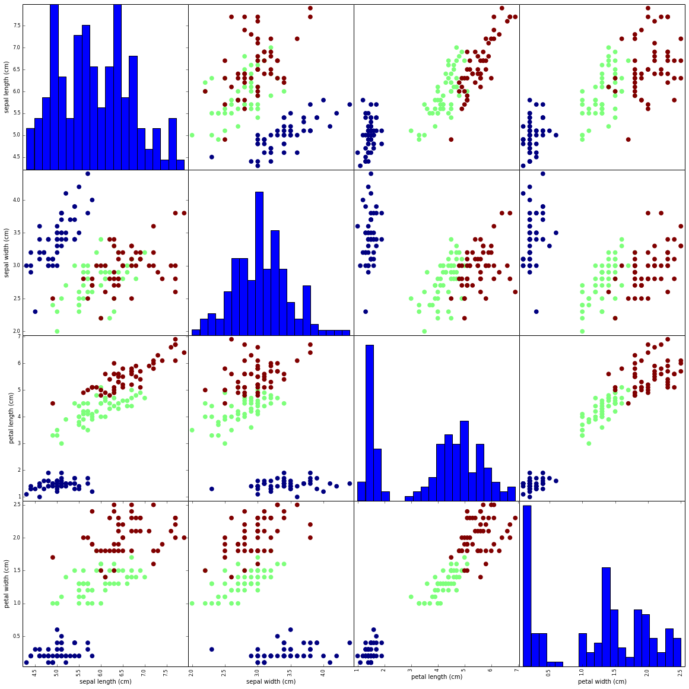

# Homework 0: Iris Flower

Class Name: CS5785/ORIE5750/ECE5414

Homework Number: Homework 0

Student Name: Scarlett Huang (sh2557)

## Question 1

How many features/attributes are there per sample? How many different species are there, and how many samples of each species did Anderson record?

- number of attributes per sample: 4

- number of different species: 3
- number of samples of each species: 50 

## Question 2

```python
import pandas as pd
import numpy as np

url = 'https://archive.ics.uci.edu/ml/machine-learning-databases/iris/iris.data'
df = pd.read_csv(url, names=names) 
df.columns=["Col1","Col2","Col3","Col4","Col5"]
 
iris_x = df[["Col1","Col2","Col3","Col4"]] 
iris_x = np.array(X)
print iris_x
print len(iris_x)
 
y = df["Col5"] 
iris_y = np.array(y) 
print iris_y
print len(iris_y)
```

## Question 3

1.Tranform array into DataFrame.

2.Use scatter_matrix function to plot Scatterplot Matrix.

```python
%matplotlib inline

from sklearn.datasets import load_iris
iris_dataset = load_iris()
iris_data = iris_dataset.data
iris_target = iris_dataset.target
print iris_data
print iris_target

import matplotlib.pyplot as plt
iris_df = pd.DataFrame(data, columns=iris_dataset.feature_names)
figure = pd.plotting.scatter_matrix(iris_df,
                                    c=iris_target,
                                    figsize=(20,20), 
                                    marker='o',
                                    hist_kwds = {'bins':20}, 
                                    s=60,
                                    alpha=1.0)
```



