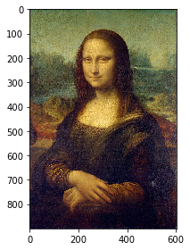

# Question 2
## 2-b Preprocessing the input

1.**Unit-Normalization**: To avoid overfitting, I used Unit-Normalization, that is, mapping all coordinate locations to the [0,1] range.


2.**Standardization**: I didn't use the standardization method. Because standardization is not required for tree-based models (e.g. random forest, Bagging and boosting) which are not sensitive to variable size.


3.**Mean subtraction**: I didn't use mean subtraction, because it's not necessary to do this in this task. 

## 2-c Preprocessing the output

1.Rescale the pixel intensities to lie between 0.0 and 1.0.

2.Convert the image to grayscale.


```python
# import modules

import numpy as np
import pandas as pd
import matplotlib.pyplot as plt
%matplotlib inline
import cv2
import os
from skimage import data,filters,io,transform,feature,segmentation,restoration,util,color
```


```python
# use color image 

img = io.imread('data/monalisa_ori.jpg') # read image
print (img.shape)
print (img.ndim)
io.imshow(img)
print(img[:2])

# gray: default 0-1
# RGB: default 0-255
img = np.array(img, dtype=np.float32)/255.0
img
```

    (900, 604, 3)
    3
    [[[103 121  97]
      [ 79  87  66]
      [112 113  97]
      ...
      [ 85  91  79]
      [116 117 111]
      [ 97  93  90]]
    
     [[110 128 102]
      [107 115  94]
      [100 101  85]
      ...
      [ 71  77  63]
      [ 84  85  77]
      [ 60  59  54]]]


    array([[[0.40392157, 0.4745098 , 0.38039216],
            [0.30980393, 0.34117648, 0.25882354],
            [0.4392157 , 0.44313726, 0.38039216],
            ...,
            [0.33333334, 0.35686275, 0.30980393],
            [0.45490196, 0.45882353, 0.43529412],
            [0.38039216, 0.3647059 , 0.3529412 ]],
    
           [[0.43137255, 0.5019608 , 0.4       ],
            [0.41960785, 0.4509804 , 0.36862746],
            [0.39215687, 0.39607844, 0.33333334],
            ...,
            [0.2784314 , 0.3019608 , 0.24705882],
            [0.32941177, 0.33333334, 0.3019608 ],
            [0.23529412, 0.23137255, 0.21176471]],
    
           [[0.31764707, 0.3882353 , 0.28627452],
            [0.3372549 , 0.36862746, 0.2784314 ],
            [0.42352942, 0.42745098, 0.35686275],
            ...,
            [0.29411766, 0.32156864, 0.25882354],
            [0.27058825, 0.28627452, 0.23137255],
            [0.16862746, 0.16862746, 0.13725491]],
    
           ...,
    
           [[0.44313726, 0.43137255, 0.46666667],
            [0.24313726, 0.23137255, 0.27450982],
            [0.12156863, 0.10588235, 0.16470589],
            ...,
            [0.1254902 , 0.10588235, 0.18431373],
            [0.52156866, 0.49411765, 0.5647059 ],
            [0.1882353 , 0.16078432, 0.23137255]],
    
           [[0.47843137, 0.46666667, 0.5019608 ],
            [0.27058825, 0.25882354, 0.3019608 ],
            [0.30980393, 0.29411766, 0.3529412 ],
            ...,
            [0.09411765, 0.07450981, 0.15294118],
            [0.30588236, 0.2784314 , 0.34901962],
            [0.1254902 , 0.09803922, 0.16862746]],
    
           [[0.43529412, 0.42352942, 0.45882353],
            [0.18431373, 0.17254902, 0.21568628],
            [0.26666668, 0.2509804 , 0.30980393],
            ...,
            [0.4117647 , 0.39215687, 0.47058824],
            [0.16078432, 0.13333334, 0.20392157],
            [0.39215687, 0.3647059 , 0.43529412]]], dtype=float32)





```python
# meshgrid, get coordinate locations

x = np.arange(0, img.shape[1])
y = np.arange(0, img.shape[0])
locations = np.meshgrid(y,x)
locations = np.stack(locations, axis=-1).reshape(-1, 2)

locations.shape
```


    (543600, 2)


```python
# sample points: uniformly sample 5,000 random (x,y) coordinate locations, to build a training set

num_sample_points = 5000
np.random.shuffle(locations)
sample_points = locations[:num_sample_points]
test_points = locations[num_sample_points:]

print (sample_points[:10])
```

    [[772 241]
     [377 485]
     [447 163]
     [448  11]
     [ 56 539]
     [161 163]
     [403 437]
     [835 314]
     [581 364]
     [193 460]]


```python
# pixels match

sample_point_pixels = np.array([img[x[0], x[1]] for x in sample_points], dtype='float32')
test_point_pixels = np.array([img[x[0], x[1]] for x in test_points], dtype='float32')
```


```python
# normalize the coordinates

normalized_sample_points = sample_points.copy().astype('float32')
normalized_test_points = test_points.copy().astype('float32')

normalized_sample_points[:, 0] /= img.shape[0]
normalized_sample_points[:, 1] /= img.shape[1]
normalized_test_points[:, 0] /= img.shape[0]
normalized_test_points[:, 1] /= img.shape[1]
```


```python
print (sample_point_pixels[:5])
print (test_point_pixels[:5])
```

    [[0.5411765  0.34117648 0.17254902]
     [0.3137255  0.31764707 0.19607843]
     [0.21568628 0.15294118 0.19607843]
     [0.45882353 0.27450982 0.20392157]
     [0.42745098 0.49411765 0.32941177]]
    [[0.5058824  0.30588236 0.19215687]
     [0.13333334 0.04313726 0.11372549]
     [0.08627451 0.03921569 0.09411765]
     [0.6313726  0.627451   0.41568628]
     [0.49411765 0.54509807 0.3254902 ]]


```python
print (normalized_sample_points[:5])
print (normalized_test_points[:5])
```

    [[0.8577778  0.39900663]
     [0.4188889  0.8029801 ]
     [0.49666667 0.26986754]
     [0.4977778  0.01821192]
     [0.06222222 0.8923841 ]]
    [[0.86777776 0.35927153]
     [0.9522222  0.39072847]
     [0.57       0.8642384 ]
     [0.21111111 0.13907285]
     [0.08555555 0.294702  ]]


```python
x_train = normalized_sample_points
y_train = sample_point_pixels
x_test = normalized_test_points
y_test = test_point_pixels
```
