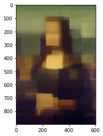

## 2-d Implement Random Forest Regressor, Build the final image


```python
%run 1.Q2_b+c_ColorImage.py
```


```python
# implement Random Forest Regressor

from sklearn.ensemble import RandomForestRegressor

rfr = RandomForestRegressor(n_estimators=50, max_depth=8, criterion='mse')
rfr.fit(x_train, y_train)
y_pred = rfr.predict(x_test)

print ("y_train:\n", y_train[:5])
print ("y_pred:\n", y_pred[:5])
print ("y_pred shape:", y_pred.shape)
```

    y_train:
     [[0.47843137 0.5294118  0.31764707]
     [0.06666667 0.05490196 0.12941177]
     [0.42352942 0.43137255 0.2784314 ]
     [0.3764706  0.41568628 0.28235295]
     [0.23921569 0.20392157 0.21568628]]
    y_pred:
     [[0.31693894 0.35834485 0.26902258]
     [0.50575719 0.37444329 0.18090416]
     [0.06159043 0.03571006 0.11538387]
     [0.38446765 0.38338337 0.26658679]
     [0.21594101 0.14575999 0.13848056]]
    y_pred shape: (538600, 3)


```python
# combine points and sample points

image = np.zeros_like(img)
print(image.shape)

for point, pixel in zip(sample_points, sample_point_pixels):
    image[point[0], point[1]] = pixel
for point, pixel in zip(test_points, y_pred):
    image[point[0], point[1]] = pixel
```

    (900, 604, 3)


```python
# show the final image

image = (image * 255).astype('uint8')
io.imshow(image)
```


    <matplotlib.image.AxesImage at 0x7faf884094a8>





```python
# model evaluation

from sklearn import metrics

MSE = metrics.mean_squared_error(y_test, y_pred)
print('Mean Squared Error(MSE)=', MSE)
```

    Mean Squared Error(MSE)= 0.0054287955890030375

