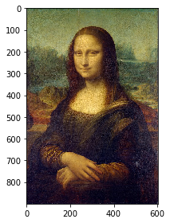

## 2-e Experimentation 

### 2-e-i Random Forest Experiment 1

The experiment's codes and results are shown below.

According to the experiment results (MSE scores and final images), we found that: 

- At first, with the depth increases (when max_depth=[1,2,3,5,10]), the performance (i.e. MSE) of the random forest model is also improved correspondingly and the final image becomes increasingly closer to the original image.
- But, when max_depth = 15, the performance of the random forest model decreases comparing to that of the max_depth=10.

**Reason**: 

- The deeper the tree structure is, the better its ability to fit the data, but it may also lead to overfitting.
- Without restriction, a decision tree will grow until no more features are available. Such decision trees tend to overfit.
- max_depth is used to limit the maximum depth of the tree, branches above the set depth will be cutted. Limiting tree depth can effectively limit overfitting. 


```python
%run 1.Q2_b+c_ColorImage.py
```

    (900, 604, 3)
    3
    [[[103 121  97]
      [ 79  87  66]
      [112 113  97]
      ...
      [ 85  91  79]
      [116 117 111]
      [ 97  93  90]]
    
     [[110 128 102]
      [107 115  94]
      [100 101  85]
      ...
      [ 71  77  63]
      [ 84  85  77]
      [ 60  59  54]]]
    [[459   3]
     [892 353]
     [ 64 411]
     [650 515]
     [740  61]
     [ 38 422]
     [699 454]
     [887 516]
     [749 208]
     [574 121]]
    [[0.41568628 0.30980393 0.3372549 ]
     [0.03921569 0.01960784 0.10980392]
     [0.49019608 0.5254902  0.31764707]
     [0.15294118 0.14117648 0.22352941]
     [0.03529412 0.02352941 0.13725491]]
    [[0.07450981 0.06666667 0.16078432]
     [0.27450982 0.33333334 0.21960784]
     [0.2509804  0.1882353  0.23137255]
     [0.20392157 0.29411766 0.22352941]
     [0.10588235 0.05882353 0.14509805]]
    [[0.51       0.00496689]
     [0.9911111  0.5844371 ]
     [0.07111111 0.68046355]
     [0.7222222  0.85264903]
     [0.82222223 0.10099338]]
    [[0.8388889  0.8509934 ]
     [0.36666667 0.7731788 ]
     [0.63555557 0.24006623]
     [0.35333332 0.7682119 ]
     [0.99       0.43543047]]





```python
# Experiment: set n_estimators=1, max_depth=[1,2,3,5,10,15]

from sklearn.ensemble import RandomForestRegressor
from sklearn import metrics

class random_forest_experimentation:
    
    def __init__(self):
        self.a=1
    
    def rfr_model(self,n,d):
        rfr = RandomForestRegressor(n_estimators=n, max_depth=d, criterion='mse')
        rfr.fit(x_train, y_train)
        y_pred = rfr.predict(x_test)
        return y_pred
    
    def calculate_mse(self,y_pred):
        MSE = metrics.mean_squared_error(y_test, y_pred)
        return MSE
    
    def final_image(self,y_pred):
        # combine points and sample points
        image = np.zeros_like(img)
        for point, pixel in zip(sample_points, sample_point_pixels):
            image[point[0], point[1]] = pixel
        for point, pixel in zip(test_points, y_pred):
            image[point[0], point[1]] = pixel
        # show the final image
        image = (image * 255).astype('uint8')
        io.imshow(image)      
```


```python
# set n_estimators=1, max_depth=1

rfr_ex = random_forest_experimentation()
y_pred = rfr_ex.rfr_model(1,1)
MSE1 = rfr_ex.calculate_mse(y_pred)
print ("MSE=", MSE1)
rfr_ex.final_image(y_pred)
```

    MSE= 0.023464145858369253


```python
# set n_estimators=1, max_depth=2

rfr_ex = random_forest_experimentation()
y_pred = rfr_ex.rfr_model(1,2)
MSE2 = rfr_ex.calculate_mse(y_pred)
print ("MSE=", MSE2)
rfr_ex.final_image(y_pred)
```

    MSE= 0.02035360798607523


```python
# set n_estimators=1, max_depth=3

rfr_ex = random_forest_experimentation()
y_pred = rfr_ex.rfr_model(1,3)
MSE3 = rfr_ex.calculate_mse(y_pred)
print ("MSE=", MSE3)
rfr_ex.final_image(y_pred)
```

    MSE= 0.01874219369715135


```python
# set n_estimators=1, max_depth=5

rfr_ex = random_forest_experimentation()
y_pred = rfr_ex.rfr_model(1,5)
MSE4 = rfr_ex.calculate_mse(y_pred)
print ("MSE=", MSE4)
rfr_ex.final_image(y_pred)
```

    MSE= 0.011496722490643761


```python
# set n_estimators=1, max_depth=10

rfr_ex = random_forest_experimentation()
y_pred = rfr_ex.rfr_model(1,10)
MSE5 = rfr_ex.calculate_mse(y_pred)
print ("MSE=", MSE5)
rfr_ex.final_image(y_pred)
```

    MSE= 0.007258782597167338


```python
# set n_estimators=1, max_depth=15

rfr_ex = random_forest_experimentation()
y_pred = rfr_ex.rfr_model(1,15)
MSE6 = rfr_ex.calculate_mse(y_pred)
print ("MSE=", MSE6)
rfr_ex.final_image(y_pred)
```

    MSE= 0.007816664587058429


```python
# plot mse trend
# In this experiment: when n_estimators=1, best max_depth=10

a = [1,2,3,5,10,15]
b = [MSE1,MSE2,MSE3,MSE4,MSE5,MSE6]
plt.figure(figsize=(15,5)) 
plt.plot(a,b,'o-',linewidth=1)   
plt.xlabel("max_depth") 
plt.ylabel("MSE")  
plt.show()
```


