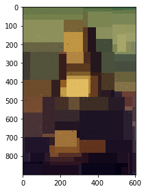
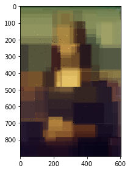
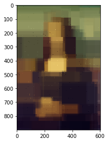
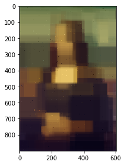
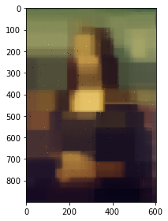
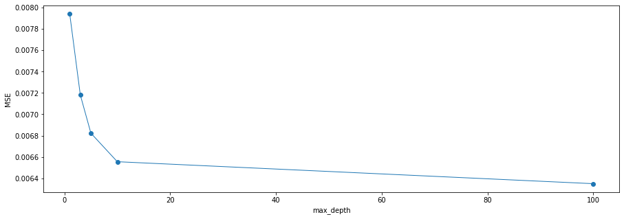

### 2-e-ii Random Forest Experiment 2

The experiment's codes and results are shown below.

According to the experiment results (MSE scores and final images), we found that: 

- With the tree number increases(when n_estimators=[1,3,5,10]), the performance (i.e. MSE) of the random forest model is also significantly improved and the final image becomes increasingly closer to the original image.
- But the model performance with n_estimators=100 doesn't significantly better than the model performance with n_estimators=10.

**Reason**: 

- Generally, the more trees there are, the better the model’s performance is.

- However, when the number of trees exceeds a certain value, the error rate of the model tends to converge. At this point, if we continue to increase the number of trees, it will not improve the model performance, instead, it will reduce the training speed.

- Therefore, the number of decision trees doesn’t need to be too large, choosing a comparatively large number is enough.


```python
%run 1.Q2_b+c_ColorImage.py
```


```python
from sklearn.ensemble import RandomForestRegressor
from sklearn import metrics

class random_forest_experimentation:
    
    def __init__(self):
        self.a=1
    
    def rfr_model(self,n):
        rfr = RandomForestRegressor(n_estimators=n, max_depth=7, criterion='mse')
        rfr.fit(x_train, y_train)
        y_pred = rfr.predict(x_test)
        return y_pred
    
    def calculate_mse(self,y_pred):
        MSE = metrics.mean_squared_error(y_test, y_pred)
        return MSE
    
    def final_image(self,y_pred):
        # combine points and sample points
        image = np.zeros_like(img)
        for point, pixel in zip(sample_points, sample_point_pixels):
            image[point[0], point[1]] = pixel
        for point, pixel in zip(test_points, y_pred):
            image[point[0], point[1]] = pixel
        # show the final image
        image = (image * 255).astype('uint8')
        io.imshow(image)      
```


```python
# set n_estimators=1, max_depth=7

rfr_ex = random_forest_experimentation()
y_pred = rfr_ex.rfr_model(1)
MSE1 = rfr_ex.calculate_mse(y_pred)
print ("MSE=", MSE1)
rfr_ex.final_image(y_pred)
```

    MSE= 0.007938261974141865





```python
# set n_estimators=3, max_depth=7

rfr_ex = random_forest_experimentation()
y_pred = rfr_ex.rfr_model(3)
MSE2 = rfr_ex.calculate_mse(y_pred)
print ("MSE=", MSE2)
rfr_ex.final_image(y_pred)
```

    MSE= 0.007180770156637865





```python
# set n_estimators=5, max_depth=7

rfr_ex = random_forest_experimentation()
y_pred = rfr_ex.rfr_model(5)
MSE3 = rfr_ex.calculate_mse(y_pred)
print ("MSE=", MSE3)
rfr_ex.final_image(y_pred)
```

    MSE= 0.0068234340318858375





```python
# set n_estimators=10, max_depth=7

rfr_ex = random_forest_experimentation()
y_pred = rfr_ex.rfr_model(10)
MSE4 = rfr_ex.calculate_mse(y_pred)
print ("MSE=", MSE4)
rfr_ex.final_image(y_pred)
```

    MSE= 0.006556347669496025





```python
# set n_estimators=100, max_depth=7

rfr_ex = random_forest_experimentation()
y_pred = rfr_ex.rfr_model(100)
MSE5 = rfr_ex.calculate_mse(y_pred)
print ("MSE=", MSE5)
rfr_ex.final_image(y_pred)
```

    MSE= 0.006350843014001221





```python
# plot mse trend
# In this experiment: when max_depth=7, best n_estimators=100

a = [1,3,5,10,100]
b = [MSE1,MSE2,MSE3,MSE4,MSE5]
plt.figure(figsize=(15,5)) 
plt.plot(a,b,'o-',linewidth=1)   
plt.xlabel("max_depth") 
plt.ylabel("MSE")  
plt.show()
```




