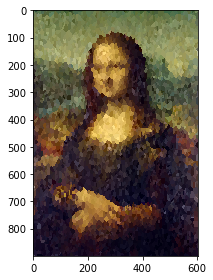

### 2-e-iii KNN Regressor 

The experiment's codes and results are shown below.

Compare and contrast the outlook: why does this look the way it does?

- The resulting image of Random Forest Regressor has many **obvious dividing lines**, which is very consistent with the characteristics of decision trees. Because each partition built by the decision tree is a dividing line that divides data points into different nodes based on eigenvalues.

- The resulting image of KNN Regressor don't have obvious dividing lines, instead, the boundaries among its categories are quite **blurred**. This is also very consistent with the characteristics of KNN model,  because the principle of KNN is to take the average of the closest points as the value of this point.


```python
%run 1.Q2_b+c_ColorImage.py
```


```python
# use KNeighbors Regressor, set k=1
from sklearn.neighbors import KNeighborsRegressor

knr = KNeighborsRegressor(n_neighbors=1)   
knr.fit(x_train,y_train)
y_pred = knr.predict(x_test)
```


```python
# combine points and sample points
image = np.zeros_like(img)
for point, pixel in zip(sample_points, sample_point_pixels):
    image[point[0], point[1]] = pixel
for point, pixel in zip(test_points, y_pred):
    image[point[0], point[1]] = pixel

# show the final image
image = (image * 255).astype('uint8')
io.imshow(image)
```


    <matplotlib.image.AxesImage at 0x7fbefae6aef0>





```python
# model evaluation

from sklearn import metrics

MSE = metrics.mean_squared_error(y_test, y_pred)
print('Mean Squared Error(MSE)=', MSE)
```

    Mean Squared Error(MSE)= 0.006142866

