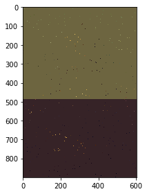
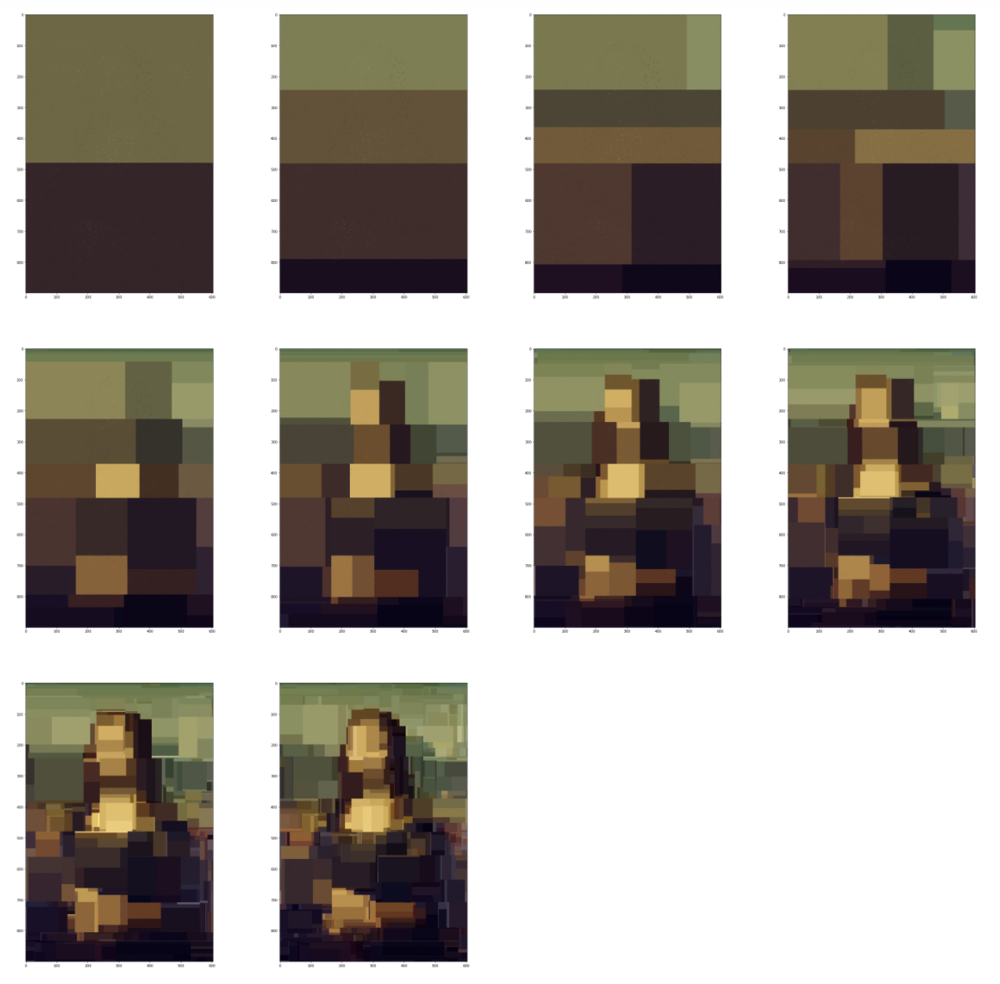

## 2-f Analysis

### 2-f-i

Chosen decision tree: single decision tree, tree depth=1.

The image below is the resulting image of this decision tree.

From the image, we can see that there is one obvious dividing line which splits two colors.

Assuming that:

- coordinate locations = (x,y); 
- the value of the color of a coordinate location is C; 
- the values of the two colors in the image are C1 and C2, respectively;
- the y coordinate of the dividing line is K.

**The formula**:
$$
C=\left\{
\begin{array}{rcl}
C_1     &      & {0 \leq y < K}\\
C_2     &      & {K \leq y \le 900}\\
\end{array} \right.
$$

### 2-f-ii

1.Why does the resulting image look the way it does:

The resulting image of Random Forest Regressor has many obvious dividing lines, which is very consistent with the characteristics of decision trees. Because each partition built by the decision tree is a dividing line that divides data points into different nodes based on eigenvalues.

2.What shape are the patches of color, and how are they arranged:

- The shape of the patches of color is rectangular.
- They are arranged horizontally or vertically according to the color distribution of the original image. 
- Under the condition of the same number of decision trees, the deeper the tree structures are , the more rectangles there are in the image, and the more close the image outlook is to the original.

### 2-f-iii

Figure: the resulting images of Random Forest Regressor contains a single decision tree but with different depths range from 1 to 10.

Assuming that:

- Y: the number of patches of color in the resulting image of the forest that contains a single decision tree;
- d: tree depth.

Then we can get the equation:
$$
Y = 2^d
$$

### 2-f-iv

Assuming that:

- Y: the number of patches of color in the resulting image of the forest;
- n: the number of decision trees;
- d: tree depth.

**Then we get the equation:**
$$
Y=2^{(n*d)}
$$
Explanation:

- Because random forest regresion is the average of N trees, the maximal possible Y of each tree is $2^d$, so the average maximal possible Y of N trees should be $2^{(n *d)}$.

- The Y here is the upper bound, namely the highest possibility. But the actual Y in real situations can't usually achieve this value, because there's no guarantee that the decision tree will be full or that every tree will have the same number of split nodes.

