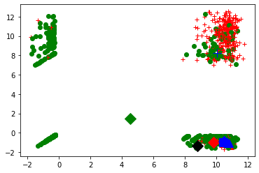
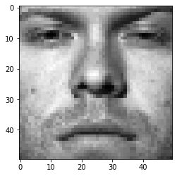
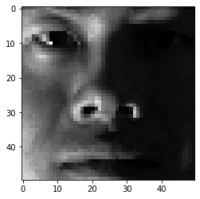
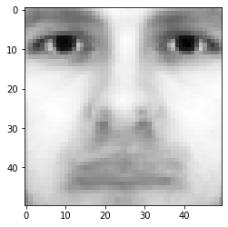
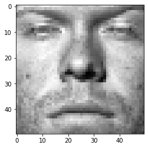
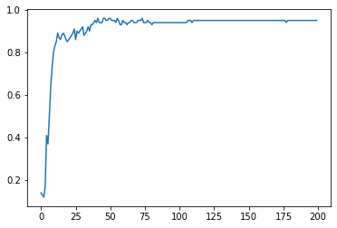

# AML_HW4_Write up

Students

- Scarlett Huang (sh2557) CM 
- Zihan Zhang (zz698) ORIE

Submission: Late


## Programming Exercises

### Question 1

#### 1.(a)


```python
# import modules

import numpy as np
import pandas as pd
import matplotlib.pyplot as plt
%matplotlib inline
import math
```


```python
# load .npy file

dw_matrix = np.load('data/science2k-doc-word.npy') 

print (dw_matrix)
print (len(dw_matrix))
print (type(dw_matrix))
print (dw_matrix.shape)
```

    [[-0.2521619 -0.2521619  9.36371   ... -0.2521619 -0.2521619 -0.2521619]
     [-0.2875293 -0.2875293  8.229864  ... -0.2875293 -0.2875293 -0.2875293]
     [-0.3634041 -0.3634041  9.252468  ... -0.3634041 -0.3634041 -0.3634041]
     ...
     [10.04846   -0.7713402  9.132197  ... -0.7713402 -0.7713402 -0.7713402]
     [11.00702   -0.8423803 10.38288   ... -0.8423803 -0.8423803 -0.8423803]
     [ 9.710337  -0.7527946  9.556191  ... -0.7527946 -0.7527946 -0.7527946]]
    1373
    <class 'numpy.ndarray'>
    (1373, 5476)


```python
# a-1: implement kmeans 

from numpy import *
import matplotlib.pyplot as plt

# Compute Euclidean distance
def euclidean_distance(vec1, vec2):
	eu_distance = sqrt(sum(power(vec2 - vec1, 2)))
	return eu_distance
 
# init centroids with random samples
def init_centroids(data, k):
	num_samples, dim = data.shape
	centroids = zeros((k, dim))
	for i in range(k):
		idx = int(random.uniform(0, num_samples))
		centroids[i, :] = data[idx, :]
	return centroids
 
# kmeans
def kmeans(data, k):
	num_samples = data.shape[0]

	doc_cluster = mat(zeros((num_samples, 2)))
	cls_changed = True
 
	# init centroids
	centroids = init_centroids(data, k)
 
	while cls_changed:
		cls_changed = False
		for i in range(num_samples):
			min_dist  = 100000.0
			min_idx = 0
			# for each centroid, find the centroid who is closest
			for j in range(k):
				distance = euclidean_distance(centroids[j, :], data[i, :])
				if distance < min_dist:
					min_dist  = distance
					min_idx = j
			
			# update its cluster
			if doc_cluster[i, 0] != min_idx:
				cls_changed = True
				doc_cluster[i, :] = min_idx, min_dist**2
 
		# update centroids
		for j in range(k):
			points_cls = data[nonzero(doc_cluster[:, 0].A == j)[0]]
			centroids[j, :] = mean(points_cls, axis = 0)
 
	return centroids, doc_cluster

# plot the cluster 
def show_cluster(data, k, centroids, doc_cluster):
	num_samples, dim = data.shape
	if dim != 5476:
		return 1
 
	marks = ['or', 'ob', 'og', 'ok', '^r', '+r', 'sr', 'dr', '<r', 'pr','or', 'ob', 'og', 'ok', '^r', '+r', 'sr', 'dr', '<r', 'pr']
	if k > len(marks):
		return 1
 
	# plot all samples
	for i in range(num_samples):
		mark_idx = int(doc_cluster[i, 0])
		plt.plot(data[i, 0], data[i, 1], marks[mark_idx])
 
	marks = ['Dr', 'Db', 'Dg', 'Dk', '^b', '+b', 'sb', 'db', '<b', 'pb','Dr', 'Db', 'Dg', 'Dk', '^b', '+b', 'sb', 'db', '<b', 'pb']
	# draw the centroids
	for i in range(k):
		plt.plot(centroids[i, 0], centroids[i, 1], marks[i], markersize = 12)
 
	plt.show()
```


```python
# Run the model
## clustering, k=10
data = mat(dw_matrix)
k = 10
centroids, doc_cluster = kmeans(data, k)

## plot
show_cluster(data, k, centroids, doc_cluster)
```


```python
# a-2: Select the best value for k

from sklearn.cluster import KMeans
from sklearn import metrics
from scipy.spatial.distance import cdist
import matplotlib.pyplot as plt

K = range(2, 20)
meandistortions = []

X = mat(dw_matrix)

for k in K:
    kmeans = KMeans(n_clusters=k)
    kmeans.fit(X)
    meandistortions.append(sum(np.min(cdist(X, kmeans.cluster_centers_, 'euclidean'), axis=1)) / X.shape[0])

plt.plot(K, meandistortions, 'bx-')
plt.xlabel('k')
plt.ylabel(u'Mean distortion degree')
plt.title(u'Use the elbow rule to determine the best value for K');
plt.show()
```


```python
# a-3: Run the model

## clustering
## set k=7, because according to elbow rule, we can see that in the process of K value increasing, the K value corresponding to the position where the improvement effect of average distortion degree decreases the most is 7.

data = mat(dw_matrix)
k = 7
centroids, doc_cluster = kmeans(data, k)

## plot
show_cluster(data, k, centroids, doc_cluster)
```





```python
# central points
print (centroids)
print (len(centroids))
print (type(centroids))
print (centroids.shape)

# labels 
print (doc_cluster)
print (len(doc_cluster))
print (type(doc_cluster))
print (doc_cluster.shape)

labels = doc_cluster[:,0]
labels = list(map(int,labels))
print (labels[:20])

cls = set(labels)
print ("clusters:", cls)
```

    [[ 9.807132   -1.012666    9.114005   ... -1.012666   -1.012666
      -1.012666  ]
     [10.46259    -0.8878248   9.421161   ... -0.8878248  -0.8878248
      -0.8878248 ]
     [ 4.53212466  1.47859304  8.96488063 ... -0.49527608 -0.56887007
      -0.47825439]
     ...
     [10.77862    -1.08089     9.627346   ... -1.08089    -1.08089
      -1.08089   ]
     [10.02691817  8.2438794   9.13370419 ... -0.51721605 -0.6103251
      -0.79039602]
     [10.45232    -0.9552607   9.6414     ... -0.9552607  -0.9552607
      -0.9552607 ]]
    7
    <class 'numpy.ndarray'>
    (7, 5476)
    [[2.00000000e+00 2.11885050e+04]
     [2.00000000e+00 2.22859889e+04]
     [2.00000000e+00 2.44449395e+04]
     ...
     [5.00000000e+00 4.20898259e+04]
     [2.00000000e+00 4.61358903e+04]
     [2.00000000e+00 4.30799672e+04]]
    1373
    <class 'numpy.matrix'>
    (1373, 2)
    [2, 2, 2, 2, 2, 2, 2, 2, 2, 2, 2, 2, 2, 2, 2, 2, 2, 2, 2, 5]
    clusters: {0, 1, 2, 3, 4, 5, 6}


```python
# a-4: Report top 10 words in each cluster

import heapq

# calculate x_average 
x_avg = np.mean(dw_matrix, axis=0)

vocab_df = pd.read_csv("data/science2k-vocab.txt", header=None)
vocab_array = np.array(vocab_df) 
vocabs = vocab_array.tolist()
#print (vocabs[:20])
#print (len(vocabs))

def cal_cn_idx_list(n):
    i = 0
    cn = []
    cn_idx_list = []
    for p in labels:
        if p == n:
            doc = dw_matrix[i]
            cn.append(doc)
            cn_idx_list.append(i)

            if i >= len(labels)-1:
                break
        i = i + 1
    #print (cn_idx_list)
    return cn_idx_list,cn

print ("------Top 10 words in each cluster------")

for n in cls:
    cn_idx_list,cn = cal_cn_idx_list(n)
    cn_matrix = np.array(cn)
    cn_mean_matrix = np.mean(cn_matrix, axis=0)
    
    cn_sig_matrix = cn_mean_matrix - x_avg 
    cn_sig_list = cn_sig_matrix.tolist()
    
    # top 10 largest numbers
    max_idx = map(cn_sig_list.index, heapq.nlargest(10, cn_sig_list))
    max_idx_list = list(max_idx)
    #print(list(max_idx_list))
    
    # report top 10 words
    top_word_list = []
    for m in max_idx_list:
        top_word = vocabs[m]
        top_word_list.append(top_word)
    print ("Cluster",n,":")
    print (top_word_list)
```

    ------Top 10 words in each cluster------
    Cluster 0 :
    [['eros'], ['solar'], ['kev'], ['sun'], ['elemental'], ['ratios'], ['asteroid'], ['ray'], ['ordinary'], ['detector']]
    Cluster 1 :
    [['coherence'], ['extinction'], ['patch'], ['dispersal'], ['coherent'], ['probabilities'], ['patches'], ['oscillations'], ['criteria'], ['probability']]
    Cluster 2 :
    [['years'], ['year'], ['scientists'], ['world'], ['researchers'], ['says'], ['field'], ['mail'], ['million'], ['focus']]
    Cluster 3 :
    [['co2'], ['terrestrial'], ['carbon'], ['ocean'], ['ecosystems'], ['atmospheric'], ['nitrogen'], ['oceans'], ['sink'], ['interglacial']]
    Cluster 4 :
    [['spectral'], ['longitude'], ['wavelengths'], ['spectra'], ['band'], ['wavelength'], ['incident'], ['kilometers'], ['elongated'], ['images']]
    Cluster 5 :
    [['protein'], ['cell'], ['cells'], ['expression'], ['proteins'], ['fig'], ['gene'], ['specific'], ['binding'], ['expressed']]
    Cluster 6 :
    [['titans'], ['clouds'], ['methane'], ['spectra'], ['cloud'], ['altitude'], ['atmosphere'], ['albedo'], ['flux'], ['saturated']]


```python
# a-5: Report the top ten documents that fall closest to each cluster center

title_df = pd.read_csv("data/science2k-titles.txt", header=None)
title_array = np.array(title_df) 
titles = title_array.tolist()
#print (titles[:20])
#print (len(titles))

def get_distances(n):
    cn_idx_list,cn = cal_cn_idx_list(n)
    cn_matrix = np.array(cn)
    cn_mean_matrix = np.mean(cn_matrix, axis=0)
    distances = []  
    for j in range(len(cn)):
        distances.append(euclidean_distance(cn[j], cn_mean_matrix))
    return distances

print ("------Top 10 documents that fall closest to each cluster center------")

for n in cls:
    cn_distances = get_distances(n)
    #print (len(cn_distances))
    #print (cn_distances)
    
    # top 10 smallest distances in each cluster
    min_idx = map(cn_distances.index, heapq.nsmallest(10, cn_distances))
    min_idx_list = list(min_idx)
    #print(list(min_idx_list))
    
    # report top 10 documents in each cluster
    top_doc_list = []
    for m in min_idx_list:
        top_doc = titles[m]
        top_doc_list.append(top_doc)
    print ("Cluster",n,":")
    print (top_doc_list)
```

    ------Top 10 documents that fall closest to each cluster center------
    Cluster 0 :
    [['Archaeology in the Holy Land']]
    Cluster 1 :
    [['Archaeology in the Holy Land']]
    Cluster 2 :
    [['Similar Requirements of a Plant Symbiont and a Mammalian Pathogen for Prolonged Intracellular Survival'], ['A Deluge of Patents Creates Legal Hassles for Research'], ['Childhood Cancer'], ['Trojan Horses'], ['An Integrative Science Finds a Home'], ['An Integrative Science Finds a Home'], ['An Integrative Science Finds a Home'], ['Archaeology in the Holy Land'], ['Close Encounters: Details Veto Depth from Shadows'], ['Thermal, Catalytic, Regiospecific Functionalization of Alkanes']]
    Cluster 3 :
    [['Archaeology in the Holy Land']]
    Cluster 4 :
    [['Archaeology in the Holy Land'], ["Baedeker's Guide, or Just Plain 'Trouble'?"]]
    Cluster 5 :
    [['Reforming the Patent System'], ["On the Hunt for a Wolf in Sheep's Clothing"], ['Is Bigger Better in Cricket?'], ['Was Lamarck Just a Little Bit Right?'], ['Hydrogen Storage in Nanotubes'], ['When Pharma Merges, R&D Is the Dowry'], ['Superplastic Extensibility of Nanocrystalline Copper at Room Temperature'], ['Coupling of Stress in the ER to Activation of JNK Protein Kinases by Transmembrane Protein Kinase IRE1'], ['Mice Are Not Furry Petri Dishes'], ['<latex>$H_3^+$</latex>-an Ion with Many Talents']]
    Cluster 6 :
    [['Archaeology in the Holy Land']]

##### a-6

Comment on these results. 

1.What has the algorithm captured? 

- This algorithm mainly captures the topic information. It clusters documents, helps to get the relevant documents for each cluster center. From this, we can know which documents belong to the same topic.

2.How might such an algorithm be useful?

- This algorithm can be applied to document classification/topic clustering. By using it, we can know what topic a document belongs to and which documents belong to the same topic. 
- Through the Top 10 words, we can know the key words in certain topics. Through the top 10 documents, we can find the documents that are most relevant to a certain topic.


#### 1.(b)


```python
# import modules

import numpy as np
import pandas as pd
import matplotlib.pyplot as plt
%matplotlib inline
import math
```


```python
# load .npy file

dw_matrix = np.load('data/science2k-word-doc.npy') 

print (dw_matrix)
print (len(dw_matrix))
print (type(dw_matrix))
print (dw_matrix.shape)
```

    [[-6.755691   -6.755691   -6.755691   ...  4.064107    5.093713
       3.707441  ]
     [-4.028205   -4.028205   -4.028205   ... -4.028205   -4.028205
      -4.028205  ]
     [-0.03370464 -1.132184   -0.03370464 ...  0.2539608   1.57568
       0.6594092 ]
     ...
     [-0.1301101  -0.1301101  -0.1301101  ... -0.1301101  -0.1301101
      -0.1301101 ]
     [-0.05128021 -0.05128021 -0.05128021 ... -0.05128021 -0.05128021
      -0.05128021]
     [-0.06441435 -0.06441435 -0.06441435 ... -0.06441435 -0.06441435
      -0.06441435]]
    5476
    <class 'numpy.ndarray'>
    (5476, 1373)


```python
# b-1: implement kmeans 

from numpy import *
import matplotlib.pyplot as plt

# Compute Euclidean distance
def euclidean_distance(vec1, vec2):
	eu_distance = sqrt(sum(power(vec2 - vec1, 2)))
	return eu_distance
 
# init centroids with random samples
def init_centroids(data, k):
	num_samples, dim = data.shape
	centroids = zeros((k, dim))
	for i in range(k):
		idx = int(random.uniform(0, num_samples))
		centroids[i, :] = data[idx, :]
	return centroids
 
# kmeans
def kmeans(data, k):
	num_samples = data.shape[0]

	doc_cluster = mat(zeros((num_samples, 2)))
	cls_changed = True
 
	# init centroids
	centroids = init_centroids(data, k)
 
	while cls_changed:
		cls_changed = False
		for i in range(num_samples):
			min_dist  = 100000.0
			min_idx = 0
			# for each centroid, find the centroid who is closest
			for j in range(k):
				distance = euclidean_distance(centroids[j, :], data[i, :])
				if distance < min_dist:
					min_dist  = distance
					min_idx = j
			
			# update its cluster
			if doc_cluster[i, 0] != min_idx:
				cls_changed = True
				doc_cluster[i, :] = min_idx, min_dist**2
 
		# update centroids
		for j in range(k):
			points_cls = data[nonzero(doc_cluster[:, 0].A == j)[0]]
			centroids[j, :] = mean(points_cls, axis = 0)
 
	return centroids, doc_cluster

# plot the cluster 
def show_cluster(data, k, centroids, doc_cluster):
	num_samples, dim = data.shape
	if dim != 5476:
		return 1
 
	marks = ['or', 'ob', 'og', 'ok', '^r', '+r', 'sr', 'dr', '<r', 'pr','or', 'ob', 'og', 'ok', '^r', '+r', 'sr', 'dr', '<r', 'pr']
	if k > len(marks):
		return 1
 
	# plot all samples
	for i in range(num_samples):
		mark_idx = int(doc_cluster[i, 0])
		plt.plot(data[i, 0], data[i, 1], marks[mark_idx])
 
	marks = ['Dr', 'Db', 'Dg', 'Dk', '^b', '+b', 'sb', 'db', '<b', 'pb','Dr', 'Db', 'Dg', 'Dk', '^b', '+b', 'sb', 'db', '<b', 'pb']
	# draw the centroids
	for i in range(k):
		plt.plot(centroids[i, 0], centroids[i, 1], marks[i], markersize = 12)
 
	plt.show()
```


```python
# b-2: Select the best value for k

from sklearn.cluster import KMeans
from sklearn import metrics
from scipy.spatial.distance import cdist
import matplotlib.pyplot as plt

K = range(2, 50)
meandistortions = []

X = mat(dw_matrix)

for k in K:
    kmeans = KMeans(n_clusters=k)
    kmeans.fit(X)
    meandistortions.append(sum(np.min(cdist(X, kmeans.cluster_centers_, 'euclidean'), axis=1)) / X.shape[0])

plt.plot(K, meandistortions, 'bx-')
plt.xlabel('k')
plt.ylabel(u'Mean distortion degree')
plt.title(u'Use the elbow rule to determine the best value for K');
plt.show()
```


```python
# b-3: Run the model
## clustering
## set k=29, because according to elbow rule, we can see that in the process of K value increasing, the K value corresponding to the position where the improvement effect of average distortion degree decreases the most is 29.

data = mat(dw_matrix)
k = 29
centroids, doc_cluster = kmeans(data, k)

## plot
show_cluster(data, k, centroids, doc_cluster)
```


```python
# central points
print (centroids)
print (len(centroids))
print (type(centroids))
print (centroids.shape)

# labels 
print (doc_cluster)
print (len(doc_cluster))
print (type(doc_cluster))
print (doc_cluster.shape)

labels = doc_cluster[:,0]
labels = list(map(int,labels))
print (labels[:20])

cls = set(labels)
print ("clusters:", cls)
```

    [[-0.18002037 -0.1617278  -0.11142196 ...  0.09050765  0.19292803
       0.18388448]
     [-2.836106   -2.836106   -2.836106   ... -2.836106   -2.836106
       5.681287  ]
     [-0.62982567 -0.61657324 -0.46394096 ...  0.11452273 -0.34449929
      -0.38625112]
     ...
     [-3.18032    -3.18032    -0.96434087 ... -2.11564588 -1.05097175
      -2.029015  ]
     [-1.32743722 -1.60219184 -1.32743722 ... -1.30508087 -0.98561187
      -0.75557164]
     [-0.4221642  -0.4221642  -0.4221642  ... -0.4221642  -0.4221642
      -0.4221642 ]]
    29
    <class 'numpy.ndarray'>
    (29, 1373)
    [[2.40000000e+01 2.82920211e+04]
     [2.60000000e+01 2.36386680e+04]
     [0.00000000e+00 0.00000000e+00]
     ...
     [0.00000000e+00 0.00000000e+00]
     [0.00000000e+00 0.00000000e+00]
     [0.00000000e+00 0.00000000e+00]]
    5476
    <class 'numpy.matrix'>
    (5476, 2)
    [24, 26, 0, 20, 0, 26, 24, 26, 11, 0, 2, 0, 0, 24, 27, 24, 24, 26, 4, 4]
    clusters: {0, 1, 2, 3, 4, 5, 6, 7, 8, 9, 10, 11, 12, 13, 14, 15, 16, 17, 18, 19, 20, 21, 22, 23, 24, 25, 26, 27, 28}


```python
# b-4: Report top 10 documents in each cluster

import heapq

# calculate x_average 
x_avg = np.mean(dw_matrix, axis=0)

title_df = pd.read_csv("data/science2k-titles.txt", header=None)
title_array = np.array(title_df) 
titles = title_array.tolist()
#print (titles[:20])
#print (len(titles))

def cal_cn_idx_list(n):
    i = 0
    cn = []
    cn_idx_list = []
    for p in labels:
        if p == n:
            doc = dw_matrix[i]
            cn.append(doc)
            cn_idx_list.append(i)

            if i >= len(labels)-1:
                break
        i = i + 1
    #print (cn_idx_list)
    return cn_idx_list,cn

print ("------Top 10 documents------")

for n in cls:
    cn_idx_list,cn = cal_cn_idx_list(n)
    cn_matrix = np.array(cn)
    cn_mean_matrix = np.mean(cn_matrix, axis=0)
    
    cn_sig_matrix = cn_mean_matrix - x_avg 
    cn_sig_list = cn_sig_matrix.tolist()
    
    # top 10 largest numbers
    max_idx = map(cn_sig_list.index, heapq.nlargest(10, cn_sig_list))
    max_idx_list = list(max_idx)
    #print(list(max_idx_list))
    
    # report top 10 documents
    top_word_list = []
    for m in max_idx_list:
        top_word = titles[m]
        top_word_list.append(top_word)
    print ("Cluster",n,":")
    print (top_word_list)
```

    ------Top 10 documents------
    Cluster 0 :
    [['National Academy of Sciences Elects New Members'], ['Biological Control of Invading Species'], ['Scientists at Brookhaven'], ['Corrections and Clarifications: Timing the Ancestor of the HIV-1 Pandemic Strains'], ['Corrections and Clarifications: Timing the Ancestor of the HIV-1 Pandemic Strains'], ['Corrections and Clarifications: Marking Time for a Kingdom'], ['Corrections and Clarifications: Marking Time for a Kingdom'], ['Corrections and Clarifications: Marking Time for a Kingdom'], ['Corrections and Clarifications: One Hundred Years of Quantum Physics'], ['Corrections and Clarifications: One Hundred Years of Quantum Physics']]
    Cluster 1 :
    [['Global Biodiversity Scenarios for the Year 2100'], ['Proximity of Chromosomal Loci That Participate in Radiation-Induced Rearrangements in Human Cells'], ['Mate Selection and the Evolution of Highly Polymorphic Self/Nonself Recognition Genes'], ['Population Dynamical Consequences of Climate Change for a Small Temperate Songbird'], ['Intersubband Electroluminescence from Silicon-Based Quantum Cascade Structures'], ['On the Origin of Internal Structure of Word Forms'], ['Evidence for Superfluidity in Para-Hydrogen Clusters inside Helium-4 Droplets at 0.15 Kelvin'], ['Real-Space Imaging of Two-Dimensional Antiferromagnetism on the Atomic Scale'], ['Scanometric DNA Array Detection with Nanoparticle Probes'], ['The Evolutionary Fate and Consequences of Duplicate Genes']]
    Cluster 2 :
    [['Central Role for G Protein-Coupled Phosphoinositide 3-Kinase g in Inflammation'], ['Function of PI3Kg in Thymocyte Development, T Cell Activation, and Neutrophil Migration'], ['Noxa, a BH3-Only Member of the Bcl-2 Family and Candidate Mediator of p53-Induced Apoptosis'], ['Kinesin Superfamily Motor Protein KIF17 and mLin-10 in NMDA Receptor-Containing Vesicle Transport'], ['Requirement of JNK for Stress-Induced Activation of the Cytochrome c-Mediated Death Pathway'], ['Requirement for RORg in Thymocyte Survival and Lymphoid Organ Development'], ['Immune Inhibitory Receptors'], ['Role of the Mouse ank Gene in Control of Tissue Calcification and Arthritis'], ['An Oral Vaccine against NMDAR1 with Efficacy in Experimental Stroke and Epilepsy'], ['Ubiquitin Protein Ligase Activity of IAPs and Their Degradation in Proteasomes in Response to Apoptotic Stimuli']]
    Cluster 3 :
    [['DNA Damage-Induced Activation of p53 by the Checkpoint Kinase Chk2'], ['Timing the Radiations of Leaf Beetles: Hispines on Gingers from Latest Cretaceous to Recent'], ['Rapid Destruction of Human Cdc25A in Response to DNA Damage'], ['Resonant Formation of DNA Strand Breaks by Low-Energy (3 to 20 eV) Electrons'], ['Northridge Earthquake Damage Caused by Geologic Focusing of Seismic Waves'], ['Radiation Tolerance of Complex Oxides'], ['Heightened Odds of Large Earthquakes near Istanbul: An Interaction-Based Probability Calculation'], ['A Sense of the End'], ['Stem Cells in Epithelial Tissues'], ['Response to RAG-Mediated V(D)J Cleavage by NBS1 and g-H2AX']]
    Cluster 4 :
    [['A Mouse Chronology'], ['Meltdown on Long Island'], ['Atom-Scale Research Gets Real'], ['Presidential Forum: Gore and Bush Offer Their Views on Science'], ['Help Needed to Rebuild Science in Yugoslavia'], ["I'd like to See America Used as a Global Lab"], ["Silent No Longer: 'Model Minority' Mobilizes"], ["Soft Money's Hard Realities"], ['Ecologists on a Mission to Save the World'], ['Clones: A Hard Act to Follow']]
    Cluster 5 :
    [['Retinal Stem Cells in the Adult Mammalian Eye'], ['Mammalian Neural Stem Cells'], ['From Marrow to Brain: Expression of Neuronal Phenotypes in Adult Mice'], ['Out of Eden: Stem Cells and Their Niches'], ['Turning Blood into Brain: Cells Bearing Neuronal Antigens Generated in Vivo from Bone Marrow'], ['The Genetic Program of Hematopoietic Stem Cells'], ['Genomic Analysis of Gene Expression in C. elegans'], ['The Initial Domestication of Goats (Capra hircus) in the Zagros Mountains 10,000 Years Ago'], ['The Osteoblast: A Sophisticated Fibroblast under Central Surveillance'], ['Allosteric Effects of Pit-1 DNA Sites on Long-Term Repression in Cell Type Specification']]
    Cluster 6 :
    [['Principles for Human Gene Therapy Studies'], ['Oxidative Damage Linked to Neurodegeneration by Selective a-Synuclein Nitration in Synucleinopathy Lesions'], ['Synapses Call the Shots'], ['Of Chimps and Men'], ['Quantized Phonon Spectrum of Single-Wall Carbon Nanotubes'], ['Information Technology Takes a Different Tack'], ['Mothers Setting Boundaries'], ['L1 Retrotransposons Shape the Mammalian Genome'], ['Fossils Come to Life in Mexico'], ['Requirement of the RNA Editing Deaminase ADAR1 Gene for Embryonic Erythropoiesis']]
    Cluster 7 :
    [['An Orientational Transition of Bent-Core Molecules in an Anisotropic Matrix'], ['Molecular Identification of a Taste Receptor Gene for Trehalose in Drosophila'], ['Multidecadal Changes in the Vertical Temperature Structure of the Tropical Troposphere'], ['Coherent High- and Low-Latitude Climate Variability during the Holocene Warm Period'], ['Quantum Criticality: Competing Ground States in Low Dimensions'], ['Rapid Changes in the Hydrologic Cycle of the Tropical Atlantic during the Last Glacial'], ['Quantum Dots as Tunable Kondo Impurities'], ['The Mouse House as a Recruiting Tool'], ['Epitopes Involved in Antibody-Mediated Protection from Ebola Virus'], ['Tracing the Origins of Salmonella Outbreaks']]
    Cluster 8 :
    [['Rapid Extragranular Plasticity in the Absence of Thalamocortical Plasticity in the Developing Primary Visual Cortex'], ['Proximity of Chromosomal Loci That Participate in Radiation-Induced Rearrangements in Human Cells'], ['The Internet of Tomorrow'], ["Detection of SO in Io's Exosphere"], ['The Structural Basis of Ribosome Activity in Peptide Bond Synthesis'], ['How Snapping Shrimp Snap: Through Cavitating Bubbles'], ['Learning-Induced LTP in Neocortex'], ['Heretical Idea Faces Its Sternest Test'], ['Cantilever Tales'], ['Single Photons on Demand']]
    Cluster 9 :
    [['How Cells Handle Cholesterol'], ['Ethanol-Induced Apoptotic Neurodegeneration and Fetal Alcohol Syndrome'], ['Molecular Evidence for the Early Evolution of Photosynthesis'], ['Direct Targeting of Light Signals to a Promoter Element-Bound Transcription Factor'], ['Architecture of RNA Polymerase II and Implications for the Transcription Mechanism'], ['Structural Evidence for Evolution of the b/a Barrel Scaffold by Gene Duplication and Fusion'], ['Timing the Ancestor of the HIV-1 Pandemic Strains'], ['The Structural Basis of Ribosome Activity in Peptide Bond Synthesis'], ['Noxa, a BH3-Only Member of the Bcl-2 Family and Candidate Mediator of p53-Induced Apoptosis'], ['Calcium Sensitivity of Glutamate Release in a Calyx-Type Terminal']]
    Cluster 10 :
    [['Diversity and Dynamics of Dendritic Signaling'], ['Actin-Based Plasticity in Dendritic Spines'], ['Dopaminergic Loss and Inclusion Body Formation in a-Synuclein Mice: Implications for Neurodegenerative Disorders'], ['Untangling Dendrites with Quantitative Models'], ['Functional Requirement for Class I MHC in CNS Development and Plasticity'], ['Turning Blood into Brain: Cells Bearing Neuronal Antigens Generated in Vivo from Bone Marrow'], ['Breaking down Scientific Barriers to the Study of Brain and Mind'], ['Neuronal Plasticity: Increasing the Gain in Pain'], ['Response of Schwann Cells to Action Potentials in Development'], ['Kinesin Superfamily Motor Protein KIF17 and mLin-10 in NMDA Receptor-Containing Vesicle Transport']]
    Cluster 11 :
    [['Status and Improvements of Coupled General Circulation Models'], ['Sedimentary Rocks of Early Mars'], ['Climate Extremes: Observations, Modeling, and Impacts'], ["A 22,000-Year Record of Monsoonal Precipitation from Northern Chile's Atacama Desert"], ['Causes of Climate Change over the past 1000 Years'], ['Rapid Changes in the Hydrologic Cycle of the Tropical Atlantic during the Last Glacial'], ['Internal Structure and Early Thermal Evolution of Mars from Mars Global Surveyor Topography and Gravity'], ['Climate Impact of Late Quaternary Equatorial Pacific Sea Surface Temperature Variations'], ['Coherent High- and Low-Latitude Climate Variability during the Holocene Warm Period'], ['Is El Nino Changing?']]
    Cluster 12 :
    [["Patients' Voices: The Powerful Sound in the Stem Cell Debate"], ['Warming of the World Ocean'], ['A Lifelong Fascination with the Chick Embryo'], ['Rapid Evolution of Reproductive Isolation in the Wild: Evidence from Introduced Salmon'], ['National Academy of Sciences Elects New Members'], ['Trans-Pacific Air Pollution'], ['Scientists at Brookhaven'], ['Does Science Drive the Productivity Train?'], ['Clinical Research'], ['Corrections and Clarifications: Luzia Is Not Alone']]
    Cluster 13 :
    [['Mechanism of ATP-Dependent Promoter Melting by Transcription Factor IIH'], ['b-Arrestin 2: A Receptor-Regulated MAPK Scaffold for the Activation of JNK3'], ['Role for Rapid Dendritic Protein Synthesis in Hippocampal mGluR-Dependent Long-Term Depression'], ['Interacting Molecular Loops in the Mammalian Circadian Clock'], ["Packard Heir Signs up for National 'Math Wars'"], ['Virus-Induced Neuronal Apoptosis Blocked by the Herpes Simplex Virus Latency-Associated Transcript'], ['Transgenic Mouse Model of Stunned Myocardium'], ['Interconnected Feedback Loops in the Neurospora Circadian System'], ['Inhibition of Adipogenesis by Wnt Signaling'], ['An Inherited Functional Circadian Clock in Zebrafish Embryos']]
    Cluster 14 :
    [['N-Cadherin, a Cell Adhesion Molecule Involved in Establishment of Embryonic Left-Right Asymmetry'], ['Transgenic Mouse Model of Stunned Myocardium'], ['Nota Bene: Contortions of the Heart'], ['Cardiovascular Evidence for an Intermediate or Higher Metabolic Rate in an Ornithischian Dinosaur'], ['Resetting of Circadian Time in Peripheral Tissues by Glucocorticoid Signaling'], ['NIH, under Pressure, Boosts Minority Health Research'], ['Generalized Potential of Adult Neural Stem Cells'], ['New Age Semiconductors Pick up the Pace'], ["Stress: The Invisible Hand in Eastern Europe's Death Rates"], ['Role of Adenine Nucleotide Translocator 1 in mtDNA Maintenance']]
    Cluster 15 :
    [['Emerging Infectious Diseases of Wildlife-Threats to Biodiversity and Human Health'], ['A Tale of Two Futures: HIV and Antiretroviral Therapy in San Francisco'], ['Predictions of Biodiversity Response to Genetically Modified Herbicide-Tolerant Crops'], ['A Tale of Two Selves'], ['Origins of HIV'], ['Fairness versus Reason in the Ultimatum Game'], ['One Sequence, Two Ribozymes: Implications for the Emergence of New Ribozyme Folds'], ['Reversal of Antipsychotic-Induced Working Memory Deficits by Short-Term Dopamine D1 Receptor Stimulation'], ['Potent Analgesic Effects of GDNF in Neuropathic Pain States'], ['AIDS in a New Millennium']]
    Cluster 16 :
    [["Evidence for Crystalline Water and Ammonia Ices on Pluto's Satellite Charon"], ['Mount St. Helens, Master Teacher'], ['Atomic Layer Deposition of Oxide Thin Films with Metal Alkoxides as Oxygen Sources'], ['Dynamics of the Pacific-North American Plate Boundary in the Western United States'], ['Discovery of a Transient Absorption Edge in the X-ray Spectrum of GRB 990705'], ['Differential Clustering of CD4 and CD3z during T Cell Recognition'], ['Memory-A Century of Consolidation'], ['Motility Powered by Supramolecular Springs and Ratchets'], ['Response of Schwann Cells to Action Potentials in Development'], ['Piecing Together the Biggest Puzzle of All']]
    Cluster 17 :
    [['An Arresting Start for MAPK'], ["CERN's Gamble Shows Perils, Rewards of Playing the Odds"], ["Outrageous Events: Don't Count Them out"], ['Mechanism of ATP-Dependent Promoter Melting by Transcription Factor IIH'], ['A Wetter, Younger Mars Emerging'], ['Rapid Extragranular Plasticity in the Absence of Thalamocortical Plasticity in the Developing Primary Visual Cortex'], ['Rounding out Solutions to Three Conjectures'], ['On the Origin of Internal Structure of Word Forms'], ['Alternative Views on Alternative Medicine'], ["Candida's Arranged Marriage"]]
    Cluster 18 :
    [['Mode-Specific Energy Disposal in the Four-Atom Reaction <latex>$OH + D_2 \\rightarrow HOD + D$</latex>'], ['A Short Fe-Fe Distance in Peroxodiferric Ferritin: Control of Fe Substrate versus Cofactor Decay?'], ['The Evolutionary Fate and Consequences of Duplicate Genes'], ["Fermat's Last Theorem's First Cousin"], ['Social Mentalizing Abilities in Mental Patients'], ['Nonavian Feathers in a Late Triassic Archosaur'], ['Nonbiological Fractionation of Iron Isotopes'], ['A Cyclic Carbanionic Valence Isomer of a Carbocation: Diphosphino Analogs of Diaminocarbocations'], ['Mechanisms of Ordering in Striped Patterns'], ['Bioinformatics in the Information Age']]
    Cluster 19 :
    [['Uptake of Glutamate into Synaptic Vesicles by an Inorganic Phosphate Transporter'], ['Gatekeepers of the Nucleus'], ['VirB/D4-Dependent Protein Translocation from Agrobacterium into Plant Cells'], ['Structure of the Light-Driven Chloride Pump Halorhodopsin at 1.8 <latex>$\\AA$</latex> Resolution'], ['Rab1 Recruitment of p115 into a cis-SNARE Complex: Programming Budding COPII Vesicles for Fusion'], ['Connectivity of Marine Populations: Open or Closed?'], ['How Cells Handle Cholesterol'], ['Trans-Pacific Air Pollution'], ['Transmembrane Molecular Pump Activity of Niemann-Pick C1 Protein'], ['The Influence of Canadian Forest Fires on Pollutant Concentrations in the United States']]
    Cluster 20 :
    [['Crystal Structure of the Ribonucleoprotein Core of the Signal Recognition Particle'], ['The Complete Atomic Structure of the Large Ribosomal Subunit at 2.4 <latex>$\\AA$</latex> Resolution'], ['Three-Dimensional Structure of the Tn5 Synaptic Complex Transposition Intermediate'], ['The Structural Basis of Ribosome Activity in Peptide Bond Synthesis'], ['Architecture of RNA Polymerase II and Implications for the Transcription Mechanism'], ['Comparative Genomics of the Eukaryotes'], ['Positional Syntenic Cloning and Functional Characterization of the Mammalian Circadian Mutation tau'], ['The Way Things Move: Looking under the Hood of Molecular Motor Proteins'], ['The Genome Sequence of Drosophila melanogaster'], ['Structure of the RNA Polymerase Domain of E. coli Primase']]
    Cluster 21 :
    [['ORCA3, a Jasmonate-Responsive Transcriptional Regulator of Plant Primary and Secondary Metabolism'], ['Psychological and Neural Mechanisms of the Affective Dimension of Pain'], ['The Complete Atomic Structure of the Large Ribosomal Subunit at 2.4 <latex>$\\AA$</latex> Resolution'], ['Green, Catalytic Oxidation of Alcohols in Water'], ['One Sequence, Two Ribozymes: Implications for the Emergence of New Ribozyme Folds'], ['A Structural Model of Transcription Elongation'], ['Template Boundary in a Yeast Telomerase Specified by RNA Structure'], ['Impacts of Climatic Change and Fishing on Pacific Salmon Abundance over the past 300 Years'], ['Evidence for Recent Groundwater Seepage and Surface Runoff on Mars'], ['Calcium-Aluminum-Rich Inclusions from Enstatite Chondrites: Indigenous or Foreign?']]
    Cluster 22 :
    [["Packard Heir Signs up for National 'Math Wars'"], ['Islamic Women in Science'], ['Not (Just) in Kansas Anymore'], ['Graduate Educators Struggle to Grade Themselves'], ['The Spirit of Discovery'], ['Support Grows for British Exercise to Allocate University Funds'], ['Sharp Jump in Teaching Fellows Draws Fire from Educators'], ['Presidential Forum: Gore and Bush Offer Their Views on Science'], ["Iran's Scientists Cautiously Reach out to the World"], ['Scaling up HIV/AIDS Programs to National Coverage']]
    Cluster 23 :
    [['Advances in the Physics of High-Temperature Superconductivity'], ['Quantum Criticality: Competing Ground States in Low Dimensions'], ['Orbital Physics in Transition-Metal Oxides'], ['The Atom-Cavity Microscope: Single Atoms Bound in Orbit by Single Photons'], ["Negative Poisson's Ratios for Extreme States of Matter"], ['Self-Mode-Locking of Quantum Cascade Lasers with Giant Ultrafast Optical Nonlinearities'], ['Generating Solitons by Phase Engineering of a Bose-Einstein Condensate'], ['Imaging Precessional Motion of the Magnetization Vector'], ['Subatomic Features on the Silicon (111)-(7 x 7) Surface Observed by Atomic Force Microscopy'], ['Blue-Fluorescent Antibodies']]
    Cluster 24 :
    [['NEAR at Eros: Imaging and Spectral Results'], ['Climate Extremes: Observations, Modeling, and Impacts'], ['Reduction of Tropical Cloudiness by Soot'], ['Causes of Climate Change over the past 1000 Years'], ['The Atom-Cavity Microscope: Single Atoms Bound in Orbit by Single Photons'], ['High Magma Storage Rates before the 1983 Eruption of Kilauea, Hawaii'], ['Hematopoietic Stem Cell Quiescence Maintained by <latex>$p21^{cip1/waf1}$</latex>'], ['Climate Impact of Late Quaternary Equatorial Pacific Sea Surface Temperature Variations'], ['Internal Structure and Early Thermal Evolution of Mars from Mars Global Surveyor Topography and Gravity'], ['Isotope Fractionation and Atmospheric Oxygen: Implications for Phanerozoic <latex>$O_2$</latex> Evolution']]
    Cluster 25 :
    [['Can Protected Areas Be Expanded in Africa?'], ['Status and Improvements of Coupled General Circulation Models'], ['Surveying the SBIR Program'], ['Tissue Engineers Build New Bone'], ['Interfering with Gene Expression'], ['Corrections and Clarifications: Commercialization of Genetic Research and Public Policy'], ['Corrections and Clarifications: Commercialization of Genetic Research and Public Policy'], ['Thyroid Tumor Banks'], ['Corrections and Clarifications: The Global Spread of Malaria in a Future, Warmer World'], ["Corrections and Clarifications: Fermat's Last Theorem's First Cousin"]]
    Cluster 26 :
    [['Global Analysis of the Genetic Network Controlling a Bacterial Cell Cycle'], ['Mitotic Misregulation and Human Aging'], ['Genes Expressed in Human Tumor Endothelium'], ['Inhibition of Adipogenesis by Wnt Signaling'], ['Interacting Molecular Loops in the Mammalian Circadian Clock'], ['From Marrow to Brain: Expression of Neuronal Phenotypes in Adult Mice'], ['Noxa, a BH3-Only Member of the Bcl-2 Family and Candidate Mediator of p53-Induced Apoptosis'], ['Translocation of C. elegans CED-4 to Nuclear Membranes during Programmed Cell Death'], ['Stat3-Mediated Transformation of NIH-3T3 Cells by the Constitutively Active Q205L <latex>$G\\alpha_o$</latex> Protein'], ['A Subset of Viral Transcripts Packaged within Human Cytomegalovirus Particles']]
    Cluster 27 :
    [['Positional Syntenic Cloning and Functional Characterization of the Mammalian Circadian Mutation tau'], ['The Genome Sequence of Drosophila melanogaster'], ['Gridlock, an HLH Gene Required for Assembly of the Aorta in Zebrafish'], ['Pif1p Helicase, a Catalytic Inhibitor of Telomerase in Yeast'], ['Conservation and Novelty in the Evolution of Cell Adhesion and Extracellular Matrix Genes'], ['Requirement of Mis6 Centromere Connector for Localizing a CENP-A-Like Protein in Fission Yeast'], ['Role of the Mouse ank Gene in Control of Tissue Calcification and Arthritis'], ['Comparative Genomics of the Eukaryotes'], ['Resetting of Circadian Time in Peripheral Tissues by Glucocorticoid Signaling'], ['Accumulation of Dietary Cholesterol in Sitosterolemia Caused by Mutations in Adjacent ABC Transporters']]
    Cluster 28 :
    [['New Observational Constraints for Atmospheric Hydroxyl on Global and Hemispheric Scales'], ['Dimensionality Effects in the Lifetime of Surface States'], ['Forster Energy Transfer in an Optical Microcavity'], ['Quantitative Imaging of Lateral ErbB1 Receptor Signal Propagation in the Plasma Membrane'], ['A Potent Greenhouse Gas Identified in the Atmosphere: $SF_5CF_3$'], ['Why Stem Cells?'], ['Intersubband Electroluminescence from Silicon-Based Quantum Cascade Structures'], ['Blue-Fluorescent Antibodies'], ['Molecules in a Bose-Einstein Condensate'], ['Quantifying Denitrification and Its Effect on Ozone Recovery']]


```python
# b-5: Report the top ten words 

vocab_df = pd.read_csv("data/science2k-vocab.txt", header=None)
vocab_array = np.array(vocab_df) 
vocabs = vocab_array.tolist()
#print (vocabs[:20])
#print (len(vocabs))

def get_distances(n):
    cn_idx_list,cn = cal_cn_idx_list(n)
    cn_matrix = np.array(cn)
    cn_mean_matrix = np.mean(cn_matrix, axis=0)
    distances = []  
    for j in range(len(cn)):
        distances.append(euclidean_distance(cn[j], cn_mean_matrix))
    return distances

print ("------Top 10 words------")

for n in cls:
    cn_distances = get_distances(n)
    #print (len(cn_distances))
    #print (cn_distances)
    
    # top 10 smallest distances in each cluster
    min_idx = map(cn_distances.index, heapq.nsmallest(10, cn_distances))
    min_idx_list = list(min_idx)
    #print(list(min_idx_list))
    
    # report top 10 words
    top_doc_list = []
    for m in min_idx_list:
        top_doc = vocabs[m]
        top_doc_list.append(top_doc)
    print ("Cluster",n,":")
    print (top_doc_list)
```

    ------Top 10 words------
    Cluster 0 :
    [['graduate'], ['cyclin'], ['historical'], ['magnification'], ['switching'], ['radial'], ['apart'], ['digital'], ['stronger'], ['tuning']]
    Cluster 1 :
    [['fig']]
    Cluster 2 :
    [['amount'], ['identical'], ['patterns'], ['cortex'], ['origin'], ['correspondence'], ['estimates'], ['working'], ['thin'], ['voltage']]
    Cluster 3 :
    [['fig']]
    Cluster 4 :
    [['medium'], ['june'], ['spin'], ['united'], ['cellular'], ['century'], ['method'], ['step'], ['helix'], ['increasing']]
    Cluster 5 :
    [['fig'], ['fig']]
    Cluster 6 :
    [['fig'], ['fig']]
    Cluster 7 :
    [['fig']]
    Cluster 8 :
    [['fig']]
    Cluster 9 :
    [['start'], ['vol'], ['www'], ['end'], ['cells'], ['time'], ['data'], ['cell'], ['two'], ['science']]
    Cluster 10 :
    [['cell'], ['data'], ['time'], ['science'], ['two'], ['protein'], ['end'], ['fig'], ['cells']]
    Cluster 11 :
    [['view'], ['band'], ['developed'], ['atoms'], ['chemical'], ['crystal'], ['correspondence'], ['expressed'], ['isolated'], ['oxygen']]
    Cluster 12 :
    [['fig']]
    Cluster 13 :
    [['fig']]
    Cluster 14 :
    [['fig']]
    Cluster 15 :
    [['fig']]
    Cluster 16 :
    [['fig']]
    Cluster 17 :
    [['fig']]
    Cluster 18 :
    [['fig']]
    Cluster 19 :
    [['fig']]
    Cluster 20 :
    [['information'], ['sequences'], ['neurons'], ['point'], ['determined'], ['age'], ['current'], ['addition'], ['activation'], ['expressed']]
    Cluster 21 :
    [['fig']]
    Cluster 22 :
    [['fig']]
    Cluster 23 :
    [['metal'], ['black'], ['chemical'], ['atoms'], ['involved'], ['open'], ['transition'], ['class'], ['components'], ['measurements']]
    Cluster 24 :
    [['science'], ['nature'], ['change'], ['site'], ['specific'], ['studies'], ['molecular'], ['changes'], ['says'], ['long']]
    Cluster 25 :
    [['fig']]
    Cluster 26 :
    [['science'], ['end'], ['cell'], ['cells'], ['fig'], ['protein'], ['data'], ['two']]
    Cluster 27 :
    [['results'], ['university'], ['shown'], ['genes'], ['observed'], ['different'], ['type'], ['expression'], ['high'], ['dna']]
    Cluster 28 :
    [['fig']]


##### b-6

Comment on these results. 

1.How might such an algorithm be useful? 

- This algorithm can be applied to subject retrieval/document retrieval, which is to retrieve documents based on keywords. For example, if I want to search for science fiction documents, I can find the relevant documents by searching for the keyword "science fiction".

2.What is different about clustering terms from clustering documents?

- The difference is that clustering terms can retrieve documents by keywords, but clustering documents cannot retrieve documents by keywords.


### Question 2

```python
import numpy as np
import matplotlib.pyplot as plt
import math
import random
```


#### 2.(a) Download the Old Faithful Geyser Dataset. The data file contains 272 observations of (eruption time, waiting time). Treat each entry as a 2 dimensional feature vector. Parse and plot all data points on 2-D plane.


```python
Data_list = []
with open("old.txt", 'r') as in_file:
    for line in in_file.readlines():
        point = []
        point.append(float(line.split()[1]))
        point.append(float(line.split()[2]))
        Data_list.append(point)
Data = np.array(Data_list)
eruptions=[]
waiting=[]
for i in range(len(Data)):
    eruptions.append(Data[i][0])
    waiting.append(Data[i][1])

#plot scatter
plt.title('Old Faithful Geyser')
plt.scatter(eruptions, waiting)
plt.xlabel('eruptions')
plt.ylabel('waiting')
plt.show()
```


As can be seen from the scatter plot, the data set has two categories.


#### 2.(b) Implement a bimodal GMM model to fit all data points using EM algorithm. Explain the reasoning behind your termination criteria. For this problem, we assume the covariance matrix is spherical (i.e., it has the form of σ^2I for scalar σ) and you can randomly initialize Gaussian parameters. For evaluation purposes, please submit the following figures:

Since the initial guess of mu and sigma are whole numbers, I set the termination criteria=0.01. When the difference between the two iterations is less than 0.01, it is considered that the parameters no longer change.


```python
parameter_dict = {}
parameter_dict["mu1"] = np.array([0, 0])
parameter_dict["sigma1"] = np.array([[1, 0], [0, 1]])
parameter_dict["mu2"] = np.array([0, 0])
parameter_dict["sigma2"] = np.array([[1, 0], [0, 1]])
parameter_dict["piweight"] = 0.5
parameter_dict["gama_list"] = []
 
 
def set_parameter(mu_1, sigma_1, mu_2, sigma_2, pi_weight):
    parameter_dict["mu1"] = mu_1
    parameter_dict["mu1"].shape = (2, 1)
    parameter_dict["sigma1"] = sigma_1
    parameter_dict["mu2"] = mu_2
    parameter_dict["mu2"].shape = (2, 1)
    parameter_dict["sigma2"] = sigma_2
    parameter_dict["piweight"] = pi_weight
 
 
def PDF(data, mu, sigma):
    
    sigma_sqrt = math.sqrt(np.linalg.det(sigma))  
    sigma_inv = np.linalg.inv(sigma)  
    data.shape = (2, 1)
    mu.shape = (2, 1)
    minus_mu = data - mu
    minus_mu_trans = np.transpose(minus_mu)
    res = (1.0 / (2.0 * math.pi * sigma_sqrt)) * math.exp(
        (-0.5) * (np.dot(np.dot(minus_mu_trans, sigma_inv), minus_mu)))
    return res
 
def E_step(Data):
    sigma_1 = parameter_dict["sigma1"]
    sigma_2 = parameter_dict["sigma2"]
    pw = parameter_dict["piweight"]
    mu_1 = parameter_dict["mu1"]
    mu_2 = parameter_dict["mu2"]
 
    parameter_dict["gama_list"] = []
    for point in Data:
        gama_i = (pw * PDF(point, mu_2, sigma_2)) / (
            (1.0 - pw) * PDF(point, mu_1, sigma_1) + pw * PDF(point, mu_2, sigma_2))
        parameter_dict["gama_list"].append(gama_i)
 
 
def M_step(Data):
    N1 = 0
    N2 = 0
    for i in range(len(parameter_dict["gama_list"])):
        N1 += 1.0 - parameter_dict["gama_list"][i]
        N2 += parameter_dict["gama_list"][i]
 
    new_mu_1 = np.array([0, 0])
    new_mu_2 = np.array([0, 0])
    for i in range(len(parameter_dict["gama_list"])):
        new_mu_1 = new_mu_1 + Data[i] * (1 - parameter_dict["gama_list"][i]) / N1
        new_mu_2 = new_mu_2 + Data[i] * parameter_dict["gama_list"][i] / N2
 

    new_mu_1.shape = (2, 1)
    new_mu_2.shape = (2, 1)
 
    new_sigma_1 = np.array([[0, 0], [0, 0]])
    new_sigma_2 = np.array([[0, 0], [0, 0]])
    for i in range(len(parameter_dict["gama_list"])):
        data_tmp = [0, 0]
        data_tmp[0] = Data[i][0]
        data_tmp[1] = Data[i][1]
        vec_tmp = np.array(data_tmp)
        vec_tmp.shape = (2, 1)
        new_sigma_1 = new_sigma_1 + np.dot((vec_tmp - new_mu_1), (vec_tmp - new_mu_1).transpose()) * (1.0 - parameter_dict["gama_list"][i]) / N1
        new_sigma_2 = new_sigma_2 + np.dot((vec_tmp - new_mu_2), (vec_tmp - new_mu_2).transpose()) * parameter_dict["gama_list"][i] / N2
        # print np.dot((vec_tmp-new_mu_1), (vec_tmp-new_mu_1).transpose())
    new_pi = N2 / len(parameter_dict["gama_list"])
 
    parameter_dict["mu1"] = new_mu_1
    parameter_dict["mu2"] = new_mu_2
    parameter_dict["sigma1"] = new_sigma_1
    parameter_dict["sigma2"] = new_sigma_2
    parameter_dict["piweight"] = new_pi

```


**i). Plot the trajectories of two mean vectors in 2 dimensions (i.e., coordinates vs. iteration).**


```python
#Plot the trajectories
def EM_iterate_trajectories(iter_time, Data, mu_1, sigma_1, mu_2, sigma_2, pi_weight, esp=0.01):
  
    mean_trace_1 = [[], []]
    mean_trace_2 = [[], []]
 
    set_parameter(mu_1, sigma_1, mu_2, sigma_2, pi_weight)
    if iter_time == None:
        while (True):
            old_mu_1 = parameter_dict["mu1"].copy()
            old_mu_2 = parameter_dict["mu2"].copy()
            E_step(Data)
            M_step(Data)
            delta_1 = parameter_dict["mu1"] - old_mu_1
            delta_2 = parameter_dict["mu2"] - old_mu_2
 
            mean_trace_1[0].append(parameter_dict["mu1"][0][0])
            mean_trace_1[1].append(parameter_dict["mu1"][1][0])
            mean_trace_2[0].append(parameter_dict["mu2"][0][0])
            mean_trace_2[1].append(parameter_dict["mu2"][1][0])
            if math.fabs(delta_1[0]) < esp and math.fabs(delta_1[1]) < esp and math.fabs(
                    delta_2[0]) < esp and math.fabs(delta_2[1]) < esp:
                break
    else:
        for i in range(iter_time):
            pass
 
    plt.xlim(xmax=6, xmin=1)
    plt.ylim(ymax=100, ymin=30)
    plt.xlabel("eruptions")
    plt.ylabel("waiting")
    plt.scatter(eruptions, waiting)
    plt.plot(mean_trace_1[0], mean_trace_1[1], 'ro')
    plt.plot(mean_trace_2[0], mean_trace_2[1], 'bo')
    plt.show()
 
def task_1():
    Mu_1 = np.array([3, 60])
    Sigma_1 = np.array([[10, 0], [0, 10]])
    Mu_2 = np.array([1, 30])
    Sigma_2 = np.array([[10, 0], [0, 10]])
    Pi_weight = 0.5
    EM_iterate_trajectories(None, Data, Mu_1, Sigma_1, Mu_2, Sigma_2, Pi_weight)
 
task_1()
```


Choose $\mu_1=[3,60],\mu_2=[1,30],\sigma_1=[[10,0],[0,10]],\sigma_2=[[10,0],[0,10]]$ as the initial input since after observing the scatter plot of the dataset we can see the two $\mu$ we guess is on the left side of the bottom of two categories. Thus, we could see the trajectories clearly and as complete as possible.


**ii). Run your program for 50 times with different initial parameter guesses. Show the distribution of the total number of iterations needed for algorithm to converge.**


```python
#Run the program for 50 times with different initial parameter guesses.
def EM_iterate_times(Data, mu_1, sigma_1, mu_2, sigma_2, pi_weight, esp=0.01):
 
    set_parameter(mu_1, sigma_1, mu_2, sigma_2, pi_weight)
    iter_times = 0
    while (True):
        iter_times += 1
        old_mu_1 = parameter_dict["mu1"].copy()
        old_mu_2 = parameter_dict["mu2"].copy()
        E_step(Data)
        M_step(Data)
        delta_1 = parameter_dict["mu1"] - old_mu_1
        delta_2 = parameter_dict["mu2"] - old_mu_2
        if math.fabs(delta_1[0]) < esp and math.fabs(delta_1[1]) < esp and math.fabs(
                delta_2[0]) < esp and math.fabs(delta_2[1]) < esp:
            break
    return iter_times

def task_2():
    iter_times=0
    try:
        x_11 = random.uniform(0, 4)
        x_12 = random.uniform(30, 70)
        x_21 = random.uniform(2, 6)
        x_22 = random.uniform(50, 100)
        Mu_1 = np.array([x_11, x_12])
        x_31 = random.uniform(1, 20)
        Sigma_1 = np.array([[x_31, 0], [0, x_31]])
        Mu_2 = np.array([x_21, x_22])
        Sigma_2 = np.array([[x_31, 0], [0, x_31]])
        Pi_weight = 0.5
        iter_times = EM_iterate_times(Data, Mu_1, Sigma_1, Mu_2, Sigma_2, Pi_weight)
        print ('mu1=[',x_11,',',x_12,'],mu2=[',x_21,',',x_22,']','total number of iterations=',iter_times)
    except Exception:
        print (Exception)
    return iter_times
 
iteration=[]
for i in range(50):
    iteration.append(task_2())
plt.hist(iteration)
plt.title('GMM')
plt.show


def M_step_1(Data):
    N1 = 0
    N2 = 0
    for i in range(len(parameter_dict["gama_list"])):
        N1 += 1.0 - parameter_dict["gama_list"][i]
        N2 += parameter_dict["gama_list"][i]
 
    new_mu_1 = np.array([0, 0])
    new_mu_2 = np.array([0, 0])
    for i in range(len(parameter_dict["gama_list"])):
        new_mu_1 = new_mu_1 + Data[i] * (1 - parameter_dict["gama_list"][i]) / N1
        new_mu_2 = new_mu_2 + Data[i] * parameter_dict["gama_list"][i] / N2
 

    new_mu_1.shape = (2, 1)
    new_mu_2.shape = (2, 1)
 
    new_sigma_1 = np.array([[0, 0], [0, 0]])
    new_sigma_2 = np.array([[0, 0], [0, 0]])
    for i in range(len(parameter_dict["gama_list"])):
        data_tmp = [0, 0]
        data_tmp[0] = Data[i][0]
        data_tmp[1] = Data[i][1]
        vec_tmp = np.array(data_tmp)
        vec_tmp.shape = (2, 1)
        new_sigma_1 = new_sigma_1 + np.dot((vec_tmp - new_mu_1), (vec_tmp - new_mu_1).transpose()) * (1.0 - parameter_dict["gama_list"][i]) / N1
        new_sigma_2 = new_sigma_2 + np.dot((vec_tmp - new_mu_2), (vec_tmp - new_mu_2).transpose()) * parameter_dict["gama_list"][i] / N2
        # print np.dot((vec_tmp-new_mu_1), (vec_tmp-new_mu_1).transpose())
    new_pi = N2 / len(parameter_dict["gama_list"])
 
    parameter_dict["mu1"] = new_mu_1
    parameter_dict["mu2"] = new_mu_2
    parameter_dict["sigma1"] = new_sigma_1
    parameter_dict["sigma2"] = new_sigma_2
    parameter_dict["piweight"] = new_pi
    covm1=[]
    covm2=[]
    print(new_mu_1)
    print(new_mu_2)
    covm1.append(new_sigma_1[0][0])
    covm1.append(new_sigma_1[1][1])
    covm2.append(new_sigma_2[0][0])
    covm2.append(new_sigma_2[1][1])
    print(covm1)
    print(covm2)
#EM result:center and covariance matrix
E_step(Data)
M_step_1(Data)
```

    mu1=[ 0.1893135405201245 , 35.369020344606255 ],mu2=[ 4.345307785548732 , 64.63663783179955 ] total number of iterations= 15
    mu1=[ 2.221758431528942 , 45.47747359129394 ],mu2=[ 4.0934557777931495 , 53.714273021455675 ] total number of iterations= 15
    mu1=[ 2.8432992305101483 , 31.42269914464936 ],mu2=[ 4.31931126754017 , 83.83778519912337 ] total number of iterations= 10
    mu1=[ 3.094910237592582 , 53.37228667775115 ],mu2=[ 4.619537418786634 , 64.63983267902262 ] total number of iterations= 9
    mu1=[ 0.8719747538166236 , 46.76388076310295 ],mu2=[ 2.005938861877005 , 91.38603886689017 ] total number of iterations= 6
    mu1=[ 0.0845258727660041 , 59.246730062985264 ],mu2=[ 2.49894764043518 , 60.130329127166405 ] total number of iterations= 13
    mu1=[ 2.9629717440087098 , 53.06543041297001 ],mu2=[ 4.555527171270407 , 86.03855911794619 ] total number of iterations= 6
    mu1=[ 1.9769560409458733 , 44.13450566893186 ],mu2=[ 3.041613249704096 , 77.49528397696082 ] total number of iterations= 8
    mu1=[ 1.9968414447742209 , 31.062437605032972 ],mu2=[ 5.274612911990247 , 55.565061254341444 ] total number of iterations= 9
    mu1=[ 2.2803772969098466 , 33.976268025059234 ],mu2=[ 3.8430136950093567 , 76.18116984311325 ] total number of iterations= 11
    mu1=[ 1.1376652390642539 , 45.43551455238631 ],mu2=[ 4.36609105083032 , 84.43625665492587 ] total number of iterations= 3
    mu1=[ 3.6629922126674384 , 46.86452042143449 ],mu2=[ 2.2748867821848564 , 52.294834501504766 ] total number of iterations= 16
    mu1=[ 0.3915060586649006 , 69.2662185623231 ],mu2=[ 3.268545013895078 , 88.83529026087001 ] total number of iterations= 13
    mu1=[ 2.630806312503527 , 39.35272269523833 ],mu2=[ 5.220488801727269 , 52.28495969819305 ] total number of iterations= 17
    mu1=[ 1.7861812550507268 , 35.90250627140895 ],mu2=[ 3.9633365219410694 , 94.03209006667464 ] total number of iterations= 4
    mu1=[ 0.3691169903609919 , 48.44419814390284 ],mu2=[ 5.229180814491622 , 70.2663021636601 ] total number of iterations= 8
    mu1=[ 0.8603210513259905 , 46.90288032657365 ],mu2=[ 4.233308171087751 , 51.212466118429504 ] total number of iterations= 16
    mu1=[ 0.4911690066962877 , 66.02275700646787 ],mu2=[ 2.944335115977025 , 97.9389785646695 ] total number of iterations= 16
    mu1=[ 0.8051782769011528 , 48.5732584441359 ],mu2=[ 2.546086943527769 , 93.16077946406496 ] total number of iterations= 7
    mu1=[ 3.4854843931704442 , 47.73486188316144 ],mu2=[ 5.979177585377549 , 61.28617570938973 ] total number of iterations= 11
    mu1=[ 2.852386438452337 , 36.637774289861255 ],mu2=[ 4.383406686700793 , 71.54195119524215 ] total number of iterations= 12
    mu1=[ 2.0043255070479726 , 36.400725821714545 ],mu2=[ 5.739160437971196 , 73.44246797647395 ] total number of iterations= 11
    mu1=[ 2.6957374475102016 , 31.539154708990512 ],mu2=[ 5.232567282361543 , 84.33006323297006 ] total number of iterations= 10
    mu1=[ 3.3878592670906844 , 38.89144997455178 ],mu2=[ 4.7804473273958 , 63.991090254053475 ] total number of iterations= 14
    mu1=[ 3.513569268511476 , 31.790252280542767 ],mu2=[ 5.613092774672461 , 68.48760949542064 ] total number of iterations= 15
    mu1=[ 0.9846761978958227 , 45.85074014878293 ],mu2=[ 5.893955561355381 , 88.01744812757072 ] total number of iterations= 5
    mu1=[ 1.6084893867380616 , 69.44175084065354 ],mu2=[ 2.099294439324174 , 82.90147379022544 ] total number of iterations= 10
    mu1=[ 2.572486164344156 , 41.12062253180023 ],mu2=[ 2.226112724849305 , 93.70290690390274 ] total number of iterations= 5
    mu1=[ 0.9535833498412507 , 57.176492968114694 ],mu2=[ 5.568121493274575 , 54.1627517305873 ] total number of iterations= 11
    mu1=[ 3.318145031187072 , 42.376800664958765 ],mu2=[ 4.378244151290286 , 74.93711588049547 ] total number of iterations= 9
    mu1=[ 3.049698162970447 , 35.677793710549864 ],mu2=[ 2.777281161152568 , 58.39125094218829 ] total number of iterations= 18
    mu1=[ 0.04830041564780041 , 43.20119999087454 ],mu2=[ 4.820290852579051 , 99.37770639034278 ] total number of iterations= 7
    mu1=[ 2.683818372497481 , 52.69776536228356 ],mu2=[ 5.579858632363873 , 92.0928442357467 ] total number of iterations= 7
    mu1=[ 2.103102347922838 , 39.74264015852395 ],mu2=[ 4.683514312055834 , 72.10140166404754 ] total number of iterations= 10
    mu1=[ 1.9050722120931396 , 45.28556168427721 ],mu2=[ 3.888850058106143 , 95.51868786005926 ] total number of iterations= 7
    mu1=[ 1.217966932603813 , 43.386403151642625 ],mu2=[ 3.9644910623022818 , 69.28408547870853 ] total number of iterations= 10
    mu1=[ 1.4699657079480386 , 45.206730753849 ],mu2=[ 3.4684049139009185 , 64.83729537736575 ] total number of iterations= 11
    mu1=[ 3.772247987679945 , 53.971735638719466 ],mu2=[ 2.6725264456168514 , 61.172305234158266 ] total number of iterations= 10
    mu1=[ 3.484023151232147 , 34.245693344673505 ],mu2=[ 2.2162015261379664 , 56.46513266029492 ] total number of iterations= 23
    mu1=[ 1.6654685051621012 , 55.8290731210131 ],mu2=[ 5.984902395692766 , 78.96466958464332 ] total number of iterations= 5
    mu1=[ 2.116223197482958 , 64.82651145356806 ],mu2=[ 3.329457762612093 , 63.36197863011105 ] total number of iterations= 9
    mu1=[ 3.1358889079370194 , 54.768000392499616 ],mu2=[ 3.849384314442742 , 65.12947860169258 ] total number of iterations= 8
    mu1=[ 0.581119062404257 , 61.63814314559249 ],mu2=[ 3.3661240839425646 , 58.260926370224766 ] total number of iterations= 7
    mu1=[ 1.0382006112690023 , 66.03695087230457 ],mu2=[ 3.208217531208292 , 87.56361837596404 ] total number of iterations= 11
    mu1=[ 3.8022212377216573 , 42.506701341004586 ],mu2=[ 2.760074054725767 , 90.82317636218744 ] total number of iterations= 5
    mu1=[ 0.39827078755873657 , 62.396269838122656 ],mu2=[ 4.956109112338703 , 93.86805504834047 ] total number of iterations= 12
    mu1=[ 1.135347070198784 , 59.74306249721188 ],mu2=[ 2.871591896482854 , 55.82066991182267 ] total number of iterations= 9
    mu1=[ 1.45475524405298 , 60.66978871723049 ],mu2=[ 2.400002795883992 , 94.22238571061874 ] total number of iterations= 12
    mu1=[ 1.4575503927461755 , 44.062498563433834 ],mu2=[ 3.324706803550839 , 88.27731477686163 ] total number of iterations= 5
    mu1=[ 1.1775053987034951 , 34.99770923313082 ],mu2=[ 3.678004414331871 , 54.29914446593736 ] total number of iterations= 21
    [[ 2.03637021]
     [54.47833297]]
    [[ 4.28964582]
     [79.96791981]]
    [0.06915319086909583, 33.69625389445514]
    [0.16998893740998494, 36.049148881677446]


After observing the scatter plot on dataset, randomly choose $\mu_1$, $\mu_2$ in uniform distribution $[U(0,4),U(30,70)]$ and $[U(2,6),U(50,100)]$, randomly choose $\sigma_1,\sigma_2\ in\ [[U(1,20),0],[0,U(1,20)]]$ as the initial guess. The distribution of the total number of iterations needed for algorithm to converge is nearly a normal distribution.


#### 2.(c) Repeat the task in (b) but with the initial guesses of the parameters generated from the following process:

**i). Run a k-means algorithm over all the data points with K = 2 and label each point with one of the two clusters.**


```python
import numpy as np
import math
import matplotlib.pyplot as plt

#load data
Data_list = []
with open("old.txt", 'r') as in_file:
    for line in in_file.readlines():
        point = []
        point.append(float(line.split()[1]))
        point.append(float(line.split()[2]))
        Data_list.append(point)
Data = np.array(Data_list)
eruptions=[]
waiting=[]
for i in range(len(Data)):
    eruptions.append(Data[i][0])
    waiting.append(Data[i][1])
    
#k-means and label each point   
def distEclud(vecA, vecB):  
    return np.sqrt(np.sum(np.power(vecA - vecB, 2)))

def randCent(dataSet, k):  
    n = np.shape(dataSet)[1]
    centroids = np.mat(np.zeros([k, n]))  
    for j in range(n):
        minj = np.min(dataSet[:,j]) 
        rangej = float(np.max(dataSet[:,j]) - minj)     
        centroids[:,j] = np.mat(minj + rangej * np.random.rand(k, 1))   
    print('initial kmeans guess:',centroids)
    return centroids


def KMeans(dataSet, k, distMeans= distEclud, createCent= randCent):
    m = np.shape(dataSet)[0]    
    clusterAssement = np.mat(np.zeros([m,2]))   
    centroids = createCent(dataSet, k)      
    clusterChanged = True
    while clusterChanged:
        clusterChanged = False
        for i in range(m):
            minDist = np.inf   
            minIndex = -1
            for j in range(k):
                distJ = distMeans(centroids[j,:], dataSet[i,:])
                if distJ <  minDist:
                    minDist = distJ 
                    minIndex = j 
            if clusterAssement[i,0] != minIndex:    
                clusterChanged = True 
            clusterAssement[i,:] = minIndex, minDist**2 
        
        
        cls0 = dataSet[np.nonzero(clusterAssement[:,0].A == 0)[0]] 
        centroids[0,:] = np.mean(cls0, axis = 0) 
        cls1 = dataSet[np.nonzero(clusterAssement[:,0].A == 1)[0]] 
        centroids[1,:] = np.mean(cls1, axis = 0) 
    return centroids, cls0,cls1
                          
center, cls0,cls1 = KMeans(Data, 2)
print(center)
```

    initial kmeans guess: [[ 2.69965796 78.79270623]
     [ 1.91038355 54.62693443]]
    [[ 4.29793023 80.28488372]
     [ 2.09433    54.75      ]]

The initial guess is $\mu_1$=[ 2.69965796, 78.79270623],$\mu_2$=[ 1.91038355, 54.62693443] and the centre is [ 4.29793023, 80.28488372] and [ 2.09433, 54.75      ].


**ii). Estimate the first guess of the mean and covariance matrices using maximum likelihood over the labeled data points.**


```python
#maximum likelihood over the labeled data points
covm0=[] 
covm1=[]                                                                                                                                                                            
mu0 = cls0.mean(axis=0)                                                                                                                                                                            
sigma0 = (cls0-mu0).T @ (cls0-mu0) / cls0.shape[0] 
mu1 = cls1.mean(axis=0)                                                                                                                                                                            
sigma1 = (cls1-mu1).T @ (cls1-mu1) / cls1.shape[0]                                                                                                                                                                                   
print(mu0)
print(mu1)
covm0.append(sigma0[0][0])
covm0.append(sigma0[1][1])
covm1.append(sigma1[0][0])
covm1.append(sigma1[1][1])
print(covm0)
print(covm1)
```

    [ 4.29793023 80.28488372]
    [ 2.09433 54.75   ]
    [0.17761716955110854, 31.48279475392103]
    [0.15427870109999997, 34.4075]

mean: [ 4.29793023, 80.28488372],[ 2.09433, 54.75   ]
covariance matrix: [[0.17761716955110854, 31.48279475392103][0.15427870109999997, 34.4075]]


**iii). Plot the trajectories of two mean vectors in 2 dimensions (i.e., coordinates vs. iteration).**


```python
parameter_dict = {}
parameter_dict["mu1"] = mu0
parameter_dict["sigma1"] = sigma0
parameter_dict["mu2"] = mu1
parameter_dict["sigma2"] = sigma1
parameter_dict["piweight"] = 0.5
parameter_dict["gama_list"] = []
 
 
def set_parameter(mu_1, sigma_1, mu_2, sigma_2, pi_weight):
    parameter_dict["mu1"] = mu_1
    parameter_dict["mu1"].shape = (2, 1)
    parameter_dict["sigma1"] = sigma_1
    parameter_dict["mu2"] = mu_2
    parameter_dict["mu2"].shape = (2, 1)
    parameter_dict["sigma2"] = sigma_2
    parameter_dict["piweight"] = pi_weight
 
 
def PDF(data, mu, sigma):
    
    sigma_sqrt = math.sqrt(np.linalg.det(sigma))  
    sigma_inv = np.linalg.inv(sigma)  
    data.shape = (2, 1)
    mu.shape = (2, 1)
    minus_mu = data - mu
    minus_mu_trans = np.transpose(minus_mu)
    res = (1.0 / (2.0 * math.pi * sigma_sqrt)) * math.exp(
        (-0.5) * (np.dot(np.dot(minus_mu_trans, sigma_inv), minus_mu)))
    return res
 
def E_step(Data):
    sigma_1 = parameter_dict["sigma1"]
    sigma_2 = parameter_dict["sigma2"]
    pw = parameter_dict["piweight"]
    mu_1 = parameter_dict["mu1"]
    mu_2 = parameter_dict["mu2"]
 
    parameter_dict["gama_list"] = []
    for point in Data:
        gama_i = (pw * PDF(point, mu_2, sigma_2)) / (
            (1.0 - pw) * PDF(point, mu_1, sigma_1) + pw * PDF(point, mu_2, sigma_2))
        parameter_dict["gama_list"].append(gama_i)
 
 
def M_step(Data):
    N1 = 0
    N2 = 0
    for i in range(len(parameter_dict["gama_list"])):
        N1 += 1.0 - parameter_dict["gama_list"][i]
        N2 += parameter_dict["gama_list"][i]
 
    new_mu_1 = np.array([0, 0])
    new_mu_2 = np.array([0, 0])
    for i in range(len(parameter_dict["gama_list"])):
        new_mu_1 = new_mu_1 + Data[i] * (1 - parameter_dict["gama_list"][i]) / N1
        new_mu_2 = new_mu_2 + Data[i] * parameter_dict["gama_list"][i] / N2
 

    new_mu_1.shape = (2, 1)
    new_mu_2.shape = (2, 1)
 
    new_sigma_1 = np.array([[0, 0], [0, 0]])
    new_sigma_2 = np.array([[0, 0], [0, 0]])
    for i in range(len(parameter_dict["gama_list"])):
        data_tmp = [0, 0]
        data_tmp[0] = Data[i][0]
        data_tmp[1] = Data[i][1]
        vec_tmp = np.array(data_tmp)
        vec_tmp.shape = (2, 1)
        new_sigma_1 = new_sigma_1 + np.dot((vec_tmp - new_mu_1), (vec_tmp - new_mu_1).transpose()) * (1.0 - parameter_dict["gama_list"][i]) / N1
        new_sigma_2 = new_sigma_2 + np.dot((vec_tmp - new_mu_2), (vec_tmp - new_mu_2).transpose()) * parameter_dict["gama_list"][i] / N2
        # print np.dot((vec_tmp-new_mu_1), (vec_tmp-new_mu_1).transpose())
    new_pi = N2 / len(parameter_dict["gama_list"])
 
    parameter_dict["mu1"] = new_mu_1
    parameter_dict["mu2"] = new_mu_2
    parameter_dict["sigma1"] = new_sigma_1
    parameter_dict["sigma2"] = new_sigma_2
    parameter_dict["piweight"] = new_pi
  
#Plot the trajectories
def EM_iterate_trajectories(iter_time, Data, mu_1, sigma_1, mu_2, sigma_2, pi_weight, esp=0.01):
  
    mean_trace_1 = [[], []]
    mean_trace_2 = [[], []]
 
    set_parameter(mu_1, sigma_1, mu_2, sigma_2, pi_weight)
    if iter_time == None:
        while (True):
            old_mu_1 = parameter_dict["mu1"].copy()
            old_mu_2 = parameter_dict["mu2"].copy()
            E_step(Data)
            M_step(Data)
            delta_1 = parameter_dict["mu1"] - old_mu_1
            delta_2 = parameter_dict["mu2"] - old_mu_2
 
            mean_trace_1[0].append(parameter_dict["mu1"][0][0])
            mean_trace_1[1].append(parameter_dict["mu1"][1][0])
            mean_trace_2[0].append(parameter_dict["mu2"][0][0])
            mean_trace_2[1].append(parameter_dict["mu2"][1][0])
            if math.fabs(delta_1[0]) < esp and math.fabs(delta_1[1]) < esp and math.fabs(
                    delta_2[0]) < esp and math.fabs(delta_2[1]) < esp:
                break
    else:
        for i in range(iter_time):
            pass
 
    plt.xlim(xmax=6, xmin=1)
    plt.ylim(ymax=100, ymin=30)
    plt.xlabel("eruptions")
    plt.ylabel("waiting")
    plt.scatter(eruptions, waiting)
    plt.plot(mean_trace_1[0], mean_trace_1[1], 'ro')
    plt.plot(mean_trace_2[0], mean_trace_2[1], 'bo')
    plt.show()
 
def task_1():
    Mu_1 = np.array([3, 60])
    Sigma_1 = np.array([[10, 0], [0, 10]])
    Mu_2 = np.array([1, 30])
    Sigma_2 = np.array([[10, 0], [0, 10]])
    Pi_weight = 0.5
 
    EM_iterate_trajectories(None, Data, Mu_1, Sigma_1, Mu_2, Sigma_2, Pi_weight)
 
task_1()
```


The choice of input is the same as (b)


**iv). Run your program for 50 times with different initial parameter guesses. Show the distribution of the total number of iterations needed for algorithm to converge.**


```python
def EM_iterate_times(Data, mu_1, sigma_1, mu_2, sigma_2, pi_weight, esp=0.01):
 
    set_parameter(mu_1, sigma_1, mu_2, sigma_2, pi_weight)
    iter_times = 0
    while (True):
        iter_times += 1
        old_mu_1 = parameter_dict["mu1"].copy()
        old_mu_2 = parameter_dict["mu2"].copy()
        E_step(Data)
        M_step(Data)
        delta_1 = parameter_dict["mu1"] - old_mu_1
        delta_2 = parameter_dict["mu2"] - old_mu_2
        if math.fabs(delta_1[0]) < esp and math.fabs(delta_1[1]) < esp and math.fabs(
                delta_2[0]) < esp and math.fabs(delta_2[1]) < esp:
            break
    return iter_times

def task_2():
    center, cls0,cls1 = KMeans(Data, 2)                                                                                                                                                                          
    mu0 = cls0.mean(axis=0)                                                                                                                                                                            
    sigma0 = (cls0-mu0).T @ (cls0-mu0) / cls0.shape[0] 
    mu1 = cls1.mean(axis=0)                                                                                                                                                                            
    sigma1 = (cls1-mu1).T @ (cls1-mu1) / cls1.shape[0]                                                                                                                                                                                   
    try:
        Mu_1 = mu0
        Sigma_1 = sigma0
        Mu_2 = mu1
        Sigma_2 = sigma1
        Pi_weight = 0.5
        iter_times = EM_iterate_times(Data, Mu_1, Sigma_1, Mu_2, Sigma_2, Pi_weight)
        print ('input of EM:mu1=[',mu0,'],mu2=[',mu1,']','total number of iterations=',iter_times)
    except Exception:
        print (Exception)
    return iter_times

iteration=[]
for i in range(50):
    iteration.append(task_2())
plt.hist(iteration)
plt.title('K-means+ML')
plt.show
 
```

    initial kmeans guess: [[ 2.68930826 93.75045882]
     [ 3.65814928 54.44413587]]
    input of EM:mu1=[ [[ 4.29793023]
     [80.28488372]] ],mu2=[ [[ 2.09433]
     [54.75   ]] ] total number of iterations= 4
    initial kmeans guess: [[ 3.95760765 47.48360481]
     [ 4.55666981 76.8755731 ]]
    input of EM:mu1=[ [[ 2.09433]
     [54.75   ]] ],mu2=[ [[ 4.29793023]
     [80.28488372]] ] total number of iterations= 4
    initial kmeans guess: [[ 4.07559629 51.21773633]
     [ 3.48531779 66.4135674 ]]
    input of EM:mu1=[ [[ 2.09433]
     [54.75   ]] ],mu2=[ [[ 4.29793023]
     [80.28488372]] ] total number of iterations= 4
    initial kmeans guess: [[ 1.85806105 80.8013877 ]
     [ 2.34142912 74.71229712]]
    input of EM:mu1=[ [[ 4.29793023]
     [80.28488372]] ],mu2=[ [[ 2.09433]
     [54.75   ]] ] total number of iterations= 4
    initial kmeans guess: [[ 3.81930558 93.10057294]
     [ 2.68298853 85.2048207 ]]
    input of EM:mu1=[ [[ 4.29793023]
     [80.28488372]] ],mu2=[ [[ 2.09433]
     [54.75   ]] ] total number of iterations= 4
    initial kmeans guess: [[ 1.80286387 73.53321619]
     [ 3.35986242 74.52127337]]
    input of EM:mu1=[ [[ 2.09433]
     [54.75   ]] ],mu2=[ [[ 4.29793023]
     [80.28488372]] ] total number of iterations= 4
    initial kmeans guess: [[ 1.71396954 85.04776507]
     [ 2.47802169 63.06664963]]
    input of EM:mu1=[ [[ 4.29793023]
     [80.28488372]] ],mu2=[ [[ 2.09433]
     [54.75   ]] ] total number of iterations= 4
    initial kmeans guess: [[ 3.35683763 48.35045179]
     [ 4.08482155 78.73504159]]
    input of EM:mu1=[ [[ 2.09433]
     [54.75   ]] ],mu2=[ [[ 4.29793023]
     [80.28488372]] ] total number of iterations= 4
    initial kmeans guess: [[ 2.17308827 61.18730929]
     [ 1.84641703 74.96256695]]
    input of EM:mu1=[ [[ 2.09433]
     [54.75   ]] ],mu2=[ [[ 4.29793023]
     [80.28488372]] ] total number of iterations= 4
    initial kmeans guess: [[ 4.97404181 50.19363041]
     [ 4.29541262 56.94099265]]
    input of EM:mu1=[ [[ 2.09433]
     [54.75   ]] ],mu2=[ [[ 4.29793023]
     [80.28488372]] ] total number of iterations= 4
    initial kmeans guess: [[ 2.60041207 47.89032733]
     [ 4.46614127 50.04936223]]
    input of EM:mu1=[ [[ 2.09433]
     [54.75   ]] ],mu2=[ [[ 4.29793023]
     [80.28488372]] ] total number of iterations= 4
    initial kmeans guess: [[ 1.97204481 90.70224316]
     [ 1.82401924 49.55252837]]
    input of EM:mu1=[ [[ 4.29793023]
     [80.28488372]] ],mu2=[ [[ 2.09433]
     [54.75   ]] ] total number of iterations= 4
    initial kmeans guess: [[ 3.46424947 47.69736584]
     [ 4.96898795 76.70892793]]
    input of EM:mu1=[ [[ 2.09433]
     [54.75   ]] ],mu2=[ [[ 4.29793023]
     [80.28488372]] ] total number of iterations= 4
    initial kmeans guess: [[ 4.59551223 49.73542565]
     [ 3.42556647 43.87720278]]
    input of EM:mu1=[ [[ 4.29793023]
     [80.28488372]] ],mu2=[ [[ 2.09433]
     [54.75   ]] ] total number of iterations= 4
    initial kmeans guess: [[ 1.86153908 52.30945672]
     [ 2.1401814  91.44658995]]
    input of EM:mu1=[ [[ 2.09433]
     [54.75   ]] ],mu2=[ [[ 4.29793023]
     [80.28488372]] ] total number of iterations= 4
    initial kmeans guess: [[ 4.52906079 57.36557084]
     [ 4.51072442 43.14278939]]
    input of EM:mu1=[ [[ 4.29793023]
     [80.28488372]] ],mu2=[ [[ 2.09433]
     [54.75   ]] ] total number of iterations= 4
    initial kmeans guess: [[ 2.51638293 51.89330513]
     [ 4.10711885 77.54743741]]
    input of EM:mu1=[ [[ 2.09433]
     [54.75   ]] ],mu2=[ [[ 4.29793023]
     [80.28488372]] ] total number of iterations= 4
    initial kmeans guess: [[ 4.73400128 59.77954756]
     [ 2.86143014 56.08758583]]
    input of EM:mu1=[ [[ 4.29793023]
     [80.28488372]] ],mu2=[ [[ 2.09433]
     [54.75   ]] ] total number of iterations= 4
    initial kmeans guess: [[ 4.79696047 51.73054456]
     [ 4.47531679 69.03859155]]
    input of EM:mu1=[ [[ 2.09433]
     [54.75   ]] ],mu2=[ [[ 4.29793023]
     [80.28488372]] ] total number of iterations= 4
    initial kmeans guess: [[ 1.8144436  87.38689893]
     [ 3.21827268 45.39302273]]
    input of EM:mu1=[ [[ 4.29793023]
     [80.28488372]] ],mu2=[ [[ 2.09433]
     [54.75   ]] ] total number of iterations= 4
    initial kmeans guess: [[ 2.49421492 91.71039159]
     [ 4.83218578 70.43047377]]
    input of EM:mu1=[ [[ 4.29793023]
     [80.28488372]] ],mu2=[ [[ 2.09433]
     [54.75   ]] ] total number of iterations= 4
    initial kmeans guess: [[ 4.86453894 83.58398761]
     [ 3.44933376 54.0810047 ]]
    input of EM:mu1=[ [[ 4.29793023]
     [80.28488372]] ],mu2=[ [[ 2.09433]
     [54.75   ]] ] total number of iterations= 4
    initial kmeans guess: [[ 3.72161422 55.6245174 ]
     [ 4.1645047  94.33519971]]
    input of EM:mu1=[ [[ 2.09433]
     [54.75   ]] ],mu2=[ [[ 4.29793023]
     [80.28488372]] ] total number of iterations= 4
    initial kmeans guess: [[ 4.72685566 55.22143181]
     [ 3.70937265 57.19244001]]
    input of EM:mu1=[ [[ 2.09433]
     [54.75   ]] ],mu2=[ [[ 4.29793023]
     [80.28488372]] ] total number of iterations= 4
    initial kmeans guess: [[ 3.96442249 72.11940614]
     [ 4.29090986 91.98123798]]
    input of EM:mu1=[ [[ 2.09433]
     [54.75   ]] ],mu2=[ [[ 4.29793023]
     [80.28488372]] ] total number of iterations= 4
    initial kmeans guess: [[ 3.41583864 74.9976597 ]
     [ 3.67762104 82.04739125]]
    input of EM:mu1=[ [[ 2.09433]
     [54.75   ]] ],mu2=[ [[ 4.29793023]
     [80.28488372]] ] total number of iterations= 4
    initial kmeans guess: [[ 2.55211655 50.5522158 ]
     [ 4.09313488 58.99528298]]
    input of EM:mu1=[ [[ 2.09433]
     [54.75   ]] ],mu2=[ [[ 4.29793023]
     [80.28488372]] ] total number of iterations= 4
    initial kmeans guess: [[ 4.61301796 90.35910438]
     [ 4.25853596 93.48037608]]
    input of EM:mu1=[ [[ 2.09433]
     [54.75   ]] ],mu2=[ [[ 4.29793023]
     [80.28488372]] ] total number of iterations= 4
    initial kmeans guess: [[ 2.64488169 43.96690331]
     [ 2.93621295 87.03996643]]
    input of EM:mu1=[ [[ 2.09433]
     [54.75   ]] ],mu2=[ [[ 4.29793023]
     [80.28488372]] ] total number of iterations= 4
    initial kmeans guess: [[ 3.85799134 87.83164891]
     [ 3.82696073 76.04726566]]
    input of EM:mu1=[ [[ 4.29793023]
     [80.28488372]] ],mu2=[ [[ 2.09433]
     [54.75   ]] ] total number of iterations= 4
    initial kmeans guess: [[ 2.83159657 87.65701463]
     [ 4.21424683 77.71753788]]
    input of EM:mu1=[ [[ 4.29793023]
     [80.28488372]] ],mu2=[ [[ 2.09433]
     [54.75   ]] ] total number of iterations= 4
    initial kmeans guess: [[ 1.69719895 95.90672076]
     [ 3.85157929 66.11071965]]
    input of EM:mu1=[ [[ 4.29793023]
     [80.28488372]] ],mu2=[ [[ 2.09433]
     [54.75   ]] ] total number of iterations= 4
    initial kmeans guess: [[ 2.21972208 49.80678854]
     [ 2.5141585  69.92274499]]
    input of EM:mu1=[ [[ 2.09433]
     [54.75   ]] ],mu2=[ [[ 4.29793023]
     [80.28488372]] ] total number of iterations= 4
    initial kmeans guess: [[ 1.73056185 80.60914335]
     [ 3.15266925 77.45429361]]
    input of EM:mu1=[ [[ 4.29793023]
     [80.28488372]] ],mu2=[ [[ 2.09433]
     [54.75   ]] ] total number of iterations= 4
    initial kmeans guess: [[ 3.5227987  71.64158428]
     [ 4.87262107 63.782147  ]]
    input of EM:mu1=[ [[ 4.29793023]
     [80.28488372]] ],mu2=[ [[ 2.09433]
     [54.75   ]] ] total number of iterations= 4
    initial kmeans guess: [[ 3.10986969 63.49797944]
     [ 2.13335105 83.37930532]]
    input of EM:mu1=[ [[ 2.09433]
     [54.75   ]] ],mu2=[ [[ 4.29793023]
     [80.28488372]] ] total number of iterations= 4
    initial kmeans guess: [[ 4.46790643 45.05398005]
     [ 2.12275439 54.85599037]]
    input of EM:mu1=[ [[ 2.09433]
     [54.75   ]] ],mu2=[ [[ 4.29793023]
     [80.28488372]] ] total number of iterations= 4
    initial kmeans guess: [[ 3.63381039 52.25239261]
     [ 2.14496275 94.66645222]]
    input of EM:mu1=[ [[ 2.09433]
     [54.75   ]] ],mu2=[ [[ 4.29793023]
     [80.28488372]] ] total number of iterations= 4
    initial kmeans guess: [[ 1.61853871 77.69969726]
     [ 3.98872359 61.66934164]]
    input of EM:mu1=[ [[ 4.29793023]
     [80.28488372]] ],mu2=[ [[ 2.09433]
     [54.75   ]] ] total number of iterations= 4
    initial kmeans guess: [[ 3.71994071 63.39599433]
     [ 3.46833509 84.39146801]]
    input of EM:mu1=[ [[ 2.09433]
     [54.75   ]] ],mu2=[ [[ 4.29793023]
     [80.28488372]] ] total number of iterations= 4
    initial kmeans guess: [[ 4.16108689 53.33885575]
     [ 2.28946327 45.27875717]]
    input of EM:mu1=[ [[ 4.29793023]
     [80.28488372]] ],mu2=[ [[ 2.09433]
     [54.75   ]] ] total number of iterations= 4
    initial kmeans guess: [[ 2.90135358 67.89446122]
     [ 2.13383438 74.67634701]]
    input of EM:mu1=[ [[ 2.09433]
     [54.75   ]] ],mu2=[ [[ 4.29793023]
     [80.28488372]] ] total number of iterations= 4
    initial kmeans guess: [[ 1.90640453 53.61443618]
     [ 3.13891829 77.77733164]]
    input of EM:mu1=[ [[ 2.09433]
     [54.75   ]] ],mu2=[ [[ 4.29793023]
     [80.28488372]] ] total number of iterations= 4
    initial kmeans guess: [[ 3.43560554 86.47344161]
     [ 2.18061814 79.21997948]]
    input of EM:mu1=[ [[ 4.29793023]
     [80.28488372]] ],mu2=[ [[ 2.09433]
     [54.75   ]] ] total number of iterations= 4
    initial kmeans guess: [[ 4.1751348  70.45770346]
     [ 4.89781251 92.16961094]]
    input of EM:mu1=[ [[ 2.09433]
     [54.75   ]] ],mu2=[ [[ 4.29793023]
     [80.28488372]] ] total number of iterations= 4
    initial kmeans guess: [[ 1.81474318 61.91395859]
     [ 4.09298786 56.24930173]]
    input of EM:mu1=[ [[ 4.29793023]
     [80.28488372]] ],mu2=[ [[ 2.09433]
     [54.75   ]] ] total number of iterations= 4
    initial kmeans guess: [[ 4.6568279  81.10030167]
     [ 4.29498886 46.66900458]]
    input of EM:mu1=[ [[ 4.29793023]
     [80.28488372]] ],mu2=[ [[ 2.09433]
     [54.75   ]] ] total number of iterations= 4
    initial kmeans guess: [[ 4.27652784 66.5551966 ]
     [ 3.70103244 63.07421508]]
    input of EM:mu1=[ [[ 4.29793023]
     [80.28488372]] ],mu2=[ [[ 2.09433]
     [54.75   ]] ] total number of iterations= 4
    initial kmeans guess: [[ 2.77564956 70.93614324]
     [ 5.00486974 81.14260518]]
    input of EM:mu1=[ [[ 2.09433]
     [54.75   ]] ],mu2=[ [[ 4.29793023]
     [80.28488372]] ] total number of iterations= 4
    initial kmeans guess: [[ 3.36363973 52.05441611]
     [ 4.57430121 70.03710333]]
    input of EM:mu1=[ [[ 2.09433]
     [54.75   ]] ],mu2=[ [[ 4.29793023]
     [80.28488372]] ] total number of iterations= 4


    <function matplotlib.pyplot.show(*args, **kw)>


**Compare the algorithm performances of (b) and (c).**

GMM+EM with random initial guess performed depending on its initial guess and the guess' distribution.
K-means+GMM+EM performed stable since the centre after k-means calculation is a same result no matter how different the initial input of the k-means. The input of EM is the same, so the iteration times of EM is the same.
However, the result of k-means is not perfect, the iteration times is always 4. In (b), with a more randomly initial guess, we have the chance to get a better initial input, so EM could be down within 2 interations.


### Question 3

#### 3.(a) Download and unzip The Face Dataset


#### 3.(b) Load the training set into a matrix X: there are 540 training images in total, each has 50×50 pixels that need to be concatenated into a 2500-dimensional vector. So the size of X should be 540×2500, where each row is a flattened face image. Pick a face image from X and display that image in grayscale. Do the same thing for the test set. The size of matrix X test for the test set should be 100×2500.


```python
import imageio
import numpy as np 
from matplotlib import pylab as plt 
import matplotlib.cm as cm 
#load data
train_labels, train_data = [], [] 
for line in open('train.txt'):
    im = imageio.imread(line.strip().split()[0])
    train_data.append(im.reshape(2500,))
    train_labels.append(line.strip().split()[1]) 
train_data, train_labels = np.array(train_data, dtype=float), np.array(train_labels, dtype=int)
#plot a train image
print(train_data.shape, train_labels.shape)
plt.imshow(train_data[10, :].reshape(50,50), cmap = cm.Greys_r) 
plt.show()

test_labels, test_data = [], [] 
for line in open('test.txt'):
    im = imageio.imread(line.strip().split()[0])
    test_data.append(im.reshape(2500,))
    test_labels.append(line.strip().split()[1]) 
test_data, test_labels = np.array(test_data, dtype=float), np.array(test_labels, dtype=int)
#plot a test image
print(test_data.shape, test_labels.shape)
plt.imshow(test_data[10, :].reshape(50,50), cmap = cm.Greys_r) 
plt.show()
```

    (540, 2500) (540,)





    (100, 2500) (100,)





#### 3.(c) Average Face.


```python
mu = np.mean(train_data, axis= 0)
print(mu)
plt.imshow(mu.reshape(50,50),cmap = cm.Greys_r)
```

    [59.25185185 56.10185185 52.42222222 ... 67.22222222 64.61851852
     59.27592593]


    <matplotlib.image.AxesImage at 0x7faefa248b38>





#### 3.(d) Mean Subtraction.


```python
train_sub=train_data-mu
test_sub=test_data-mu
plt.imshow(train_sub[10, :].reshape(50,50), cmap = cm.Greys_r) 
plt.show()
plt.imshow(test_sub[10, :].reshape(50,50), cmap = cm.Greys_r) 
plt.show()
```





#### 3.(e) Eigenface


```python
X=train_sub
u,s,v = np.linalg.svd(X)
plt.figure(figsize=(10,5))
for i in range(10):
    plt.subplot(2,5,i+1)
    plt.imshow(v[i, :].reshape(50,50), cmap = cm.Greys_r) 
plt.show()
```


#### 3.(f) Eigenface Feature.


```python
X_test=test_sub
def Eigenface_Feature(r):
    V=v[:r,:]
    F=np.dot(X,V.T)
    
    V_test=V
    F_test=np.dot(X_test,V_test.T)
    return F, F_test
```

#### 3.(g) Face Recognition.


```python
from sklearn.linear_model.logistic import LogisticRegression
from sklearn.multiclass import OneVsRestClassifier

#r=10
F,F_test=Eigenface_Feature(10)
F_label=train_labels
F_test_label=test_labels
lr=LogisticRegression(solver='lbfgs',max_iter=10000)
ovr=OneVsRestClassifier(lr)
ovr.fit(F,F_label)           
print(ovr.score(F_test,F_test_label))
```

    0.8


```python
#r=1-200

acc=[]
R=[]
for i in range(200):
    F,F_test=Eigenface_Feature(i+1)
    ovr.fit(F,F_label)
    acc.append(ovr.score(F_test,F_test_label))
    R.append(i)
plt.plot(R,acc)    
plt.show()
```





## Written Exercises

### Written 1

Question: Show that from the Singular Value Decomposition(SVD) of a matrix $X$, we can obtain the eigendecomposition of $X^TX$. This tells us that we can do an SVD of $X$ and get same result as the eigendecomposition of $X^TX$ but the SVD is faster and easier.

Answer:

The eigenvalue decomposition of a real symmetric matrix can be written as follows:
$$
X = Q \Lambda Q^T
$$
Assuming that matrix $X$ is an $m*n$ matrix, we can define the SVD of matrix $X$ as follows:
$$
X = U \Sigma V^T
$$
The columns of $V$ are composed of the eigenvectors of $X^TX$, and the eigenvectors are unit column vectors. 

Here's the proof:
$$
X = U \Sigma V^T
$$

$$
\Rightarrow X^T = V \Sigma^{T} U^T
$$

$$
\Rightarrow X^TX = V \Sigma^{T} U^T U \Sigma V = V \Sigma \Sigma^{T} V^T
$$

Note: $\Sigma$ is a $m*n$ matrix, except for the elements on the main diagonal, the value of other elements are all zero. Every element on the main diagonal is a singular value. So we have:
$$
\Sigma^T \Sigma = \Sigma^2
$$
Therefore, we can get:
$$
\Rightarrow X^TX = V \Sigma^2 V^T
$$
Here, $\Sigma$ is a diagonal matrix with singular values as its elements, and $\Sigma \Sigma^T $ is a diagonal matrix consisting of the square of singular values. 

Thus, we can see that as a symmetric matrix, the form of the equation (7) of $X^TX$ above is the same as the eigenvalue decomposition of a symmetric matrix.

Therefore, we can know that:

- The nonzero singular values of matrix $X$ is the positive square root of the nonzero eigenvalues of $X^TX$.
- The orthogonal matrix $V$ is the eigenvector of $X^TX$.

In conclusion, we can obtain the eigendecomposition of $X^TX$ from the Singular Value Decomposition(SVD) of a matrix $X$ very fast and easily.


### Written 2

$$
z_{il} = x_{il}(\frac{w_l}{\sum^p_{l=1}w_l})^{\frac{1}{2}} \Rightarrow z_{i^{'}l} = x_{i^{'}l}(\frac{w_l}{\sum^p_{l=1}w_l})^{\frac{1}{2}}
$$


$$
d_e^{(w)}(x_i,x_{i^{'}}) = \sum^p_{l=1}(z_{il}-z_{i^{'}l})^2
$$

$$
= \sum^p_{l=1}[x_{il}(\frac{w_l}{\sum^p_{l=1}w_l})^{\frac{1}{2}}-x_{i^{'}l}(\frac{w_l}{\sum^p_{l=1}w_l})^{\frac{1}{2}}]^2
$$

$$
= \sum^p_{l=1}[(x_{il}-x_{i^{'}l})(\frac{w_l}{\sum^p_{l=1}w_l})^{\frac{1}{2}}]^2
$$

$$
= \sum^p_{l=1}(x_{il}-x_{i^{'}l})^2(\frac{w_l}{\sum^p_{l=1}w_l})
$$

$$
=\frac{\sum^p_{l=1}w_l(x_{il}-x_{i^{'}l})^2}{\sum^p_{l=1}w_l}
$$


### Written 3

```python
# import modules

import numpy as np
import math
```


```python
# create the matrix

M = np.array([[1,0,3],[3,7,2],[2,-2,8],[0,-1,1],[5,8,7]])
M = np.mat(M)
print (M)
print (M.shape)
print (type(M))
```

    [[ 1  0  3]
     [ 3  7  2]
     [ 2 -2  8]
     [ 0 -1  1]
     [ 5  8  7]]
    (5, 3)
    <class 'numpy.matrix'>


```python
# (a) Compute the matrices M^T*M and M*M^T

MT = M.T
print (MT)
print (MT.shape)
```

    [[ 1  3  2  0  5]
     [ 0  7 -2 -1  8]
     [ 3  2  8  1  7]]
    (3, 5)


```python
# a-1: Compute the matrix M^T*M

MTM = MT*M
print (MTM)
print (MTM.shape)
```

    [[ 39  57  60]
     [ 57 118  53]
     [ 60  53 127]]
    (3, 3)


```python
# a-2: Compute the matrix M*M^T

MMT = M*MT
print (MMT)
print (MMT.shape)
```

    [[ 10   9  26   3  26]
     [  9  62   8  -5  85]
     [ 26   8  72  10  50]
     [  3  -5  10   2  -1]
     [ 26  85  50  -1 138]]
    (5, 5)


```python
# (b)&(c) 

# 1.Find the eigenvalues and eigenvectors for M^T*M

MTM_E, MTM_V = np.linalg.eig(MTM)

print ("eigenvalues=", MTM_E)
print (type(MTM_E))
print ("eigenvector=", MTM_V)
print (type(MTM_V))
```

    eigenvalues= [2.14670489e+02 9.32587341e-15 6.93295108e+01]
    <class 'numpy.ndarray'>
    eigenvector= [[ 0.42615127  0.90453403 -0.01460404]
     [ 0.61500884 -0.30151134 -0.72859799]
     [ 0.66344497 -0.30151134  0.68478587]]
    <class 'numpy.matrix'>


```python
# 1.Find the eigenvalues and eigenvectors for M*M^T

MMT_E, MMT_V = np.linalg.eig(MMT)

print ("eigenvalues=", MMT_E)
print (type(MMT_E))
print ("eigenvector=", MMT_V)
print (type(MMT_V))
```

    eigenvalues= [ 2.14670489e+02 -8.88178420e-16  6.93295108e+01 -3.34838281e-15
      7.47833227e-16]
    <class 'numpy.ndarray'>
    eigenvector= [[-0.16492942 -0.95539856  0.24497323 -0.54001979 -0.78501713]
     [-0.47164732 -0.03481209 -0.45330644 -0.62022234  0.30294097]
     [-0.33647055  0.27076072  0.82943965 -0.12704172  0.2856551 ]
     [-0.00330585  0.04409532  0.16974659  0.16015949  0.43709105]
     [-0.79820031  0.10366268 -0.13310656  0.53095405 -0.13902319]]
    <class 'numpy.matrix'>


```python
# (d) Method 1

# Find the SVD for the original matrix M from parts (b) and (c)

# d-1: Find the sigma of matrix M
# The result is the same when replacing MMT_E with MTM_E, because MTM and MMT have same non-zero eigenvalues, index=0,2  
M_sigma = np.array([math.sqrt(MMT_E[0]),math.sqrt(MMT_E[2])])
print ("sigma=", M_sigma) 

# check the number of non-zero eigenvalues, = the rank of matrix 
M_rank = np.linalg.matrix_rank(M)
print (M_rank) # M is rank 2.
```

    sigma= [14.65163776  8.32643446]
    2


```python
# d-2: Find the VT of matrix M, VT is a 2*2 matrix 

rows_V = [0,1] # get row 0 and 1
cols_V = [0,2] # get column 0 and 2
M_V = MTM_V[rows_V,:][:,cols_V]
M_VT = M_V.T
print ("VT=", M_VT)
```

    VT= [[ 0.42615127  0.61500884]
     [-0.01460404 -0.72859799]]


```python
# d-3: Find the U of matrix M, U is a 5*2 matrix 

cols_U = [0,2] #  get column 0 and 2
M_U = MMT_V[:,cols_U]
print ("U=", M_U)
```

    U= [[-0.16492942  0.24497323]
     [-0.47164732 -0.45330644]
     [-0.33647055  0.82943965]
     [-0.00330585  0.16974659]
     [-0.79820031 -0.13310656]]


```python
# (e) Method 1

# e-1: keep only one non-zero singular value, by setting the smaller singular value to 0

sigma_max = max(M_sigma)
print (sigma_max)
M_sigma_new = np.array([sigma_max]) 
#M_sigma_new = np.mat(M_sigma_new)
print (M_sigma_new)
```

    14.651637764976883
    [14.65163776]


```python
# e-2: Compute the 1D approximation to M

k=1
u,d,vt = M_U[:,:k],M_sigma[:k],M_VT[:,:k][:k,:]
print("------U-----")
print(u)
print("------S-----")
print(d)
print("------VT-----")
print(vt)

# Compute the 1D approximation to M

A = np.zeros([1,1])
for i in range(1):
    A[i][i] = d[i]
print (A)
tmp = np.dot(u,A)
print("1D approximation to M:")
print(np.dot(tmp,vt))
```

    ------U-----
    [[-0.16492942]
     [-0.47164732]
     [-0.33647055]
     [-0.00330585]
     [-0.79820031]]
    ------S-----
    [14.65163776]
    ------VT-----
    [[0.42615127]]
    [[14.65163776]]
    1D approximation to M:
    [[-1.02978864]
     [-2.94487812]
     [-2.10085952]
     [-0.02064112]
     [-4.9838143 ]]


```python
# (d) Method 2

U,sigma,VT = np.linalg.svd(M)

print ("U=", U)
print ("sigma=", sigma)
print ("VT=", VT)

k=2
u,d,vt = U[:,:k],sigma[:k],VT[:,:k][:k,:]
print("------U-----")
print(u)
print("------S-----")
print(d)
print("------VT-----")
print(vt)
```

    U= [[-0.16492942 -0.24497323  0.9482579   0.09864471 -0.06214956]
     [-0.47164732  0.45330644 -0.02261948  0.08103373 -0.75165416]
     [-0.33647055 -0.82943965 -0.27341434 -0.18350729 -0.3006445 ]
     [-0.00330585 -0.16974659 -0.14522096  0.97468061  0.00915155]
     [-0.79820031  0.13310656 -0.06671416  0.00505374  0.58368021]]
    sigma= [1.46516378e+01 8.32643446e+00 2.99921582e-16]
    VT= [[-0.42615127 -0.61500884 -0.66344497]
     [ 0.01460404  0.72859799 -0.68478587]
     [-0.90453403  0.30151134  0.30151134]]
    ------U-----
    [[-0.16492942 -0.24497323]
     [-0.47164732  0.45330644]
     [-0.33647055 -0.82943965]
     [-0.00330585 -0.16974659]
     [-0.79820031  0.13310656]]
    ------S-----
    [14.65163776  8.32643446]
    ------VT-----
    [[-0.42615127 -0.61500884]
     [ 0.01460404  0.72859799]]


```python
# (e) Method 2

k=1
u,d,vt = u[:,:k],d[:k],vt[:,:k][:k,:]
print("------U-----")
print(u)
print("------S-----")
print(d)
print("------VT-----")
print(vt)

# Compute the 1D approximation to M
A = np.zeros([1,1])
for i in range(1):
    A[i][i] = d[i]
tmp = np.dot(u,A)
print("1D approximation to M:")
print(np.dot(tmp,vt))
```

    ------U-----
    [[-0.16492942]
     [-0.47164732]
     [-0.33647055]
     [-0.00330585]
     [-0.79820031]]
    ------S-----
    [14.65163776]
    ------VT-----
    [[-0.42615127]]
    1D approximation to M:
    [[1.02978864]
     [2.94487812]
     [2.10085952]
     [0.02064112]
     [4.9838143 ]]


