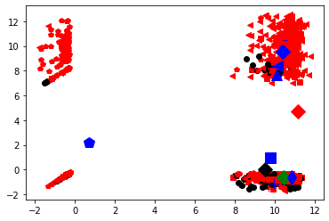
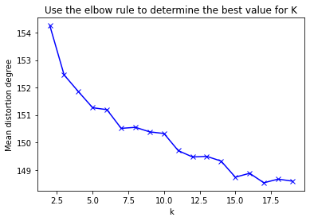
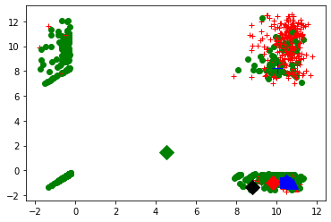

# Programming 1

## 1.a


```python
# import modules

import numpy as np
import pandas as pd
import matplotlib.pyplot as plt
%matplotlib inline
import math
```


```python
# load .npy file

dw_matrix = np.load('data/science2k-doc-word.npy') 

print (dw_matrix)
print (len(dw_matrix))
print (type(dw_matrix))
print (dw_matrix.shape)
```

    [[-0.2521619 -0.2521619  9.36371   ... -0.2521619 -0.2521619 -0.2521619]
     [-0.2875293 -0.2875293  8.229864  ... -0.2875293 -0.2875293 -0.2875293]
     [-0.3634041 -0.3634041  9.252468  ... -0.3634041 -0.3634041 -0.3634041]
     ...
     [10.04846   -0.7713402  9.132197  ... -0.7713402 -0.7713402 -0.7713402]
     [11.00702   -0.8423803 10.38288   ... -0.8423803 -0.8423803 -0.8423803]
     [ 9.710337  -0.7527946  9.556191  ... -0.7527946 -0.7527946 -0.7527946]]
    1373
    <class 'numpy.ndarray'>
    (1373, 5476)


```python
# a-1: implement kmeans 

from numpy import *
import matplotlib.pyplot as plt

# calculate Euclidean distance
def euclidean_distance(vector1, vector2):
	eu_distance = sqrt(sum(power(vector2 - vector1, 2)))
	return eu_distance
 
# init centroids with random samples
def init_entroids(data, k):
	num_samples, dim = data.shape
	centroids = zeros((k, dim))
	for i in range(k):
		idx = int(random.uniform(0, num_samples))
		centroids[i, :] = data[idx, :]
	return centroids
 
# kmeans
def kmeans(data, k):
	num_samples = data.shape[0]

	doc_cluster = mat(zeros((num_samples, 2)))
	cluster_changed = True
 
	# init centroids
	centroids = init_entroids(data, k)
 
	while cluster_changed:
		cluster_changed = False
		for i in range(num_samples):
			min_dist  = 100000.0
			min_idx = 0
			# for each centroid, find the centroid who is closest
			for j in range(k):
				distance = euclidean_distance(centroids[j, :], data[i, :])
				if distance < min_dist:
					min_dist  = distance
					min_idx = j
			
			# update its cluster
			if doc_cluster[i, 0] != min_idx:
				cluster_changed = True
				doc_cluster[i, :] = min_idx, min_dist**2
 
		# update centroids
		for j in range(k):
			points_incluster = data[nonzero(doc_cluster[:, 0].A == j)[0]]
			centroids[j, :] = mean(points_incluster, axis = 0)
 
	return centroids, doc_cluster

# plot the cluster 
def show_cluster(data, k, centroids, doc_cluster):
	num_samples, dim = data.shape
	if dim != 5476:
		return 1
 
	marks = ['or', 'ob', 'og', 'ok', '^r', '+r', 'sr', 'dr', '<r', 'pr','or', 'ob', 'og', 'ok', '^r', '+r', 'sr', 'dr', '<r', 'pr']
	if k > len(marks):
		return 1
 
	# plot all samples
	for i in range(num_samples):
		mark_idx = int(doc_cluster[i, 0])
		plt.plot(data[i, 0], data[i, 1], marks[mark_idx])
 
	marks = ['Dr', 'Db', 'Dg', 'Dk', '^b', '+b', 'sb', 'db', '<b', 'pb','Dr', 'Db', 'Dg', 'Dk', '^b', '+b', 'sb', 'db', '<b', 'pb']
	# draw the centroids
	for i in range(k):
		plt.plot(centroids[i, 0], centroids[i, 1], marks[i], markersize = 12)
 
	plt.show()
```


```python
# Run the model
## clustering, k=10
data = mat(dw_matrix)
k = 10
centroids, doc_cluster = kmeans(data, k)

## plot
show_cluster(data, k, centroids, doc_cluster)
```





```python
# a-2: Select the best value for k

from sklearn.cluster import KMeans
from sklearn import metrics
from scipy.spatial.distance import cdist
import matplotlib.pyplot as plt

K = range(2, 20)
meandistortions = []

X = mat(dw_matrix)

for k in K:
    kmeans = KMeans(n_clusters=k)
    kmeans.fit(X)
    meandistortions.append(sum(np.min(cdist(X, kmeans.cluster_centers_, 'euclidean'), axis=1)) / X.shape[0])

plt.plot(K, meandistortions, 'bx-')
plt.xlabel('k')
plt.ylabel(u'Mean distortion degree')
plt.title(u'Use the elbow rule to determine the best value for K');
plt.show()
```





```python
# a-3: Run the model

## clustering
## set k=7, because according to elbow rule, we can see that in the process of K value increasing, the K value corresponding to the position where the improvement effect of average distortion degree decreases the most is 7.

data = mat(dw_matrix)
k = 7
centroids, doc_cluster = kmeans(data, k)

## plot
show_cluster(data, k, centroids, doc_cluster)
```





```python
# central points
print (centroids)
print (len(centroids))
print (type(centroids))
print (centroids.shape)

# labels 
print (doc_cluster)
print (len(doc_cluster))
print (type(doc_cluster))
print (doc_cluster.shape)

labels = doc_cluster[:,0]
labels = list(map(int,labels))
print (labels[:20])

cls = set(labels)
print ("clusters:", cls)
```

    [[ 9.807132   -1.012666    9.114005   ... -1.012666   -1.012666
      -1.012666  ]
     [10.46259    -0.8878248   9.421161   ... -0.8878248  -0.8878248
      -0.8878248 ]
     [ 4.53212466  1.47859304  8.96488063 ... -0.49527608 -0.56887007
      -0.47825439]
     ...
     [10.77862    -1.08089     9.627346   ... -1.08089    -1.08089
      -1.08089   ]
     [10.02691817  8.2438794   9.13370419 ... -0.51721605 -0.6103251
      -0.79039602]
     [10.45232    -0.9552607   9.6414     ... -0.9552607  -0.9552607
      -0.9552607 ]]
    7
    <class 'numpy.ndarray'>
    (7, 5476)
    [[2.00000000e+00 2.11885050e+04]
     [2.00000000e+00 2.22859889e+04]
     [2.00000000e+00 2.44449395e+04]
     ...
     [5.00000000e+00 4.20898259e+04]
     [2.00000000e+00 4.61358903e+04]
     [2.00000000e+00 4.30799672e+04]]
    1373
    <class 'numpy.matrix'>
    (1373, 2)
    [2, 2, 2, 2, 2, 2, 2, 2, 2, 2, 2, 2, 2, 2, 2, 2, 2, 2, 2, 5]
    clusters: {0, 1, 2, 3, 4, 5, 6}


```python
# a-4: Report top 10 words in each cluster

import heapq

# calculate x_average 
x_avg = np.mean(dw_matrix, axis=0)

vocab_df = pd.read_csv("data/science2k-vocab.txt", header=None)
vocab_array = np.array(vocab_df) 
vocabs = vocab_array.tolist()
#print (vocabs[:20])
#print (len(vocabs))

def cal_cn_idx_list(n):
    i = 0
    cn = []
    cn_idx_list = []
    for p in labels:
        if p == n:
            doc = dw_matrix[i]
            cn.append(doc)
            cn_idx_list.append(i)

            if i >= len(labels)-1:
                break
        i = i + 1
    #print (cn_idx_list)
    return cn_idx_list,cn

print ("------Top 10 words in each cluster------")

for n in cls:
    cn_idx_list,cn = cal_cn_idx_list(n)
    cn_matrix = np.array(cn)
    cn_mean_matrix = np.mean(cn_matrix, axis=0)
    
    cn_sig_matrix = cn_mean_matrix - x_avg 
    cn_sig_list = cn_sig_matrix.tolist()
    
    # top 10 largest numbers
    max_idx = map(cn_sig_list.index, heapq.nlargest(10, cn_sig_list))
    max_idx_list = list(max_idx)
    #print(list(max_idx_list))
    
    # report top 10 words
    top_word_list = []
    for m in max_idx_list:
        top_word = vocabs[m]
        top_word_list.append(top_word)
    print ("Cluster",n,":")
    print (top_word_list)
```

    ------Top 10 words in each cluster------
    Cluster 0 :
    [['eros'], ['solar'], ['kev'], ['sun'], ['elemental'], ['ratios'], ['asteroid'], ['ray'], ['ordinary'], ['detector']]
    Cluster 1 :
    [['coherence'], ['extinction'], ['patch'], ['dispersal'], ['coherent'], ['probabilities'], ['patches'], ['oscillations'], ['criteria'], ['probability']]
    Cluster 2 :
    [['years'], ['year'], ['scientists'], ['world'], ['researchers'], ['says'], ['field'], ['mail'], ['million'], ['focus']]
    Cluster 3 :
    [['co2'], ['terrestrial'], ['carbon'], ['ocean'], ['ecosystems'], ['atmospheric'], ['nitrogen'], ['oceans'], ['sink'], ['interglacial']]
    Cluster 4 :
    [['spectral'], ['longitude'], ['wavelengths'], ['spectra'], ['band'], ['wavelength'], ['incident'], ['kilometers'], ['elongated'], ['images']]
    Cluster 5 :
    [['protein'], ['cell'], ['cells'], ['expression'], ['proteins'], ['fig'], ['gene'], ['specific'], ['binding'], ['expressed']]
    Cluster 6 :
    [['titans'], ['clouds'], ['methane'], ['spectra'], ['cloud'], ['altitude'], ['atmosphere'], ['albedo'], ['flux'], ['saturated']]


```python
# a-5: Report the top ten documents that fall closest to each cluster center

title_df = pd.read_csv("data/science2k-titles.txt", header=None)
title_array = np.array(title_df) 
titles = title_array.tolist()
#print (titles[:20])
#print (len(titles))

def get_distances(n):
    cn_idx_list,cn = cal_cn_idx_list(n)
    cn_matrix = np.array(cn)
    cn_mean_matrix = np.mean(cn_matrix, axis=0)
    distances = []  
    for j in range(len(cn)):
        distances.append(euclidean_distance(cn[j], cn_mean_matrix))
    return distances

print ("------Top 10 documents that fall closest to each cluster center------")

for n in cls:
    cn_distances = get_distances(n)
    #print (len(cn_distances))
    #print (cn_distances)
    
    # top 10 smallest distances in each cluster
    min_idx = map(cn_distances.index, heapq.nsmallest(10, cn_distances))
    min_idx_list = list(min_idx)
    #print(list(min_idx_list))
    
    # report top 10 documents in each cluster
    top_doc_list = []
    for m in min_idx_list:
        top_doc = titles[m]
        top_doc_list.append(top_doc)
    print ("Cluster",n,":")
    print (top_doc_list)
```

    ------Top 10 documents that fall closest to each cluster center------
    Cluster 0 :
    [['Archaeology in the Holy Land']]
    Cluster 1 :
    [['Archaeology in the Holy Land']]
    Cluster 2 :
    [['Similar Requirements of a Plant Symbiont and a Mammalian Pathogen for Prolonged Intracellular Survival'], ['A Deluge of Patents Creates Legal Hassles for Research'], ['Childhood Cancer'], ['Trojan Horses'], ['An Integrative Science Finds a Home'], ['An Integrative Science Finds a Home'], ['An Integrative Science Finds a Home'], ['Archaeology in the Holy Land'], ['Close Encounters: Details Veto Depth from Shadows'], ['Thermal, Catalytic, Regiospecific Functionalization of Alkanes']]
    Cluster 3 :
    [['Archaeology in the Holy Land']]
    Cluster 4 :
    [['Archaeology in the Holy Land'], ["Baedeker's Guide, or Just Plain 'Trouble'?"]]
    Cluster 5 :
    [['Reforming the Patent System'], ["On the Hunt for a Wolf in Sheep's Clothing"], ['Is Bigger Better in Cricket?'], ['Was Lamarck Just a Little Bit Right?'], ['Hydrogen Storage in Nanotubes'], ['When Pharma Merges, R&D Is the Dowry'], ['Superplastic Extensibility of Nanocrystalline Copper at Room Temperature'], ['Coupling of Stress in the ER to Activation of JNK Protein Kinases by Transmembrane Protein Kinase IRE1'], ['Mice Are Not Furry Petri Dishes'], ['<latex>$H_3^+$</latex>-an Ion with Many Talents']]
    Cluster 6 :
    [['Archaeology in the Holy Land']]


### a-6

Comment on these results. 

1.What has the algorithm captured? 

- This algorithm mainly captures the topic information. It clusters documents, helps to get the relevant documents for each cluster center. From this, we can know which documents belong to the same topic.

2.How might such an algorithm be useful?

- This algorithm can be applied to document classification/topic clustering. By using it, we can know what topic a document belongs to and which documents belong to the same topic. 
- Through the Top 10 words, we can know the key words in certain topics. Through the top 10 documents, we can find the documents that are most relevant to a certain topic.
