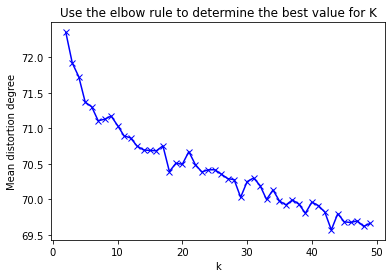

#### 1.b


```python
# import modules

import numpy as np
import pandas as pd
import matplotlib.pyplot as plt
%matplotlib inline
import math
```


```python
# load .npy file

dw_matrix = np.load('data/science2k-word-doc.npy') 

print (dw_matrix)
print (len(dw_matrix))
print (type(dw_matrix))
print (dw_matrix.shape)
```

    [[-6.755691   -6.755691   -6.755691   ...  4.064107    5.093713
       3.707441  ]
     [-4.028205   -4.028205   -4.028205   ... -4.028205   -4.028205
      -4.028205  ]
     [-0.03370464 -1.132184   -0.03370464 ...  0.2539608   1.57568
       0.6594092 ]
     ...
     [-0.1301101  -0.1301101  -0.1301101  ... -0.1301101  -0.1301101
      -0.1301101 ]
     [-0.05128021 -0.05128021 -0.05128021 ... -0.05128021 -0.05128021
      -0.05128021]
     [-0.06441435 -0.06441435 -0.06441435 ... -0.06441435 -0.06441435
      -0.06441435]]
    5476
    <class 'numpy.ndarray'>
    (5476, 1373)


```python
# b-1: implement kmeans 

from numpy import *
import matplotlib.pyplot as plt

# calculate Euclidean distance
def euclidean_distance(vector1, vector2):
	eu_distance = sqrt(sum(power(vector2 - vector1, 2)))
	return eu_distance
 
# init centroids with random samples
def init_entroids(data, k):
	num_samples, dim = data.shape
	centroids = zeros((k, dim))
	for i in range(k):
		idx = int(random.uniform(0, num_samples))
		centroids[i, :] = data[idx, :]
	return centroids
 
# kmeans
def kmeans(data, k):
	num_samples = data.shape[0]

	doc_cluster = mat(zeros((num_samples, 2)))
	cluster_changed = True
 
	# init centroids
	centroids = init_entroids(data, k)
 
	while cluster_changed:
		cluster_changed = False
		for i in range(num_samples):
			min_dist  = 100000.0
			min_idx = 0
			# for each centroid, find the centroid who is closest
			for j in range(k):
				distance = euclidean_distance(centroids[j, :], data[i, :])
				if distance < min_dist:
					min_dist  = distance
					min_idx = j
			
			# update its cluster
			if doc_cluster[i, 0] != min_idx:
				cluster_changed = True
				doc_cluster[i, :] = min_idx, min_dist**2
 
		# update centroids
		for j in range(k):
			points_incluster = data[nonzero(doc_cluster[:, 0].A == j)[0]]
			centroids[j, :] = mean(points_incluster, axis = 0)
 
	return centroids, doc_cluster

# plot the cluster 
def show_cluster(data, k, centroids, doc_cluster):
	num_samples, dim = data.shape
	if dim != 5476:
		return 1
 
	marks = ['or', 'ob', 'og', 'ok', '^r', '+r', 'sr', 'dr', '<r', 'pr','or', 'ob', 'og', 'ok', '^r', '+r', 'sr', 'dr', '<r', 'pr']
	if k > len(marks):
		return 1
 
	# plot all samples
	for i in range(num_samples):
		mark_idx = int(doc_cluster[i, 0])
		plt.plot(data[i, 0], data[i, 1], marks[mark_idx])
 
	marks = ['Dr', 'Db', 'Dg', 'Dk', '^b', '+b', 'sb', 'db', '<b', 'pb','Dr', 'Db', 'Dg', 'Dk', '^b', '+b', 'sb', 'db', '<b', 'pb']
	# draw the centroids
	for i in range(k):
		plt.plot(centroids[i, 0], centroids[i, 1], marks[i], markersize = 12)
 
	plt.show()
```


```python
# b-2: Select the best value for k

from sklearn.cluster import KMeans
from sklearn import metrics
from scipy.spatial.distance import cdist
import matplotlib.pyplot as plt

K = range(2, 50)
meandistortions = []

X = mat(dw_matrix)

for k in K:
    kmeans = KMeans(n_clusters=k)
    kmeans.fit(X)
    meandistortions.append(sum(np.min(cdist(X, kmeans.cluster_centers_, 'euclidean'), axis=1)) / X.shape[0])

plt.plot(K, meandistortions, 'bx-')
plt.xlabel('k')
plt.ylabel(u'Mean distortion degree')
plt.title(u'Use the elbow rule to determine the best value for K');
plt.show()
```





```python
# b-3: Run the model
## clustering
## set k=29, because according to elbow rule, we can see that in the process of K value increasing, the K value corresponding to the position where the improvement effect of average distortion degree decreases the most is 29.

data = mat(dw_matrix)
k = 29
centroids, doc_cluster = kmeans(data, k)

## plot
show_cluster(data, k, centroids, doc_cluster)
```


    1


```python
# central points
print (centroids)
print (len(centroids))
print (type(centroids))
print (centroids.shape)

# labels 
print (doc_cluster)
print (len(doc_cluster))
print (type(doc_cluster))
print (doc_cluster.shape)

labels = doc_cluster[:,0]
labels = list(map(int,labels))
print (labels[:20])

cls = set(labels)
print ("clusters:", cls)
```

    [[-0.18002037 -0.1617278  -0.11142196 ...  0.09050765  0.19292803
       0.18388448]
     [-2.836106   -2.836106   -2.836106   ... -2.836106   -2.836106
       5.681287  ]
     [-0.62982567 -0.61657324 -0.46394096 ...  0.11452273 -0.34449929
      -0.38625112]
     ...
     [-3.18032    -3.18032    -0.96434087 ... -2.11564588 -1.05097175
      -2.029015  ]
     [-1.32743722 -1.60219184 -1.32743722 ... -1.30508087 -0.98561187
      -0.75557164]
     [-0.4221642  -0.4221642  -0.4221642  ... -0.4221642  -0.4221642
      -0.4221642 ]]
    29
    <class 'numpy.ndarray'>
    (29, 1373)
    [[2.40000000e+01 2.82920211e+04]
     [2.60000000e+01 2.36386680e+04]
     [0.00000000e+00 0.00000000e+00]
     ...
     [0.00000000e+00 0.00000000e+00]
     [0.00000000e+00 0.00000000e+00]
     [0.00000000e+00 0.00000000e+00]]
    5476
    <class 'numpy.matrix'>
    (5476, 2)
    [24, 26, 0, 20, 0, 26, 24, 26, 11, 0, 2, 0, 0, 24, 27, 24, 24, 26, 4, 4]
    clusters: {0, 1, 2, 3, 4, 5, 6, 7, 8, 9, 10, 11, 12, 13, 14, 15, 16, 17, 18, 19, 20, 21, 22, 23, 24, 25, 26, 27, 28}


```python
# b-4: Report top 10 documents in each cluster

import heapq

# calculate x_average 
x_avg = np.mean(dw_matrix, axis=0)

title_df = pd.read_csv("data/science2k-titles.txt", header=None)
title_array = np.array(title_df) 
titles = title_array.tolist()
#print (titles[:20])
#print (len(titles))

def cal_cn_idx_list(n):
    i = 0
    cn = []
    cn_idx_list = []
    for p in labels:
        if p == n:
            doc = dw_matrix[i]
            cn.append(doc)
            cn_idx_list.append(i)

            if i >= len(labels)-1:
                break
        i = i + 1
    #print (cn_idx_list)
    return cn_idx_list,cn

print ("------Top 10 documents------")

for n in cls:
    cn_idx_list,cn = cal_cn_idx_list(n)
    cn_matrix = np.array(cn)
    cn_mean_matrix = np.mean(cn_matrix, axis=0)
    
    cn_sig_matrix = cn_mean_matrix - x_avg 
    cn_sig_list = cn_sig_matrix.tolist()
    
    # top 10 largest numbers
    max_idx = map(cn_sig_list.index, heapq.nlargest(10, cn_sig_list))
    max_idx_list = list(max_idx)
    #print(list(max_idx_list))
    
    # report top 10 documents
    top_word_list = []
    for m in max_idx_list:
        top_word = titles[m]
        top_word_list.append(top_word)
    print ("Cluster",n,":")
    print (top_word_list)
```

    ------Top 10 documents------
    Cluster 0 :
    [['National Academy of Sciences Elects New Members'], ['Biological Control of Invading Species'], ['Scientists at Brookhaven'], ['Corrections and Clarifications: Timing the Ancestor of the HIV-1 Pandemic Strains'], ['Corrections and Clarifications: Timing the Ancestor of the HIV-1 Pandemic Strains'], ['Corrections and Clarifications: Marking Time for a Kingdom'], ['Corrections and Clarifications: Marking Time for a Kingdom'], ['Corrections and Clarifications: Marking Time for a Kingdom'], ['Corrections and Clarifications: One Hundred Years of Quantum Physics'], ['Corrections and Clarifications: One Hundred Years of Quantum Physics']]
    Cluster 1 :
    [['Global Biodiversity Scenarios for the Year 2100'], ['Proximity of Chromosomal Loci That Participate in Radiation-Induced Rearrangements in Human Cells'], ['Mate Selection and the Evolution of Highly Polymorphic Self/Nonself Recognition Genes'], ['Population Dynamical Consequences of Climate Change for a Small Temperate Songbird'], ['Intersubband Electroluminescence from Silicon-Based Quantum Cascade Structures'], ['On the Origin of Internal Structure of Word Forms'], ['Evidence for Superfluidity in Para-Hydrogen Clusters inside Helium-4 Droplets at 0.15 Kelvin'], ['Real-Space Imaging of Two-Dimensional Antiferromagnetism on the Atomic Scale'], ['Scanometric DNA Array Detection with Nanoparticle Probes'], ['The Evolutionary Fate and Consequences of Duplicate Genes']]
    Cluster 2 :
    [['Central Role for G Protein-Coupled Phosphoinositide 3-Kinase g in Inflammation'], ['Function of PI3Kg in Thymocyte Development, T Cell Activation, and Neutrophil Migration'], ['Noxa, a BH3-Only Member of the Bcl-2 Family and Candidate Mediator of p53-Induced Apoptosis'], ['Kinesin Superfamily Motor Protein KIF17 and mLin-10 in NMDA Receptor-Containing Vesicle Transport'], ['Requirement of JNK for Stress-Induced Activation of the Cytochrome c-Mediated Death Pathway'], ['Requirement for RORg in Thymocyte Survival and Lymphoid Organ Development'], ['Immune Inhibitory Receptors'], ['Role of the Mouse ank Gene in Control of Tissue Calcification and Arthritis'], ['An Oral Vaccine against NMDAR1 with Efficacy in Experimental Stroke and Epilepsy'], ['Ubiquitin Protein Ligase Activity of IAPs and Their Degradation in Proteasomes in Response to Apoptotic Stimuli']]
    Cluster 3 :
    [['DNA Damage-Induced Activation of p53 by the Checkpoint Kinase Chk2'], ['Timing the Radiations of Leaf Beetles: Hispines on Gingers from Latest Cretaceous to Recent'], ['Rapid Destruction of Human Cdc25A in Response to DNA Damage'], ['Resonant Formation of DNA Strand Breaks by Low-Energy (3 to 20 eV) Electrons'], ['Northridge Earthquake Damage Caused by Geologic Focusing of Seismic Waves'], ['Radiation Tolerance of Complex Oxides'], ['Heightened Odds of Large Earthquakes near Istanbul: An Interaction-Based Probability Calculation'], ['A Sense of the End'], ['Stem Cells in Epithelial Tissues'], ['Response to RAG-Mediated V(D)J Cleavage by NBS1 and g-H2AX']]
    Cluster 4 :
    [['A Mouse Chronology'], ['Meltdown on Long Island'], ['Atom-Scale Research Gets Real'], ['Presidential Forum: Gore and Bush Offer Their Views on Science'], ['Help Needed to Rebuild Science in Yugoslavia'], ["I'd like to See America Used as a Global Lab"], ["Silent No Longer: 'Model Minority' Mobilizes"], ["Soft Money's Hard Realities"], ['Ecologists on a Mission to Save the World'], ['Clones: A Hard Act to Follow']]
    Cluster 5 :
    [['Retinal Stem Cells in the Adult Mammalian Eye'], ['Mammalian Neural Stem Cells'], ['From Marrow to Brain: Expression of Neuronal Phenotypes in Adult Mice'], ['Out of Eden: Stem Cells and Their Niches'], ['Turning Blood into Brain: Cells Bearing Neuronal Antigens Generated in Vivo from Bone Marrow'], ['The Genetic Program of Hematopoietic Stem Cells'], ['Genomic Analysis of Gene Expression in C. elegans'], ['The Initial Domestication of Goats (Capra hircus) in the Zagros Mountains 10,000 Years Ago'], ['The Osteoblast: A Sophisticated Fibroblast under Central Surveillance'], ['Allosteric Effects of Pit-1 DNA Sites on Long-Term Repression in Cell Type Specification']]
    Cluster 6 :
    [['Principles for Human Gene Therapy Studies'], ['Oxidative Damage Linked to Neurodegeneration by Selective a-Synuclein Nitration in Synucleinopathy Lesions'], ['Synapses Call the Shots'], ['Of Chimps and Men'], ['Quantized Phonon Spectrum of Single-Wall Carbon Nanotubes'], ['Information Technology Takes a Different Tack'], ['Mothers Setting Boundaries'], ['L1 Retrotransposons Shape the Mammalian Genome'], ['Fossils Come to Life in Mexico'], ['Requirement of the RNA Editing Deaminase ADAR1 Gene for Embryonic Erythropoiesis']]
    Cluster 7 :
    [['An Orientational Transition of Bent-Core Molecules in an Anisotropic Matrix'], ['Molecular Identification of a Taste Receptor Gene for Trehalose in Drosophila'], ['Multidecadal Changes in the Vertical Temperature Structure of the Tropical Troposphere'], ['Coherent High- and Low-Latitude Climate Variability during the Holocene Warm Period'], ['Quantum Criticality: Competing Ground States in Low Dimensions'], ['Rapid Changes in the Hydrologic Cycle of the Tropical Atlantic during the Last Glacial'], ['Quantum Dots as Tunable Kondo Impurities'], ['The Mouse House as a Recruiting Tool'], ['Epitopes Involved in Antibody-Mediated Protection from Ebola Virus'], ['Tracing the Origins of Salmonella Outbreaks']]
    Cluster 8 :
    [['Rapid Extragranular Plasticity in the Absence of Thalamocortical Plasticity in the Developing Primary Visual Cortex'], ['Proximity of Chromosomal Loci That Participate in Radiation-Induced Rearrangements in Human Cells'], ['The Internet of Tomorrow'], ["Detection of SO in Io's Exosphere"], ['The Structural Basis of Ribosome Activity in Peptide Bond Synthesis'], ['How Snapping Shrimp Snap: Through Cavitating Bubbles'], ['Learning-Induced LTP in Neocortex'], ['Heretical Idea Faces Its Sternest Test'], ['Cantilever Tales'], ['Single Photons on Demand']]
    Cluster 9 :
    [['How Cells Handle Cholesterol'], ['Ethanol-Induced Apoptotic Neurodegeneration and Fetal Alcohol Syndrome'], ['Molecular Evidence for the Early Evolution of Photosynthesis'], ['Direct Targeting of Light Signals to a Promoter Element-Bound Transcription Factor'], ['Architecture of RNA Polymerase II and Implications for the Transcription Mechanism'], ['Structural Evidence for Evolution of the b/a Barrel Scaffold by Gene Duplication and Fusion'], ['Timing the Ancestor of the HIV-1 Pandemic Strains'], ['The Structural Basis of Ribosome Activity in Peptide Bond Synthesis'], ['Noxa, a BH3-Only Member of the Bcl-2 Family and Candidate Mediator of p53-Induced Apoptosis'], ['Calcium Sensitivity of Glutamate Release in a Calyx-Type Terminal']]
    Cluster 10 :
    [['Diversity and Dynamics of Dendritic Signaling'], ['Actin-Based Plasticity in Dendritic Spines'], ['Dopaminergic Loss and Inclusion Body Formation in a-Synuclein Mice: Implications for Neurodegenerative Disorders'], ['Untangling Dendrites with Quantitative Models'], ['Functional Requirement for Class I MHC in CNS Development and Plasticity'], ['Turning Blood into Brain: Cells Bearing Neuronal Antigens Generated in Vivo from Bone Marrow'], ['Breaking down Scientific Barriers to the Study of Brain and Mind'], ['Neuronal Plasticity: Increasing the Gain in Pain'], ['Response of Schwann Cells to Action Potentials in Development'], ['Kinesin Superfamily Motor Protein KIF17 and mLin-10 in NMDA Receptor-Containing Vesicle Transport']]
    Cluster 11 :
    [['Status and Improvements of Coupled General Circulation Models'], ['Sedimentary Rocks of Early Mars'], ['Climate Extremes: Observations, Modeling, and Impacts'], ["A 22,000-Year Record of Monsoonal Precipitation from Northern Chile's Atacama Desert"], ['Causes of Climate Change over the past 1000 Years'], ['Rapid Changes in the Hydrologic Cycle of the Tropical Atlantic during the Last Glacial'], ['Internal Structure and Early Thermal Evolution of Mars from Mars Global Surveyor Topography and Gravity'], ['Climate Impact of Late Quaternary Equatorial Pacific Sea Surface Temperature Variations'], ['Coherent High- and Low-Latitude Climate Variability during the Holocene Warm Period'], ['Is El Nino Changing?']]
    Cluster 12 :
    [["Patients' Voices: The Powerful Sound in the Stem Cell Debate"], ['Warming of the World Ocean'], ['A Lifelong Fascination with the Chick Embryo'], ['Rapid Evolution of Reproductive Isolation in the Wild: Evidence from Introduced Salmon'], ['National Academy of Sciences Elects New Members'], ['Trans-Pacific Air Pollution'], ['Scientists at Brookhaven'], ['Does Science Drive the Productivity Train?'], ['Clinical Research'], ['Corrections and Clarifications: Luzia Is Not Alone']]
    Cluster 13 :
    [['Mechanism of ATP-Dependent Promoter Melting by Transcription Factor IIH'], ['b-Arrestin 2: A Receptor-Regulated MAPK Scaffold for the Activation of JNK3'], ['Role for Rapid Dendritic Protein Synthesis in Hippocampal mGluR-Dependent Long-Term Depression'], ['Interacting Molecular Loops in the Mammalian Circadian Clock'], ["Packard Heir Signs up for National 'Math Wars'"], ['Virus-Induced Neuronal Apoptosis Blocked by the Herpes Simplex Virus Latency-Associated Transcript'], ['Transgenic Mouse Model of Stunned Myocardium'], ['Interconnected Feedback Loops in the Neurospora Circadian System'], ['Inhibition of Adipogenesis by Wnt Signaling'], ['An Inherited Functional Circadian Clock in Zebrafish Embryos']]
    Cluster 14 :
    [['N-Cadherin, a Cell Adhesion Molecule Involved in Establishment of Embryonic Left-Right Asymmetry'], ['Transgenic Mouse Model of Stunned Myocardium'], ['Nota Bene: Contortions of the Heart'], ['Cardiovascular Evidence for an Intermediate or Higher Metabolic Rate in an Ornithischian Dinosaur'], ['Resetting of Circadian Time in Peripheral Tissues by Glucocorticoid Signaling'], ['NIH, under Pressure, Boosts Minority Health Research'], ['Generalized Potential of Adult Neural Stem Cells'], ['New Age Semiconductors Pick up the Pace'], ["Stress: The Invisible Hand in Eastern Europe's Death Rates"], ['Role of Adenine Nucleotide Translocator 1 in mtDNA Maintenance']]
    Cluster 15 :
    [['Emerging Infectious Diseases of Wildlife-Threats to Biodiversity and Human Health'], ['A Tale of Two Futures: HIV and Antiretroviral Therapy in San Francisco'], ['Predictions of Biodiversity Response to Genetically Modified Herbicide-Tolerant Crops'], ['A Tale of Two Selves'], ['Origins of HIV'], ['Fairness versus Reason in the Ultimatum Game'], ['One Sequence, Two Ribozymes: Implications for the Emergence of New Ribozyme Folds'], ['Reversal of Antipsychotic-Induced Working Memory Deficits by Short-Term Dopamine D1 Receptor Stimulation'], ['Potent Analgesic Effects of GDNF in Neuropathic Pain States'], ['AIDS in a New Millennium']]
    Cluster 16 :
    [["Evidence for Crystalline Water and Ammonia Ices on Pluto's Satellite Charon"], ['Mount St. Helens, Master Teacher'], ['Atomic Layer Deposition of Oxide Thin Films with Metal Alkoxides as Oxygen Sources'], ['Dynamics of the Pacific-North American Plate Boundary in the Western United States'], ['Discovery of a Transient Absorption Edge in the X-ray Spectrum of GRB 990705'], ['Differential Clustering of CD4 and CD3z during T Cell Recognition'], ['Memory-A Century of Consolidation'], ['Motility Powered by Supramolecular Springs and Ratchets'], ['Response of Schwann Cells to Action Potentials in Development'], ['Piecing Together the Biggest Puzzle of All']]
    Cluster 17 :
    [['An Arresting Start for MAPK'], ["CERN's Gamble Shows Perils, Rewards of Playing the Odds"], ["Outrageous Events: Don't Count Them out"], ['Mechanism of ATP-Dependent Promoter Melting by Transcription Factor IIH'], ['A Wetter, Younger Mars Emerging'], ['Rapid Extragranular Plasticity in the Absence of Thalamocortical Plasticity in the Developing Primary Visual Cortex'], ['Rounding out Solutions to Three Conjectures'], ['On the Origin of Internal Structure of Word Forms'], ['Alternative Views on Alternative Medicine'], ["Candida's Arranged Marriage"]]
    Cluster 18 :
    [['Mode-Specific Energy Disposal in the Four-Atom Reaction <latex>$OH + D_2 \\rightarrow HOD + D$</latex>'], ['A Short Fe-Fe Distance in Peroxodiferric Ferritin: Control of Fe Substrate versus Cofactor Decay?'], ['The Evolutionary Fate and Consequences of Duplicate Genes'], ["Fermat's Last Theorem's First Cousin"], ['Social Mentalizing Abilities in Mental Patients'], ['Nonavian Feathers in a Late Triassic Archosaur'], ['Nonbiological Fractionation of Iron Isotopes'], ['A Cyclic Carbanionic Valence Isomer of a Carbocation: Diphosphino Analogs of Diaminocarbocations'], ['Mechanisms of Ordering in Striped Patterns'], ['Bioinformatics in the Information Age']]
    Cluster 19 :
    [['Uptake of Glutamate into Synaptic Vesicles by an Inorganic Phosphate Transporter'], ['Gatekeepers of the Nucleus'], ['VirB/D4-Dependent Protein Translocation from Agrobacterium into Plant Cells'], ['Structure of the Light-Driven Chloride Pump Halorhodopsin at 1.8 <latex>$\\AA$</latex> Resolution'], ['Rab1 Recruitment of p115 into a cis-SNARE Complex: Programming Budding COPII Vesicles for Fusion'], ['Connectivity of Marine Populations: Open or Closed?'], ['How Cells Handle Cholesterol'], ['Trans-Pacific Air Pollution'], ['Transmembrane Molecular Pump Activity of Niemann-Pick C1 Protein'], ['The Influence of Canadian Forest Fires on Pollutant Concentrations in the United States']]
    Cluster 20 :
    [['Crystal Structure of the Ribonucleoprotein Core of the Signal Recognition Particle'], ['The Complete Atomic Structure of the Large Ribosomal Subunit at 2.4 <latex>$\\AA$</latex> Resolution'], ['Three-Dimensional Structure of the Tn5 Synaptic Complex Transposition Intermediate'], ['The Structural Basis of Ribosome Activity in Peptide Bond Synthesis'], ['Architecture of RNA Polymerase II and Implications for the Transcription Mechanism'], ['Comparative Genomics of the Eukaryotes'], ['Positional Syntenic Cloning and Functional Characterization of the Mammalian Circadian Mutation tau'], ['The Way Things Move: Looking under the Hood of Molecular Motor Proteins'], ['The Genome Sequence of Drosophila melanogaster'], ['Structure of the RNA Polymerase Domain of E. coli Primase']]
    Cluster 21 :
    [['ORCA3, a Jasmonate-Responsive Transcriptional Regulator of Plant Primary and Secondary Metabolism'], ['Psychological and Neural Mechanisms of the Affective Dimension of Pain'], ['The Complete Atomic Structure of the Large Ribosomal Subunit at 2.4 <latex>$\\AA$</latex> Resolution'], ['Green, Catalytic Oxidation of Alcohols in Water'], ['One Sequence, Two Ribozymes: Implications for the Emergence of New Ribozyme Folds'], ['A Structural Model of Transcription Elongation'], ['Template Boundary in a Yeast Telomerase Specified by RNA Structure'], ['Impacts of Climatic Change and Fishing on Pacific Salmon Abundance over the past 300 Years'], ['Evidence for Recent Groundwater Seepage and Surface Runoff on Mars'], ['Calcium-Aluminum-Rich Inclusions from Enstatite Chondrites: Indigenous or Foreign?']]
    Cluster 22 :
    [["Packard Heir Signs up for National 'Math Wars'"], ['Islamic Women in Science'], ['Not (Just) in Kansas Anymore'], ['Graduate Educators Struggle to Grade Themselves'], ['The Spirit of Discovery'], ['Support Grows for British Exercise to Allocate University Funds'], ['Sharp Jump in Teaching Fellows Draws Fire from Educators'], ['Presidential Forum: Gore and Bush Offer Their Views on Science'], ["Iran's Scientists Cautiously Reach out to the World"], ['Scaling up HIV/AIDS Programs to National Coverage']]
    Cluster 23 :
    [['Advances in the Physics of High-Temperature Superconductivity'], ['Quantum Criticality: Competing Ground States in Low Dimensions'], ['Orbital Physics in Transition-Metal Oxides'], ['The Atom-Cavity Microscope: Single Atoms Bound in Orbit by Single Photons'], ["Negative Poisson's Ratios for Extreme States of Matter"], ['Self-Mode-Locking of Quantum Cascade Lasers with Giant Ultrafast Optical Nonlinearities'], ['Generating Solitons by Phase Engineering of a Bose-Einstein Condensate'], ['Imaging Precessional Motion of the Magnetization Vector'], ['Subatomic Features on the Silicon (111)-(7 x 7) Surface Observed by Atomic Force Microscopy'], ['Blue-Fluorescent Antibodies']]
    Cluster 24 :
    [['NEAR at Eros: Imaging and Spectral Results'], ['Climate Extremes: Observations, Modeling, and Impacts'], ['Reduction of Tropical Cloudiness by Soot'], ['Causes of Climate Change over the past 1000 Years'], ['The Atom-Cavity Microscope: Single Atoms Bound in Orbit by Single Photons'], ['High Magma Storage Rates before the 1983 Eruption of Kilauea, Hawaii'], ['Hematopoietic Stem Cell Quiescence Maintained by <latex>$p21^{cip1/waf1}$</latex>'], ['Climate Impact of Late Quaternary Equatorial Pacific Sea Surface Temperature Variations'], ['Internal Structure and Early Thermal Evolution of Mars from Mars Global Surveyor Topography and Gravity'], ['Isotope Fractionation and Atmospheric Oxygen: Implications for Phanerozoic <latex>$O_2$</latex> Evolution']]
    Cluster 25 :
    [['Can Protected Areas Be Expanded in Africa?'], ['Status and Improvements of Coupled General Circulation Models'], ['Surveying the SBIR Program'], ['Tissue Engineers Build New Bone'], ['Interfering with Gene Expression'], ['Corrections and Clarifications: Commercialization of Genetic Research and Public Policy'], ['Corrections and Clarifications: Commercialization of Genetic Research and Public Policy'], ['Thyroid Tumor Banks'], ['Corrections and Clarifications: The Global Spread of Malaria in a Future, Warmer World'], ["Corrections and Clarifications: Fermat's Last Theorem's First Cousin"]]
    Cluster 26 :
    [['Global Analysis of the Genetic Network Controlling a Bacterial Cell Cycle'], ['Mitotic Misregulation and Human Aging'], ['Genes Expressed in Human Tumor Endothelium'], ['Inhibition of Adipogenesis by Wnt Signaling'], ['Interacting Molecular Loops in the Mammalian Circadian Clock'], ['From Marrow to Brain: Expression of Neuronal Phenotypes in Adult Mice'], ['Noxa, a BH3-Only Member of the Bcl-2 Family and Candidate Mediator of p53-Induced Apoptosis'], ['Translocation of C. elegans CED-4 to Nuclear Membranes during Programmed Cell Death'], ['Stat3-Mediated Transformation of NIH-3T3 Cells by the Constitutively Active Q205L <latex>$G\\alpha_o$</latex> Protein'], ['A Subset of Viral Transcripts Packaged within Human Cytomegalovirus Particles']]
    Cluster 27 :
    [['Positional Syntenic Cloning and Functional Characterization of the Mammalian Circadian Mutation tau'], ['The Genome Sequence of Drosophila melanogaster'], ['Gridlock, an HLH Gene Required for Assembly of the Aorta in Zebrafish'], ['Pif1p Helicase, a Catalytic Inhibitor of Telomerase in Yeast'], ['Conservation and Novelty in the Evolution of Cell Adhesion and Extracellular Matrix Genes'], ['Requirement of Mis6 Centromere Connector for Localizing a CENP-A-Like Protein in Fission Yeast'], ['Role of the Mouse ank Gene in Control of Tissue Calcification and Arthritis'], ['Comparative Genomics of the Eukaryotes'], ['Resetting of Circadian Time in Peripheral Tissues by Glucocorticoid Signaling'], ['Accumulation of Dietary Cholesterol in Sitosterolemia Caused by Mutations in Adjacent ABC Transporters']]
    Cluster 28 :
    [['New Observational Constraints for Atmospheric Hydroxyl on Global and Hemispheric Scales'], ['Dimensionality Effects in the Lifetime of Surface States'], ['Forster Energy Transfer in an Optical Microcavity'], ['Quantitative Imaging of Lateral ErbB1 Receptor Signal Propagation in the Plasma Membrane'], ['A Potent Greenhouse Gas Identified in the Atmosphere: $SF_5CF_3$'], ['Why Stem Cells?'], ['Intersubband Electroluminescence from Silicon-Based Quantum Cascade Structures'], ['Blue-Fluorescent Antibodies'], ['Molecules in a Bose-Einstein Condensate'], ['Quantifying Denitrification and Its Effect on Ozone Recovery']]


```python
# b-5: Report the top ten words 

vocab_df = pd.read_csv("data/science2k-vocab.txt", header=None)
vocab_array = np.array(vocab_df) 
vocabs = vocab_array.tolist()
#print (vocabs[:20])
#print (len(vocabs))

def get_distances(n):
    cn_idx_list,cn = cal_cn_idx_list(n)
    cn_matrix = np.array(cn)
    cn_mean_matrix = np.mean(cn_matrix, axis=0)
    distances = []  
    for j in range(len(cn)):
        distances.append(euclidean_distance(cn[j], cn_mean_matrix))
    return distances

print ("------Top 10 words------")

for n in cls:
    cn_distances = get_distances(n)
    #print (len(cn_distances))
    #print (cn_distances)
    
    # top 10 smallest distances in each cluster
    min_idx = map(cn_distances.index, heapq.nsmallest(10, cn_distances))
    min_idx_list = list(min_idx)
    #print(list(min_idx_list))
    
    # report top 10 words
    top_doc_list = []
    for m in min_idx_list:
        top_doc = vocabs[m]
        top_doc_list.append(top_doc)
    print ("Cluster",n,":")
    print (top_doc_list)
```

    ------Top 10 words------
    Cluster 0 :
    [['graduate'], ['cyclin'], ['historical'], ['magnification'], ['switching'], ['radial'], ['apart'], ['digital'], ['stronger'], ['tuning']]
    Cluster 1 :
    [['fig']]
    Cluster 2 :
    [['amount'], ['identical'], ['patterns'], ['cortex'], ['origin'], ['correspondence'], ['estimates'], ['working'], ['thin'], ['voltage']]
    Cluster 3 :
    [['fig']]
    Cluster 4 :
    [['medium'], ['june'], ['spin'], ['united'], ['cellular'], ['century'], ['method'], ['step'], ['helix'], ['increasing']]
    Cluster 5 :
    [['fig'], ['fig']]
    Cluster 6 :
    [['fig'], ['fig']]
    Cluster 7 :
    [['fig']]
    Cluster 8 :
    [['fig']]
    Cluster 9 :
    [['start'], ['vol'], ['www'], ['end'], ['cells'], ['time'], ['data'], ['cell'], ['two'], ['science']]
    Cluster 10 :
    [['cell'], ['data'], ['time'], ['science'], ['two'], ['protein'], ['end'], ['fig'], ['cells']]
    Cluster 11 :
    [['view'], ['band'], ['developed'], ['atoms'], ['chemical'], ['crystal'], ['correspondence'], ['expressed'], ['isolated'], ['oxygen']]
    Cluster 12 :
    [['fig']]
    Cluster 13 :
    [['fig']]
    Cluster 14 :
    [['fig']]
    Cluster 15 :
    [['fig']]
    Cluster 16 :
    [['fig']]
    Cluster 17 :
    [['fig']]
    Cluster 18 :
    [['fig']]
    Cluster 19 :
    [['fig']]
    Cluster 20 :
    [['information'], ['sequences'], ['neurons'], ['point'], ['determined'], ['age'], ['current'], ['addition'], ['activation'], ['expressed']]
    Cluster 21 :
    [['fig']]
    Cluster 22 :
    [['fig']]
    Cluster 23 :
    [['metal'], ['black'], ['chemical'], ['atoms'], ['involved'], ['open'], ['transition'], ['class'], ['components'], ['measurements']]
    Cluster 24 :
    [['science'], ['nature'], ['change'], ['site'], ['specific'], ['studies'], ['molecular'], ['changes'], ['says'], ['long']]
    Cluster 25 :
    [['fig']]
    Cluster 26 :
    [['science'], ['end'], ['cell'], ['cells'], ['fig'], ['protein'], ['data'], ['two']]
    Cluster 27 :
    [['results'], ['university'], ['shown'], ['genes'], ['observed'], ['different'], ['type'], ['expression'], ['high'], ['dna']]
    Cluster 28 :
    [['fig']]


##### b-6

Comment on these results. 

1.How might such an algorithm be useful? 

- This algorithm can be applied to subject retrieval/document retrieval, which is to retrieve documents based on keywords. For example, if I want to search for science fiction documents, I can find the relevant documents by searching for the keyword "science fiction".

2.What is different about clustering terms from clustering documents?

- The difference is that clustering terms can retrieve documents by keywords, but clustering documents cannot retrieve documents by keywords.


