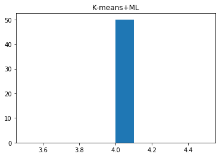

```python
import numpy as np
import matplotlib.pyplot as plt
import math
import random
```

#### 2.(a) Download the Old Faithful Geyser Dataset. The data file contains 272 observations of (eruption time, waiting time). Treat each entry as a 2 dimensional feature vector. Parse and plot all data points on 2-D plane.


```python
Data_list = []
with open("old.txt", 'r') as in_file:
    for line in in_file.readlines():
        point = []
        point.append(float(line.split()[1]))
        point.append(float(line.split()[2]))
        Data_list.append(point)
Data = np.array(Data_list)
eruptions=[]
waiting=[]
for i in range(len(Data)):
    eruptions.append(Data[i][0])
    waiting.append(Data[i][1])

#plot scatter
plt.title('Old Faithful Geyser')
plt.scatter(eruptions, waiting)
plt.xlabel('eruptions')
plt.ylabel('waiting')
plt.show()
```


As can be seen from the scatter plot, the data set has two categories.

#### 2.(b) Implement a bimodal GMM model to fit all data points using EM algorithm. Explain the reasoning behind your termination criteria. For this problem, we assume the covariance matrix is spherical (i.e., it has the form of σ^2I for scalar σ) and you can randomly initialize Gaussian parameters. For evaluation purposes, please submit the following figures:

Since the initial guess of mu and sigma are whole numbers, I set the termination criteria=0.01. When the difference between the two iterations is less than 0.01, it is considered that the parameters no longer change.


```python
parameter_dict = {}
parameter_dict["mu1"] = np.array([0, 0])
parameter_dict["sigma1"] = np.array([[1, 0], [0, 1]])
parameter_dict["mu2"] = np.array([0, 0])
parameter_dict["sigma2"] = np.array([[1, 0], [0, 1]])
parameter_dict["piweight"] = 0.5
parameter_dict["gama_list"] = []
 
 
def set_parameter(mu_1, sigma_1, mu_2, sigma_2, pi_weight):
    parameter_dict["mu1"] = mu_1
    parameter_dict["mu1"].shape = (2, 1)
    parameter_dict["sigma1"] = sigma_1
    parameter_dict["mu2"] = mu_2
    parameter_dict["mu2"].shape = (2, 1)
    parameter_dict["sigma2"] = sigma_2
    parameter_dict["piweight"] = pi_weight
 
 
def PDF(data, mu, sigma):
    
    sigma_sqrt = math.sqrt(np.linalg.det(sigma))  
    sigma_inv = np.linalg.inv(sigma)  
    data.shape = (2, 1)
    mu.shape = (2, 1)
    minus_mu = data - mu
    minus_mu_trans = np.transpose(minus_mu)
    res = (1.0 / (2.0 * math.pi * sigma_sqrt)) * math.exp(
        (-0.5) * (np.dot(np.dot(minus_mu_trans, sigma_inv), minus_mu)))
    return res
 
def E_step(Data):
    sigma_1 = parameter_dict["sigma1"]
    sigma_2 = parameter_dict["sigma2"]
    pw = parameter_dict["piweight"]
    mu_1 = parameter_dict["mu1"]
    mu_2 = parameter_dict["mu2"]
 
    parameter_dict["gama_list"] = []
    for point in Data:
        gama_i = (pw * PDF(point, mu_2, sigma_2)) / (
            (1.0 - pw) * PDF(point, mu_1, sigma_1) + pw * PDF(point, mu_2, sigma_2))
        parameter_dict["gama_list"].append(gama_i)
 
 
def M_step(Data):
    N1 = 0
    N2 = 0
    for i in range(len(parameter_dict["gama_list"])):
        N1 += 1.0 - parameter_dict["gama_list"][i]
        N2 += parameter_dict["gama_list"][i]
 
    new_mu_1 = np.array([0, 0])
    new_mu_2 = np.array([0, 0])
    for i in range(len(parameter_dict["gama_list"])):
        new_mu_1 = new_mu_1 + Data[i] * (1 - parameter_dict["gama_list"][i]) / N1
        new_mu_2 = new_mu_2 + Data[i] * parameter_dict["gama_list"][i] / N2
 

    new_mu_1.shape = (2, 1)
    new_mu_2.shape = (2, 1)
 
    new_sigma_1 = np.array([[0, 0], [0, 0]])
    new_sigma_2 = np.array([[0, 0], [0, 0]])
    for i in range(len(parameter_dict["gama_list"])):
        data_tmp = [0, 0]
        data_tmp[0] = Data[i][0]
        data_tmp[1] = Data[i][1]
        vec_tmp = np.array(data_tmp)
        vec_tmp.shape = (2, 1)
        new_sigma_1 = new_sigma_1 + np.dot((vec_tmp - new_mu_1), (vec_tmp - new_mu_1).transpose()) * (1.0 - parameter_dict["gama_list"][i]) / N1
        new_sigma_2 = new_sigma_2 + np.dot((vec_tmp - new_mu_2), (vec_tmp - new_mu_2).transpose()) * parameter_dict["gama_list"][i] / N2
        # print np.dot((vec_tmp-new_mu_1), (vec_tmp-new_mu_1).transpose())
    new_pi = N2 / len(parameter_dict["gama_list"])
 
    parameter_dict["mu1"] = new_mu_1
    parameter_dict["mu2"] = new_mu_2
    parameter_dict["sigma1"] = new_sigma_1
    parameter_dict["sigma2"] = new_sigma_2
    parameter_dict["piweight"] = new_pi

```


**i). Plot the trajectories of two mean vectors in 2 dimensions (i.e., coordinates vs. iteration).**


```python
#Plot the trajectories
def EM_iterate_trajectories(iter_time, Data, mu_1, sigma_1, mu_2, sigma_2, pi_weight, esp=0.01):
  
    mean_trace_1 = [[], []]
    mean_trace_2 = [[], []]
 
    set_parameter(mu_1, sigma_1, mu_2, sigma_2, pi_weight)
    if iter_time == None:
        while (True):
            old_mu_1 = parameter_dict["mu1"].copy()
            old_mu_2 = parameter_dict["mu2"].copy()
            E_step(Data)
            M_step(Data)
            delta_1 = parameter_dict["mu1"] - old_mu_1
            delta_2 = parameter_dict["mu2"] - old_mu_2
 
            mean_trace_1[0].append(parameter_dict["mu1"][0][0])
            mean_trace_1[1].append(parameter_dict["mu1"][1][0])
            mean_trace_2[0].append(parameter_dict["mu2"][0][0])
            mean_trace_2[1].append(parameter_dict["mu2"][1][0])
            if math.fabs(delta_1[0]) < esp and math.fabs(delta_1[1]) < esp and math.fabs(
                    delta_2[0]) < esp and math.fabs(delta_2[1]) < esp:
                break
    else:
        for i in range(iter_time):
            pass
 
    plt.xlim(xmax=6, xmin=1)
    plt.ylim(ymax=100, ymin=30)
    plt.xlabel("eruptions")
    plt.ylabel("waiting")
    plt.scatter(eruptions, waiting)
    plt.plot(mean_trace_1[0], mean_trace_1[1], 'ro')
    plt.plot(mean_trace_2[0], mean_trace_2[1], 'bo')
    plt.show()
 
def task_1():
    Mu_1 = np.array([3, 60])
    Sigma_1 = np.array([[10, 0], [0, 10]])
    Mu_2 = np.array([1, 30])
    Sigma_2 = np.array([[10, 0], [0, 10]])
    Pi_weight = 0.5
    EM_iterate_trajectories(None, Data, Mu_1, Sigma_1, Mu_2, Sigma_2, Pi_weight)
 
task_1()
```


Choose $\mu_1=[3,60],\mu_2=[1,30],\sigma_1=[[10,0],[0,10]],\sigma_2=[[10,0],[0,10]]$ as the initial input since after observing the scatter plot of the dataset we can see the two $\mu$ we guess is on the left side of the bottom of two categories. Thus, we could see the trajectories clearly and as complete as possible.


**ii). Run your program for 50 times with different initial parameter guesses. Show the distribution of the total number of iterations needed for algorithm to converge.**


```python
#Run the program for 50 times with different initial parameter guesses.
def EM_iterate_times(Data, mu_1, sigma_1, mu_2, sigma_2, pi_weight, esp=0.01):
 
    set_parameter(mu_1, sigma_1, mu_2, sigma_2, pi_weight)
    iter_times = 0
    while (True):
        iter_times += 1
        old_mu_1 = parameter_dict["mu1"].copy()
        old_mu_2 = parameter_dict["mu2"].copy()
        E_step(Data)
        M_step(Data)
        delta_1 = parameter_dict["mu1"] - old_mu_1
        delta_2 = parameter_dict["mu2"] - old_mu_2
        if math.fabs(delta_1[0]) < esp and math.fabs(delta_1[1]) < esp and math.fabs(
                delta_2[0]) < esp and math.fabs(delta_2[1]) < esp:
            break
    return iter_times

def task_2():
    iter_times=0
    try:
        x_11 = random.uniform(0, 4)
        x_12 = random.uniform(30, 70)
        x_21 = random.uniform(2, 6)
        x_22 = random.uniform(50, 100)
        Mu_1 = np.array([x_11, x_12])
        x_31 = random.uniform(1, 20)
        Sigma_1 = np.array([[x_31, 0], [0, x_31]])
        Mu_2 = np.array([x_21, x_22])
        Sigma_2 = np.array([[x_31, 0], [0, x_31]])
        Pi_weight = 0.5
        iter_times = EM_iterate_times(Data, Mu_1, Sigma_1, Mu_2, Sigma_2, Pi_weight)
        print ('mu1=[',x_11,',',x_12,'],mu2=[',x_21,',',x_22,']','total number of iterations=',iter_times)
    except Exception:
        print (Exception)
    return iter_times
 
iteration=[]
for i in range(50):
    iteration.append(task_2())
plt.hist(iteration)
plt.title('GMM')
plt.show


def M_step_1(Data):
    N1 = 0
    N2 = 0
    for i in range(len(parameter_dict["gama_list"])):
        N1 += 1.0 - parameter_dict["gama_list"][i]
        N2 += parameter_dict["gama_list"][i]
 
    new_mu_1 = np.array([0, 0])
    new_mu_2 = np.array([0, 0])
    for i in range(len(parameter_dict["gama_list"])):
        new_mu_1 = new_mu_1 + Data[i] * (1 - parameter_dict["gama_list"][i]) / N1
        new_mu_2 = new_mu_2 + Data[i] * parameter_dict["gama_list"][i] / N2
 

    new_mu_1.shape = (2, 1)
    new_mu_2.shape = (2, 1)
 
    new_sigma_1 = np.array([[0, 0], [0, 0]])
    new_sigma_2 = np.array([[0, 0], [0, 0]])
    for i in range(len(parameter_dict["gama_list"])):
        data_tmp = [0, 0]
        data_tmp[0] = Data[i][0]
        data_tmp[1] = Data[i][1]
        vec_tmp = np.array(data_tmp)
        vec_tmp.shape = (2, 1)
        new_sigma_1 = new_sigma_1 + np.dot((vec_tmp - new_mu_1), (vec_tmp - new_mu_1).transpose()) * (1.0 - parameter_dict["gama_list"][i]) / N1
        new_sigma_2 = new_sigma_2 + np.dot((vec_tmp - new_mu_2), (vec_tmp - new_mu_2).transpose()) * parameter_dict["gama_list"][i] / N2
        # print np.dot((vec_tmp-new_mu_1), (vec_tmp-new_mu_1).transpose())
    new_pi = N2 / len(parameter_dict["gama_list"])
 
    parameter_dict["mu1"] = new_mu_1
    parameter_dict["mu2"] = new_mu_2
    parameter_dict["sigma1"] = new_sigma_1
    parameter_dict["sigma2"] = new_sigma_2
    parameter_dict["piweight"] = new_pi
    covm1=[]
    covm2=[]
    print(new_mu_1)
    print(new_mu_2)
    covm1.append(new_sigma_1[0][0])
    covm1.append(new_sigma_1[1][1])
    covm2.append(new_sigma_2[0][0])
    covm2.append(new_sigma_2[1][1])
    print(covm1)
    print(covm2)
#EM result:center and covariance matrix
E_step(Data)
M_step_1(Data)
```

    mu1=[ 0.1893135405201245 , 35.369020344606255 ],mu2=[ 4.345307785548732 , 64.63663783179955 ] total number of iterations= 15
    mu1=[ 2.221758431528942 , 45.47747359129394 ],mu2=[ 4.0934557777931495 , 53.714273021455675 ] total number of iterations= 15
    mu1=[ 2.8432992305101483 , 31.42269914464936 ],mu2=[ 4.31931126754017 , 83.83778519912337 ] total number of iterations= 10
    mu1=[ 3.094910237592582 , 53.37228667775115 ],mu2=[ 4.619537418786634 , 64.63983267902262 ] total number of iterations= 9
    mu1=[ 0.8719747538166236 , 46.76388076310295 ],mu2=[ 2.005938861877005 , 91.38603886689017 ] total number of iterations= 6
    mu1=[ 0.0845258727660041 , 59.246730062985264 ],mu2=[ 2.49894764043518 , 60.130329127166405 ] total number of iterations= 13
    mu1=[ 2.9629717440087098 , 53.06543041297001 ],mu2=[ 4.555527171270407 , 86.03855911794619 ] total number of iterations= 6
    mu1=[ 1.9769560409458733 , 44.13450566893186 ],mu2=[ 3.041613249704096 , 77.49528397696082 ] total number of iterations= 8
    mu1=[ 1.9968414447742209 , 31.062437605032972 ],mu2=[ 5.274612911990247 , 55.565061254341444 ] total number of iterations= 9
    mu1=[ 2.2803772969098466 , 33.976268025059234 ],mu2=[ 3.8430136950093567 , 76.18116984311325 ] total number of iterations= 11
    mu1=[ 1.1376652390642539 , 45.43551455238631 ],mu2=[ 4.36609105083032 , 84.43625665492587 ] total number of iterations= 3
    mu1=[ 3.6629922126674384 , 46.86452042143449 ],mu2=[ 2.2748867821848564 , 52.294834501504766 ] total number of iterations= 16
    mu1=[ 0.3915060586649006 , 69.2662185623231 ],mu2=[ 3.268545013895078 , 88.83529026087001 ] total number of iterations= 13
    mu1=[ 2.630806312503527 , 39.35272269523833 ],mu2=[ 5.220488801727269 , 52.28495969819305 ] total number of iterations= 17
    mu1=[ 1.7861812550507268 , 35.90250627140895 ],mu2=[ 3.9633365219410694 , 94.03209006667464 ] total number of iterations= 4
    mu1=[ 0.3691169903609919 , 48.44419814390284 ],mu2=[ 5.229180814491622 , 70.2663021636601 ] total number of iterations= 8
    mu1=[ 0.8603210513259905 , 46.90288032657365 ],mu2=[ 4.233308171087751 , 51.212466118429504 ] total number of iterations= 16
    mu1=[ 0.4911690066962877 , 66.02275700646787 ],mu2=[ 2.944335115977025 , 97.9389785646695 ] total number of iterations= 16
    mu1=[ 0.8051782769011528 , 48.5732584441359 ],mu2=[ 2.546086943527769 , 93.16077946406496 ] total number of iterations= 7
    mu1=[ 3.4854843931704442 , 47.73486188316144 ],mu2=[ 5.979177585377549 , 61.28617570938973 ] total number of iterations= 11
    mu1=[ 2.852386438452337 , 36.637774289861255 ],mu2=[ 4.383406686700793 , 71.54195119524215 ] total number of iterations= 12
    mu1=[ 2.0043255070479726 , 36.400725821714545 ],mu2=[ 5.739160437971196 , 73.44246797647395 ] total number of iterations= 11
    mu1=[ 2.6957374475102016 , 31.539154708990512 ],mu2=[ 5.232567282361543 , 84.33006323297006 ] total number of iterations= 10
    mu1=[ 3.3878592670906844 , 38.89144997455178 ],mu2=[ 4.7804473273958 , 63.991090254053475 ] total number of iterations= 14
    mu1=[ 3.513569268511476 , 31.790252280542767 ],mu2=[ 5.613092774672461 , 68.48760949542064 ] total number of iterations= 15
    mu1=[ 0.9846761978958227 , 45.85074014878293 ],mu2=[ 5.893955561355381 , 88.01744812757072 ] total number of iterations= 5
    mu1=[ 1.6084893867380616 , 69.44175084065354 ],mu2=[ 2.099294439324174 , 82.90147379022544 ] total number of iterations= 10
    mu1=[ 2.572486164344156 , 41.12062253180023 ],mu2=[ 2.226112724849305 , 93.70290690390274 ] total number of iterations= 5
    mu1=[ 0.9535833498412507 , 57.176492968114694 ],mu2=[ 5.568121493274575 , 54.1627517305873 ] total number of iterations= 11
    mu1=[ 3.318145031187072 , 42.376800664958765 ],mu2=[ 4.378244151290286 , 74.93711588049547 ] total number of iterations= 9
    mu1=[ 3.049698162970447 , 35.677793710549864 ],mu2=[ 2.777281161152568 , 58.39125094218829 ] total number of iterations= 18
    mu1=[ 0.04830041564780041 , 43.20119999087454 ],mu2=[ 4.820290852579051 , 99.37770639034278 ] total number of iterations= 7
    mu1=[ 2.683818372497481 , 52.69776536228356 ],mu2=[ 5.579858632363873 , 92.0928442357467 ] total number of iterations= 7
    mu1=[ 2.103102347922838 , 39.74264015852395 ],mu2=[ 4.683514312055834 , 72.10140166404754 ] total number of iterations= 10
    mu1=[ 1.9050722120931396 , 45.28556168427721 ],mu2=[ 3.888850058106143 , 95.51868786005926 ] total number of iterations= 7
    mu1=[ 1.217966932603813 , 43.386403151642625 ],mu2=[ 3.9644910623022818 , 69.28408547870853 ] total number of iterations= 10
    mu1=[ 1.4699657079480386 , 45.206730753849 ],mu2=[ 3.4684049139009185 , 64.83729537736575 ] total number of iterations= 11
    mu1=[ 3.772247987679945 , 53.971735638719466 ],mu2=[ 2.6725264456168514 , 61.172305234158266 ] total number of iterations= 10
    mu1=[ 3.484023151232147 , 34.245693344673505 ],mu2=[ 2.2162015261379664 , 56.46513266029492 ] total number of iterations= 23
    mu1=[ 1.6654685051621012 , 55.8290731210131 ],mu2=[ 5.984902395692766 , 78.96466958464332 ] total number of iterations= 5
    mu1=[ 2.116223197482958 , 64.82651145356806 ],mu2=[ 3.329457762612093 , 63.36197863011105 ] total number of iterations= 9
    mu1=[ 3.1358889079370194 , 54.768000392499616 ],mu2=[ 3.849384314442742 , 65.12947860169258 ] total number of iterations= 8
    mu1=[ 0.581119062404257 , 61.63814314559249 ],mu2=[ 3.3661240839425646 , 58.260926370224766 ] total number of iterations= 7
    mu1=[ 1.0382006112690023 , 66.03695087230457 ],mu2=[ 3.208217531208292 , 87.56361837596404 ] total number of iterations= 11
    mu1=[ 3.8022212377216573 , 42.506701341004586 ],mu2=[ 2.760074054725767 , 90.82317636218744 ] total number of iterations= 5
    mu1=[ 0.39827078755873657 , 62.396269838122656 ],mu2=[ 4.956109112338703 , 93.86805504834047 ] total number of iterations= 12
    mu1=[ 1.135347070198784 , 59.74306249721188 ],mu2=[ 2.871591896482854 , 55.82066991182267 ] total number of iterations= 9
    mu1=[ 1.45475524405298 , 60.66978871723049 ],mu2=[ 2.400002795883992 , 94.22238571061874 ] total number of iterations= 12
    mu1=[ 1.4575503927461755 , 44.062498563433834 ],mu2=[ 3.324706803550839 , 88.27731477686163 ] total number of iterations= 5
    mu1=[ 1.1775053987034951 , 34.99770923313082 ],mu2=[ 3.678004414331871 , 54.29914446593736 ] total number of iterations= 21
    [[ 2.03637021]
     [54.47833297]]
    [[ 4.28964582]
     [79.96791981]]
    [0.06915319086909583, 33.69625389445514]
    [0.16998893740998494, 36.049148881677446]


After observing the scatter plot on dataset, randomly choose $\mu_1$, $\mu_2$ in uniform distribution $[U(0,4),U(30,70)]$ and $[U(2,6),U(50,100)]$, randomly choose $\sigma_1,\sigma_2\ in\ [[U(1,20),0],[0,U(1,20)]]$ as the initial guess. The distribution of the total number of iterations needed for algorithm to converge is nearly a normal distribution.


#### 2.(c) Repeat the task in (b) but with the initial guesses of the parameters generated from the following process:
**i). Run a k-means algorithm over all the data points with K = 2 and label each point with one of the two clusters.**


```python
import numpy as np
import math
import matplotlib.pyplot as plt

#load data
Data_list = []
with open("old.txt", 'r') as in_file:
    for line in in_file.readlines():
        point = []
        point.append(float(line.split()[1]))
        point.append(float(line.split()[2]))
        Data_list.append(point)
Data = np.array(Data_list)
eruptions=[]
waiting=[]
for i in range(len(Data)):
    eruptions.append(Data[i][0])
    waiting.append(Data[i][1])
    
#k-means and label each point   
def distEclud(vecA, vecB):  
    return np.sqrt(np.sum(np.power(vecA - vecB, 2)))

def randCent(dataSet, k):  
    n = np.shape(dataSet)[1]
    centroids = np.mat(np.zeros([k, n]))  
    for j in range(n):
        minj = np.min(dataSet[:,j]) 
        rangej = float(np.max(dataSet[:,j]) - minj)     
        centroids[:,j] = np.mat(minj + rangej * np.random.rand(k, 1))   
    print('initial kmeans guess:',centroids)
    return centroids


def KMeans(dataSet, k, distMeans= distEclud, createCent= randCent):
    m = np.shape(dataSet)[0]    
    clusterAssement = np.mat(np.zeros([m,2]))   
    centroids = createCent(dataSet, k)      
    clusterChanged = True
    while clusterChanged:
        clusterChanged = False
        for i in range(m):
            minDist = np.inf   
            minIndex = -1
            for j in range(k):
                distJ = distMeans(centroids[j,:], dataSet[i,:])
                if distJ <  minDist:
                    minDist = distJ 
                    minIndex = j 
            if clusterAssement[i,0] != minIndex:    
                clusterChanged = True 
            clusterAssement[i,:] = minIndex, minDist**2 
        
        
        cls0 = dataSet[np.nonzero(clusterAssement[:,0].A == 0)[0]] 
        centroids[0,:] = np.mean(cls0, axis = 0) 
        cls1 = dataSet[np.nonzero(clusterAssement[:,0].A == 1)[0]] 
        centroids[1,:] = np.mean(cls1, axis = 0) 
    return centroids, cls0,cls1
                          
center, cls0,cls1 = KMeans(Data, 2)
print(center)
```

    initial kmeans guess: [[ 2.69965796 78.79270623]
     [ 1.91038355 54.62693443]]
    [[ 4.29793023 80.28488372]
     [ 2.09433    54.75      ]]

The initial guess is $\mu_1$=[ 2.69965796, 78.79270623],$\mu_2$=[ 1.91038355, 54.62693443] and the centre is [ 4.29793023, 80.28488372] and [ 2.09433, 54.75      ].


**ii). Estimate the first guess of the mean and covariance matrices using maximum likelihood over the labeled data points.**


```python
#maximum likelihood over the labeled data points
covm0=[] 
covm1=[]                                                                                                                                                                            
mu0 = cls0.mean(axis=0)                                                                                                                                                                            
sigma0 = (cls0-mu0).T @ (cls0-mu0) / cls0.shape[0] 
mu1 = cls1.mean(axis=0)                                                                                                                                                                            
sigma1 = (cls1-mu1).T @ (cls1-mu1) / cls1.shape[0]                                                                                                                                                                                   
print(mu0)
print(mu1)
covm0.append(sigma0[0][0])
covm0.append(sigma0[1][1])
covm1.append(sigma1[0][0])
covm1.append(sigma1[1][1])
print(covm0)
print(covm1)
```

    [ 4.29793023 80.28488372]
    [ 2.09433 54.75   ]
    [0.17761716955110854, 31.48279475392103]
    [0.15427870109999997, 34.4075]

mean: [ 4.29793023, 80.28488372],[ 2.09433, 54.75   ]
covariance matrix: [[0.17761716955110854, 31.48279475392103][0.15427870109999997, 34.4075]]


**iii). Plot the trajectories of two mean vectors in 2 dimensions (i.e., coordinates vs. iteration).**


```python
parameter_dict = {}
parameter_dict["mu1"] = mu0
parameter_dict["sigma1"] = sigma0
parameter_dict["mu2"] = mu1
parameter_dict["sigma2"] = sigma1
parameter_dict["piweight"] = 0.5
parameter_dict["gama_list"] = []
 
 
def set_parameter(mu_1, sigma_1, mu_2, sigma_2, pi_weight):
    parameter_dict["mu1"] = mu_1
    parameter_dict["mu1"].shape = (2, 1)
    parameter_dict["sigma1"] = sigma_1
    parameter_dict["mu2"] = mu_2
    parameter_dict["mu2"].shape = (2, 1)
    parameter_dict["sigma2"] = sigma_2
    parameter_dict["piweight"] = pi_weight
 
 
def PDF(data, mu, sigma):
    
    sigma_sqrt = math.sqrt(np.linalg.det(sigma))  
    sigma_inv = np.linalg.inv(sigma)  
    data.shape = (2, 1)
    mu.shape = (2, 1)
    minus_mu = data - mu
    minus_mu_trans = np.transpose(minus_mu)
    res = (1.0 / (2.0 * math.pi * sigma_sqrt)) * math.exp(
        (-0.5) * (np.dot(np.dot(minus_mu_trans, sigma_inv), minus_mu)))
    return res
 
def E_step(Data):
    sigma_1 = parameter_dict["sigma1"]
    sigma_2 = parameter_dict["sigma2"]
    pw = parameter_dict["piweight"]
    mu_1 = parameter_dict["mu1"]
    mu_2 = parameter_dict["mu2"]
 
    parameter_dict["gama_list"] = []
    for point in Data:
        gama_i = (pw * PDF(point, mu_2, sigma_2)) / (
            (1.0 - pw) * PDF(point, mu_1, sigma_1) + pw * PDF(point, mu_2, sigma_2))
        parameter_dict["gama_list"].append(gama_i)
 
 
def M_step(Data):
    N1 = 0
    N2 = 0
    for i in range(len(parameter_dict["gama_list"])):
        N1 += 1.0 - parameter_dict["gama_list"][i]
        N2 += parameter_dict["gama_list"][i]
 
    new_mu_1 = np.array([0, 0])
    new_mu_2 = np.array([0, 0])
    for i in range(len(parameter_dict["gama_list"])):
        new_mu_1 = new_mu_1 + Data[i] * (1 - parameter_dict["gama_list"][i]) / N1
        new_mu_2 = new_mu_2 + Data[i] * parameter_dict["gama_list"][i] / N2
 

    new_mu_1.shape = (2, 1)
    new_mu_2.shape = (2, 1)
 
    new_sigma_1 = np.array([[0, 0], [0, 0]])
    new_sigma_2 = np.array([[0, 0], [0, 0]])
    for i in range(len(parameter_dict["gama_list"])):
        data_tmp = [0, 0]
        data_tmp[0] = Data[i][0]
        data_tmp[1] = Data[i][1]
        vec_tmp = np.array(data_tmp)
        vec_tmp.shape = (2, 1)
        new_sigma_1 = new_sigma_1 + np.dot((vec_tmp - new_mu_1), (vec_tmp - new_mu_1).transpose()) * (1.0 - parameter_dict["gama_list"][i]) / N1
        new_sigma_2 = new_sigma_2 + np.dot((vec_tmp - new_mu_2), (vec_tmp - new_mu_2).transpose()) * parameter_dict["gama_list"][i] / N2
        # print np.dot((vec_tmp-new_mu_1), (vec_tmp-new_mu_1).transpose())
    new_pi = N2 / len(parameter_dict["gama_list"])
 
    parameter_dict["mu1"] = new_mu_1
    parameter_dict["mu2"] = new_mu_2
    parameter_dict["sigma1"] = new_sigma_1
    parameter_dict["sigma2"] = new_sigma_2
    parameter_dict["piweight"] = new_pi
  
#Plot the trajectories
def EM_iterate_trajectories(iter_time, Data, mu_1, sigma_1, mu_2, sigma_2, pi_weight, esp=0.01):
  
    mean_trace_1 = [[], []]
    mean_trace_2 = [[], []]
 
    set_parameter(mu_1, sigma_1, mu_2, sigma_2, pi_weight)
    if iter_time == None:
        while (True):
            old_mu_1 = parameter_dict["mu1"].copy()
            old_mu_2 = parameter_dict["mu2"].copy()
            E_step(Data)
            M_step(Data)
            delta_1 = parameter_dict["mu1"] - old_mu_1
            delta_2 = parameter_dict["mu2"] - old_mu_2
 
            mean_trace_1[0].append(parameter_dict["mu1"][0][0])
            mean_trace_1[1].append(parameter_dict["mu1"][1][0])
            mean_trace_2[0].append(parameter_dict["mu2"][0][0])
            mean_trace_2[1].append(parameter_dict["mu2"][1][0])
            if math.fabs(delta_1[0]) < esp and math.fabs(delta_1[1]) < esp and math.fabs(
                    delta_2[0]) < esp and math.fabs(delta_2[1]) < esp:
                break
    else:
        for i in range(iter_time):
            pass
 
    plt.xlim(xmax=6, xmin=1)
    plt.ylim(ymax=100, ymin=30)
    plt.xlabel("eruptions")
    plt.ylabel("waiting")
    plt.scatter(eruptions, waiting)
    plt.plot(mean_trace_1[0], mean_trace_1[1], 'ro')
    plt.plot(mean_trace_2[0], mean_trace_2[1], 'bo')
    plt.show()
 
def task_1():
    Mu_1 = np.array([3, 60])
    Sigma_1 = np.array([[10, 0], [0, 10]])
    Mu_2 = np.array([1, 30])
    Sigma_2 = np.array([[10, 0], [0, 10]])
    Pi_weight = 0.5
 
    EM_iterate_trajectories(None, Data, Mu_1, Sigma_1, Mu_2, Sigma_2, Pi_weight)
 
task_1()
```


The choice of input is the same as (b)


**iv). Run your program for 50 times with different initial parameter guesses. Show the distribution of the total number of iterations needed for algorithm to converge.**


```python
def EM_iterate_times(Data, mu_1, sigma_1, mu_2, sigma_2, pi_weight, esp=0.01):
 
    set_parameter(mu_1, sigma_1, mu_2, sigma_2, pi_weight)
    iter_times = 0
    while (True):
        iter_times += 1
        old_mu_1 = parameter_dict["mu1"].copy()
        old_mu_2 = parameter_dict["mu2"].copy()
        E_step(Data)
        M_step(Data)
        delta_1 = parameter_dict["mu1"] - old_mu_1
        delta_2 = parameter_dict["mu2"] - old_mu_2
        if math.fabs(delta_1[0]) < esp and math.fabs(delta_1[1]) < esp and math.fabs(
                delta_2[0]) < esp and math.fabs(delta_2[1]) < esp:
            break
    return iter_times

def task_2():
    center, cls0,cls1 = KMeans(Data, 2)                                                                                                                                                                          
    mu0 = cls0.mean(axis=0)                                                                                                                                                                            
    sigma0 = (cls0-mu0).T @ (cls0-mu0) / cls0.shape[0] 
    mu1 = cls1.mean(axis=0)                                                                                                                                                                            
    sigma1 = (cls1-mu1).T @ (cls1-mu1) / cls1.shape[0]                                                                                                                                                                                   
    try:
        Mu_1 = mu0
        Sigma_1 = sigma0
        Mu_2 = mu1
        Sigma_2 = sigma1
        Pi_weight = 0.5
        iter_times = EM_iterate_times(Data, Mu_1, Sigma_1, Mu_2, Sigma_2, Pi_weight)
        print ('input of EM:mu1=[',mu0,'],mu2=[',mu1,']','total number of iterations=',iter_times)
    except Exception:
        print (Exception)
    return iter_times

iteration=[]
for i in range(50):
    iteration.append(task_2())
plt.hist(iteration)
plt.title('K-means+ML')
plt.show
 
```

    initial kmeans guess: [[ 2.68930826 93.75045882]
     [ 3.65814928 54.44413587]]
    input of EM:mu1=[ [[ 4.29793023]
     [80.28488372]] ],mu2=[ [[ 2.09433]
     [54.75   ]] ] total number of iterations= 4
    initial kmeans guess: [[ 3.95760765 47.48360481]
     [ 4.55666981 76.8755731 ]]
    input of EM:mu1=[ [[ 2.09433]
     [54.75   ]] ],mu2=[ [[ 4.29793023]
     [80.28488372]] ] total number of iterations= 4
    initial kmeans guess: [[ 4.07559629 51.21773633]
     [ 3.48531779 66.4135674 ]]
    input of EM:mu1=[ [[ 2.09433]
     [54.75   ]] ],mu2=[ [[ 4.29793023]
     [80.28488372]] ] total number of iterations= 4
    initial kmeans guess: [[ 1.85806105 80.8013877 ]
     [ 2.34142912 74.71229712]]
    input of EM:mu1=[ [[ 4.29793023]
     [80.28488372]] ],mu2=[ [[ 2.09433]
     [54.75   ]] ] total number of iterations= 4
    initial kmeans guess: [[ 3.81930558 93.10057294]
     [ 2.68298853 85.2048207 ]]
    input of EM:mu1=[ [[ 4.29793023]
     [80.28488372]] ],mu2=[ [[ 2.09433]
     [54.75   ]] ] total number of iterations= 4
    initial kmeans guess: [[ 1.80286387 73.53321619]
     [ 3.35986242 74.52127337]]
    input of EM:mu1=[ [[ 2.09433]
     [54.75   ]] ],mu2=[ [[ 4.29793023]
     [80.28488372]] ] total number of iterations= 4
    initial kmeans guess: [[ 1.71396954 85.04776507]
     [ 2.47802169 63.06664963]]
    input of EM:mu1=[ [[ 4.29793023]
     [80.28488372]] ],mu2=[ [[ 2.09433]
     [54.75   ]] ] total number of iterations= 4
    initial kmeans guess: [[ 3.35683763 48.35045179]
     [ 4.08482155 78.73504159]]
    input of EM:mu1=[ [[ 2.09433]
     [54.75   ]] ],mu2=[ [[ 4.29793023]
     [80.28488372]] ] total number of iterations= 4
    initial kmeans guess: [[ 2.17308827 61.18730929]
     [ 1.84641703 74.96256695]]
    input of EM:mu1=[ [[ 2.09433]
     [54.75   ]] ],mu2=[ [[ 4.29793023]
     [80.28488372]] ] total number of iterations= 4
    initial kmeans guess: [[ 4.97404181 50.19363041]
     [ 4.29541262 56.94099265]]
    input of EM:mu1=[ [[ 2.09433]
     [54.75   ]] ],mu2=[ [[ 4.29793023]
     [80.28488372]] ] total number of iterations= 4
    initial kmeans guess: [[ 2.60041207 47.89032733]
     [ 4.46614127 50.04936223]]
    input of EM:mu1=[ [[ 2.09433]
     [54.75   ]] ],mu2=[ [[ 4.29793023]
     [80.28488372]] ] total number of iterations= 4
    initial kmeans guess: [[ 1.97204481 90.70224316]
     [ 1.82401924 49.55252837]]
    input of EM:mu1=[ [[ 4.29793023]
     [80.28488372]] ],mu2=[ [[ 2.09433]
     [54.75   ]] ] total number of iterations= 4
    initial kmeans guess: [[ 3.46424947 47.69736584]
     [ 4.96898795 76.70892793]]
    input of EM:mu1=[ [[ 2.09433]
     [54.75   ]] ],mu2=[ [[ 4.29793023]
     [80.28488372]] ] total number of iterations= 4
    initial kmeans guess: [[ 4.59551223 49.73542565]
     [ 3.42556647 43.87720278]]
    input of EM:mu1=[ [[ 4.29793023]
     [80.28488372]] ],mu2=[ [[ 2.09433]
     [54.75   ]] ] total number of iterations= 4
    initial kmeans guess: [[ 1.86153908 52.30945672]
     [ 2.1401814  91.44658995]]
    input of EM:mu1=[ [[ 2.09433]
     [54.75   ]] ],mu2=[ [[ 4.29793023]
     [80.28488372]] ] total number of iterations= 4
    initial kmeans guess: [[ 4.52906079 57.36557084]
     [ 4.51072442 43.14278939]]
    input of EM:mu1=[ [[ 4.29793023]
     [80.28488372]] ],mu2=[ [[ 2.09433]
     [54.75   ]] ] total number of iterations= 4
    initial kmeans guess: [[ 2.51638293 51.89330513]
     [ 4.10711885 77.54743741]]
    input of EM:mu1=[ [[ 2.09433]
     [54.75   ]] ],mu2=[ [[ 4.29793023]
     [80.28488372]] ] total number of iterations= 4
    initial kmeans guess: [[ 4.73400128 59.77954756]
     [ 2.86143014 56.08758583]]
    input of EM:mu1=[ [[ 4.29793023]
     [80.28488372]] ],mu2=[ [[ 2.09433]
     [54.75   ]] ] total number of iterations= 4
    initial kmeans guess: [[ 4.79696047 51.73054456]
     [ 4.47531679 69.03859155]]
    input of EM:mu1=[ [[ 2.09433]
     [54.75   ]] ],mu2=[ [[ 4.29793023]
     [80.28488372]] ] total number of iterations= 4
    initial kmeans guess: [[ 1.8144436  87.38689893]
     [ 3.21827268 45.39302273]]
    input of EM:mu1=[ [[ 4.29793023]
     [80.28488372]] ],mu2=[ [[ 2.09433]
     [54.75   ]] ] total number of iterations= 4
    initial kmeans guess: [[ 2.49421492 91.71039159]
     [ 4.83218578 70.43047377]]
    input of EM:mu1=[ [[ 4.29793023]
     [80.28488372]] ],mu2=[ [[ 2.09433]
     [54.75   ]] ] total number of iterations= 4
    initial kmeans guess: [[ 4.86453894 83.58398761]
     [ 3.44933376 54.0810047 ]]
    input of EM:mu1=[ [[ 4.29793023]
     [80.28488372]] ],mu2=[ [[ 2.09433]
     [54.75   ]] ] total number of iterations= 4
    initial kmeans guess: [[ 3.72161422 55.6245174 ]
     [ 4.1645047  94.33519971]]
    input of EM:mu1=[ [[ 2.09433]
     [54.75   ]] ],mu2=[ [[ 4.29793023]
     [80.28488372]] ] total number of iterations= 4
    initial kmeans guess: [[ 4.72685566 55.22143181]
     [ 3.70937265 57.19244001]]
    input of EM:mu1=[ [[ 2.09433]
     [54.75   ]] ],mu2=[ [[ 4.29793023]
     [80.28488372]] ] total number of iterations= 4
    initial kmeans guess: [[ 3.96442249 72.11940614]
     [ 4.29090986 91.98123798]]
    input of EM:mu1=[ [[ 2.09433]
     [54.75   ]] ],mu2=[ [[ 4.29793023]
     [80.28488372]] ] total number of iterations= 4
    initial kmeans guess: [[ 3.41583864 74.9976597 ]
     [ 3.67762104 82.04739125]]
    input of EM:mu1=[ [[ 2.09433]
     [54.75   ]] ],mu2=[ [[ 4.29793023]
     [80.28488372]] ] total number of iterations= 4
    initial kmeans guess: [[ 2.55211655 50.5522158 ]
     [ 4.09313488 58.99528298]]
    input of EM:mu1=[ [[ 2.09433]
     [54.75   ]] ],mu2=[ [[ 4.29793023]
     [80.28488372]] ] total number of iterations= 4
    initial kmeans guess: [[ 4.61301796 90.35910438]
     [ 4.25853596 93.48037608]]
    input of EM:mu1=[ [[ 2.09433]
     [54.75   ]] ],mu2=[ [[ 4.29793023]
     [80.28488372]] ] total number of iterations= 4
    initial kmeans guess: [[ 2.64488169 43.96690331]
     [ 2.93621295 87.03996643]]
    input of EM:mu1=[ [[ 2.09433]
     [54.75   ]] ],mu2=[ [[ 4.29793023]
     [80.28488372]] ] total number of iterations= 4
    initial kmeans guess: [[ 3.85799134 87.83164891]
     [ 3.82696073 76.04726566]]
    input of EM:mu1=[ [[ 4.29793023]
     [80.28488372]] ],mu2=[ [[ 2.09433]
     [54.75   ]] ] total number of iterations= 4
    initial kmeans guess: [[ 2.83159657 87.65701463]
     [ 4.21424683 77.71753788]]
    input of EM:mu1=[ [[ 4.29793023]
     [80.28488372]] ],mu2=[ [[ 2.09433]
     [54.75   ]] ] total number of iterations= 4
    initial kmeans guess: [[ 1.69719895 95.90672076]
     [ 3.85157929 66.11071965]]
    input of EM:mu1=[ [[ 4.29793023]
     [80.28488372]] ],mu2=[ [[ 2.09433]
     [54.75   ]] ] total number of iterations= 4
    initial kmeans guess: [[ 2.21972208 49.80678854]
     [ 2.5141585  69.92274499]]
    input of EM:mu1=[ [[ 2.09433]
     [54.75   ]] ],mu2=[ [[ 4.29793023]
     [80.28488372]] ] total number of iterations= 4
    initial kmeans guess: [[ 1.73056185 80.60914335]
     [ 3.15266925 77.45429361]]
    input of EM:mu1=[ [[ 4.29793023]
     [80.28488372]] ],mu2=[ [[ 2.09433]
     [54.75   ]] ] total number of iterations= 4
    initial kmeans guess: [[ 3.5227987  71.64158428]
     [ 4.87262107 63.782147  ]]
    input of EM:mu1=[ [[ 4.29793023]
     [80.28488372]] ],mu2=[ [[ 2.09433]
     [54.75   ]] ] total number of iterations= 4
    initial kmeans guess: [[ 3.10986969 63.49797944]
     [ 2.13335105 83.37930532]]
    input of EM:mu1=[ [[ 2.09433]
     [54.75   ]] ],mu2=[ [[ 4.29793023]
     [80.28488372]] ] total number of iterations= 4
    initial kmeans guess: [[ 4.46790643 45.05398005]
     [ 2.12275439 54.85599037]]
    input of EM:mu1=[ [[ 2.09433]
     [54.75   ]] ],mu2=[ [[ 4.29793023]
     [80.28488372]] ] total number of iterations= 4
    initial kmeans guess: [[ 3.63381039 52.25239261]
     [ 2.14496275 94.66645222]]
    input of EM:mu1=[ [[ 2.09433]
     [54.75   ]] ],mu2=[ [[ 4.29793023]
     [80.28488372]] ] total number of iterations= 4
    initial kmeans guess: [[ 1.61853871 77.69969726]
     [ 3.98872359 61.66934164]]
    input of EM:mu1=[ [[ 4.29793023]
     [80.28488372]] ],mu2=[ [[ 2.09433]
     [54.75   ]] ] total number of iterations= 4
    initial kmeans guess: [[ 3.71994071 63.39599433]
     [ 3.46833509 84.39146801]]
    input of EM:mu1=[ [[ 2.09433]
     [54.75   ]] ],mu2=[ [[ 4.29793023]
     [80.28488372]] ] total number of iterations= 4
    initial kmeans guess: [[ 4.16108689 53.33885575]
     [ 2.28946327 45.27875717]]
    input of EM:mu1=[ [[ 4.29793023]
     [80.28488372]] ],mu2=[ [[ 2.09433]
     [54.75   ]] ] total number of iterations= 4
    initial kmeans guess: [[ 2.90135358 67.89446122]
     [ 2.13383438 74.67634701]]
    input of EM:mu1=[ [[ 2.09433]
     [54.75   ]] ],mu2=[ [[ 4.29793023]
     [80.28488372]] ] total number of iterations= 4
    initial kmeans guess: [[ 1.90640453 53.61443618]
     [ 3.13891829 77.77733164]]
    input of EM:mu1=[ [[ 2.09433]
     [54.75   ]] ],mu2=[ [[ 4.29793023]
     [80.28488372]] ] total number of iterations= 4
    initial kmeans guess: [[ 3.43560554 86.47344161]
     [ 2.18061814 79.21997948]]
    input of EM:mu1=[ [[ 4.29793023]
     [80.28488372]] ],mu2=[ [[ 2.09433]
     [54.75   ]] ] total number of iterations= 4
    initial kmeans guess: [[ 4.1751348  70.45770346]
     [ 4.89781251 92.16961094]]
    input of EM:mu1=[ [[ 2.09433]
     [54.75   ]] ],mu2=[ [[ 4.29793023]
     [80.28488372]] ] total number of iterations= 4
    initial kmeans guess: [[ 1.81474318 61.91395859]
     [ 4.09298786 56.24930173]]
    input of EM:mu1=[ [[ 4.29793023]
     [80.28488372]] ],mu2=[ [[ 2.09433]
     [54.75   ]] ] total number of iterations= 4
    initial kmeans guess: [[ 4.6568279  81.10030167]
     [ 4.29498886 46.66900458]]
    input of EM:mu1=[ [[ 4.29793023]
     [80.28488372]] ],mu2=[ [[ 2.09433]
     [54.75   ]] ] total number of iterations= 4
    initial kmeans guess: [[ 4.27652784 66.5551966 ]
     [ 3.70103244 63.07421508]]
    input of EM:mu1=[ [[ 4.29793023]
     [80.28488372]] ],mu2=[ [[ 2.09433]
     [54.75   ]] ] total number of iterations= 4
    initial kmeans guess: [[ 2.77564956 70.93614324]
     [ 5.00486974 81.14260518]]
    input of EM:mu1=[ [[ 2.09433]
     [54.75   ]] ],mu2=[ [[ 4.29793023]
     [80.28488372]] ] total number of iterations= 4
    initial kmeans guess: [[ 3.36363973 52.05441611]
     [ 4.57430121 70.03710333]]
    input of EM:mu1=[ [[ 2.09433]
     [54.75   ]] ],mu2=[ [[ 4.29793023]
     [80.28488372]] ] total number of iterations= 4


    <function matplotlib.pyplot.show(*args, **kw)>





**Compare the algorithm performances of (b) and (c).**

GMM+EM with random initial guess performed depending on its initial guess and the guess' distribution.
K-means+GMM+EM performed stable since the centre after k-means calculation is a same result no matter how different the initial input of the k-means. The input of EM is the same, so the iteration times of EM is the same.
However, the result of k-means is not perfect, the iteration times is always 4. In (b), with a more randomly initial guess, we have the chance to get a better initial input, so EM could be down within 2 interations.


